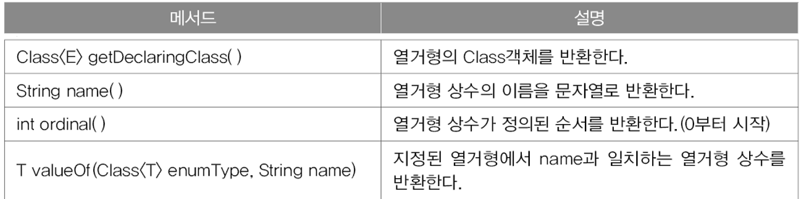
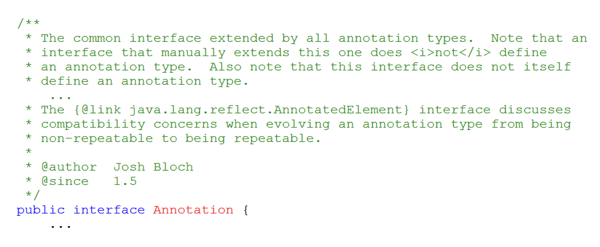
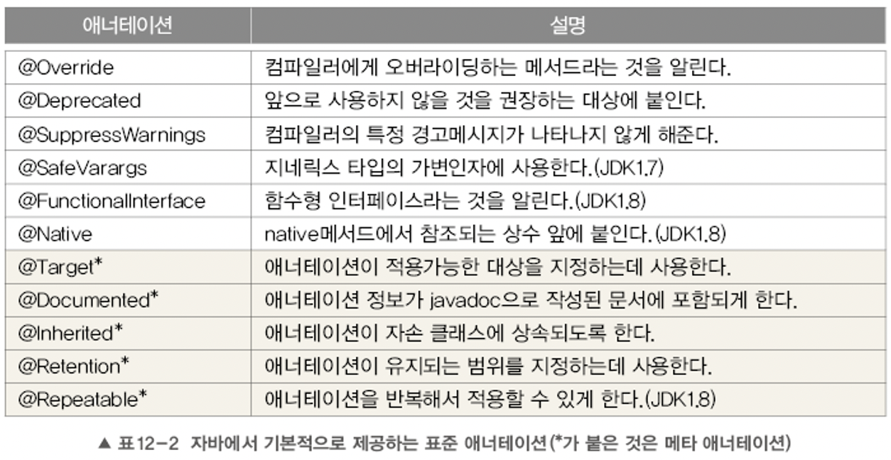
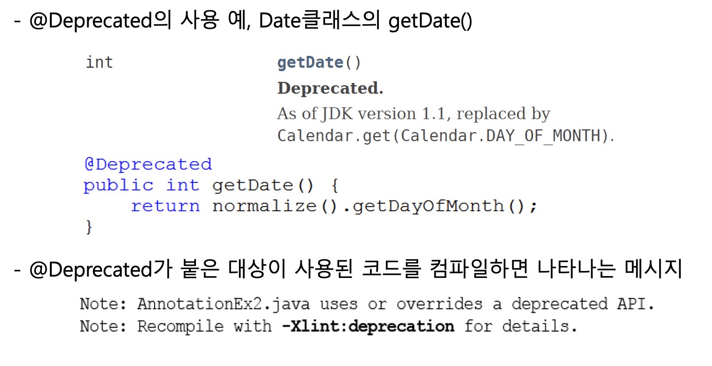
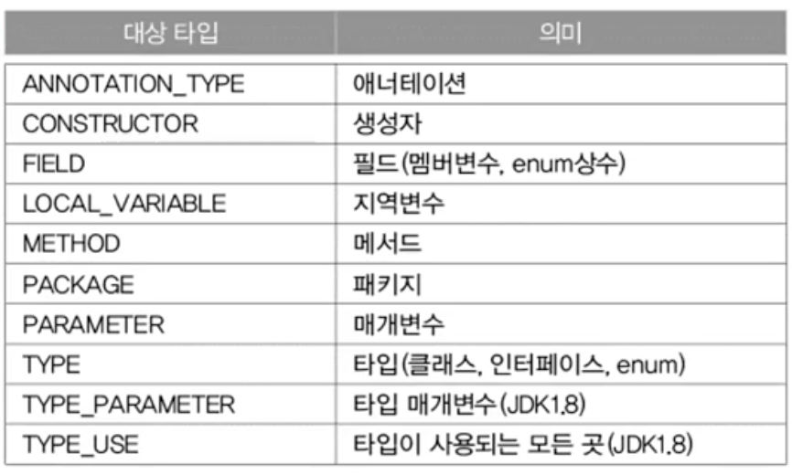
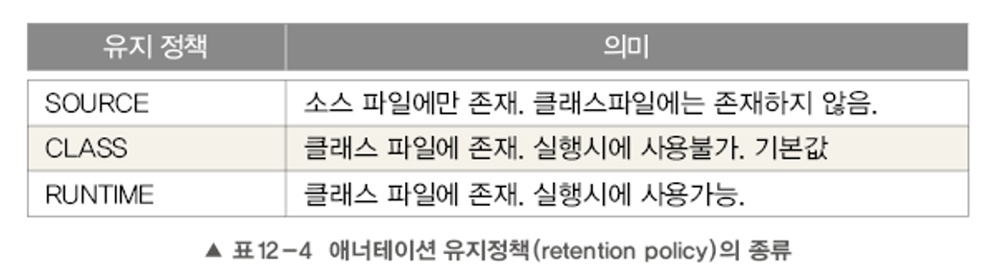

# chap 12 지네릭스, 열거형, 애너테이션

### 지네릭스(Generics)

- jdk 1.5에서 처음 도입된 지네릭스는 1.8에 추가된 람다식만큼 큰 변화
- 지네릭스는 다양한 타입의 객체들을 다루는 메서드나 컬렉션 클래스에 컴파일 시의 타입 체크를 해주는 기능이다.
- 객체의 타입을 컴파일 시에 체크하기 때문에 객체의 타입 안정성을 높이고 형변환의 번거로움이 줄어든다.
    - 타입 안정성을 높인다는 것은 의도하지 않은 타입의 객체가 저장되는 것을 막고, 저장된 객체를 꺼내올 때 원래의 타입과 다른 타입으로 잘못 형변환되어 발생할 수 있는 오류를 줄여준다는 뜻이다.
    - 예를 들어, 컬렉션 클래스는 다양한 종류의 객체를 담을 수 있긴 하지만 보통 한 종류의 객체를 담는 경우가 더 많다.  그런데 꺼낼 때 마다 타입체크를 하고 형변환하는 것은 불편하다.
    - 게다가 원하지 않는 종류의 객체가 포함되는 것을 막을 방법이 없다는 것도 문제이다.
    - 이러한 문제를 지네릭스가 해결해준다.
- 장점
    1. 타입 안정성을 제공한다.
    2. 타입체크와 형변환을 생략할 수 있으므로 코드가 간결해 진다.
- 즉 객체의 타입을 미리 명시해줌으로써 번거로운 형변환을 줄여준다는 이야기

### 지네릭 클래스의 선언

- 지네릭 타입은 클래스와 메서드에 선언할 수 있다.
- 클래스에 선언하는 지네릭 타입

    ```java
    class Box {
    		Object item;

    		void setItem(Object item) { this.item = item; }
    		Object getItem( return item; )
    }
    ```

    ```java
    class Box<T> {
    		T item;

    		void setItem(T item) { this.item = item; }
    		T getItem( return item; )
    }
    ```

    - 클래스 옆에 <T>를 붙이면 된다. 그리고 Object를 모두 T로 바꾼다.
    - T를 타입 변수(type variable)라고 하며, Type의 첫 글자에서 따온 것이다.
    - 타입변수는 T가 아닌 다른 것을 사용해도 된다.
        - ArrayList<E>의 경우, 타입 변수 E는 Element의 첫 글자를 따서 사용했다.
    - 타입변수가 여러 개인 경우에는 Map<K, V>와 같이 콤마','를 구분자로 나열하면 된다.
        - Key, Value
    - 무조건 T를 사용하기보다 가능하면 상황에 맞게 의미있는 문자를 선택해서 사용하는 것이 좋다.
    - 이들은 기호의 종류만 다를 뿐 '임의의 참조형 타입을' 의미한다는 것은 모두 같다.
    - 기존에는 다양한 종류의 타입을 다루는 메서드의 매개변수나 리턴타입으로 Object 타입의 참조변수를 많이 사용했고, 그로 인해 형변환이 불가피 했지만
        - 이제는 Object타입 대신 원하는 타입을 지정하기만 하면 되는 것이다.
    - 지네릭 클래스가 된 클래스의 객체를 생성할 때는 다음과 같이 참조변수와 생성자에 타입 T대신에 사용될 실제 타입을 지정해주어야 한다.

        ```java
        Box<String> b = new Box<String>(); // 타입 T 대신, 실제 타입을 지정
        b.setItem(new Object())  // 에러, String이외에 타입은 지정불가
        b.setItem("ABC")  // ok
        String item = b.getItem(); // (String)b.getItem(); 처럼 형변환이 필요없음 

        ```

        - 위의 코드에서 T대신에 String타입을 지정해줬으므로, 지네릭 클래스 Box<T>는 다음과 같이 정의된 것과 같다.

        ```java
        class Box<T> {
        		T item;

        		void setItem(T item) { this.item = item; }
        		T getItem( return item; )
        }
        ```

        - 지네릭이 도입되기 이전의 코드와 호환을 위해, 지네릭 클래스인데도 예전의 방식으로 객체를 생성하는 것이 허용된다. 다만 지네릭 타입을 지정하지 않아서 경고가 발생한다.

        ```java
        Box b = new Box(); // ok, T는 Object로 간주
        b.setItem("ABC"); // 경고, uncheck or unsafe operation
        b.setItem(new Object()); // 경고, uncheck or unsafe operation
        ```

        - 아래와 같이 타입 변수 T에 Object타입을 지정하면, 타입을 지정하지 않은 것이 아니라 알고 적은 것이므로 경고는 발생하지 않는다.

        ```java
        Box<Object> b = new Box<Object>();
        b.setItem("ABC"); // 경고 발생 안함
        b.setItem(new Object()); // 경고 발생 안함
        ```

    ### 지네릭스의 용어

    - 다음과 같이 지네릭 클래스 Box가 선언되어 있을 때

    ```java
    class Box<T> {}
    ```

    - Box<T>: 지네릭 클래스, T의 박스 또는 T 박스 라고 읽는다.
    - Box: 원시 타입(raw type)
    - T: 타입 변수 또는 타입 매개변수
        - 메서드의 매개변수와 유사한 면이 있기 때문

        ```java
            --3--
        Box<String> b = new Box<String>();
        -----1-----         ------2----

        1, 2: 지네릭 타입 호출
        3: 대입된 타입(매개변수화된 타입)
        ```

        - 그래서 위와 같이 타입 매개변수에 타입을 지정하는 것을 '지네릭 타입 호출'이라고 한다
        - 지정된 타입 'String'을 '매개변수화된 타입(parameterized type)' 이라고 한다.
        - 예를 들어 Box<String>과 Box<Integer>는 지네릭 클래스 Box<T>에 서로 다른 타입을 대입하여 호출한 것일 뿐, 이 둘이 별개의 클래스를 의미하는 것은 아니다.
            - 마치 매개변수의 값이 다른 메서드 호출이 서로 다른 메서드를 호출하는 것이 아닌 것과 같다.
            - add(3,5) vs add(2,4)
    - 컴파일 후에 Box<String> 과 Box<Integer>는 이들의 '원시타입'인 Box로 바뀐다.
        - 즉 지네릭 타입이 제거된다.
        - 지네릭 타입의 제거에서 자세히

### 지네릭스의 제한

- 지네릭 클래스 Box의 객체를 생성할 때, 객체별로 다른 타입을지정하는 것은 적절하다.
- 하지만 모든 객체에 대해 동일하게 동작해야하는 static 멤버에 타입 변수 T를 사용할 수 없다.
    - T는 인스턴스 변수로 간주되기 때문
    - static 멤버는 타입 변수에 지정된 타입, 즉 대입된 타입의 종류에 관계없이 동일한 것이어야 하기 때문
    - 즉, Box<Apple>.item 과 Box<Grape>.item이 다른 것이어서는 안된다는뜻

    ```java
    class Box<T> {
    		static T item; // error
    		static int compare(T t1, T t2) {} // error
    }
    ```

- 또, 지네릭 배열 타입의 배열을 생성하는 것도 허용되지 않는다.
    - 지네릭 배열 타입의 참조변수를 선언하는 것은 가능하지만
    - new T[10]과 같이 배열을 생성하는 것은 안된다.
    - 생성할 수 없는 이유는 new 연산자 때문, 이 연산자는 컴파일 시점에 타입 T가 뭔지 정확히 알아야 한다. 그런데 아래 코드는 정의된 Box<T> 클래스를 컴파일 하는 시점에서는 T가 어떤 타입이 될지 전혀 알 수 없다.
    - intanceof 연산자도 마찬가지
    - 꼭 지네릭 배열을 생성해야할 필요가 있을 때는
        - new 연산자 대신 Reflection API의 newInstance()와 같이 동적으로 객체 생성
        - Object 배열을 생성해서 복사한 다음에 T[]로 형변환 하는 방법

    ```java
    class Box<T> {
    		T[] itemArr; // ok, T타입의 배열을 위한 참조변수
        T[] toArray() {
    				T[] tmpArr = new T[itemArr.length]; // error, 지네릭 배열 생성불가
    				...
    		}

    }
    ```

### 지네릭 클래스의 객체 생성과 사용

```java
class Box<T> {
		ArrayList<T> list = new ArrayList<T>();
		
		void add(T item) { list.add(item); }
		T get(int i)     { return list.get(i); }
    ArrayList<T> getList() { return list; }
    int size()       { return list.size(); }
    public String toString() { return list.toString(); }
}
```

- Box<T>의 객체를 생성할 때는 다음과 같이 참조변수와 생성자에 대입된 타입(매개변수화된 타입)이 일치해야 한다.
    - 일치하지 않으면 에러가 발생

    ```java
    Box<Apple> appleBox = new Box<Apple>(); // ok
    Box<Apple> appleBox = new Box<Grape>(); // error
    ```

    - 두 타입이 상속관계에 있어도 마찬가지
        - Apple이 Fruit의 자손이라고 가정

    ```java
    Box<Fruit> appleBox = new Box<Apple>(); // error, 대입된 타입이 다르다.
    ```

    - 단, 두 지네릭 클래스의 타입이 상속관계에 있고, 대입된 타입이 같은 것은 괜찮다.
        - FruitBox는 Box의 자손이라고 가정

    ```java
    Box<Apple> appleBox = new FruitBox<Apple>(); // ok, 다형성
    ```

    - jdk 1.7부터는 추정이 가능한 경우 타입 생략 가능, 참조변수의 타입으로부터 Box가 Apple타입의 객체만 저장한다는 것을 알 수 있기 때문에, 생성자에 반복해서 타입을 지정해주지 않아도 되는 것
        - 아래 두 코드는 동일한 문장

    ```java
    Box<Apple> appleBox = new Box<Apple>(); // ok
    Box<Apple> appleBox = new Box<>(); // ok, jdk 1.7부터 생략가능
    ```

    - 생성된 Box<T> 객체에 void add(T item) 메서드를 실행해서 객체를 추가할 때, 대입된 타입과 다른 타입의 객체는 추가할 수 없다.

    ```java
    Box<Apple> appleBox = new Box<Apple>();
    appleBox.add(new Apple()); // ok
    appleBox.add(new Grape()); // error, Box<Apple>에는 Apple 객체만 추가 가능
    ```

    - 그러나 타입 T가 Fruit인 경우, void add(Fruit item)가 되므로 Fruit의 자손들은 이 메서드의 매개변수가 될 수 있다.
        - Apple이 Fruit의 자손이라고 가정

    ```java
    Box<Fruit> fBox = new Box<Fruit>();
    fBox.add(new Fruit()); // ok
    fBox.add(new Apple()); // ok. void add(Fruit item)
    ```

- Ex1

    ```java
    import java.util.ArrayList;

    class Fruit				  { public String toString() { return "Fruit";}}
    class Apple extends Fruit { public String toString() { return "Apple";}}
    class Grape extends Fruit { public String toString() { return "Grape";}}
    class Toy		          { public String toString() { return "Toy"  ;}}

    class FruitBoxEx1 {
    	public static void main(String[] args) {
    		Box<Fruit> fruitBox = new Box<Fruit>();
    		Box<Apple> appleBox = new Box<Apple>();
    		Box<Toy>   toyBox   = new Box<Toy>();
    //		Box<Grape> grapeBox = new Box<Apple>(); // 에러. 타입 불일치

    		fruitBox.add(new Fruit());
    		fruitBox.add(new Apple()); // OK. void add(Fruit item)

    		appleBox.add(new Apple());
    		appleBox.add(new Apple());
    //		appleBox.add(new Toy()); // 에러. Box<Apple>에는 Apple만 담을 수 있음

    		toyBox.add(new Toy());
    //		toyBox.add(new Apple()); // 에러. Box<Toy>에는 Apple을 담을 수 없음

    		System.out.println(fruitBox);
    		System.out.println(appleBox);
    		System.out.println(toyBox);
    	}  // main의 끝
    }

    class Box<T> {
    	ArrayList<T> list = new ArrayList<T>();
    	void add(T item)  { list.add(item); }
    	T get(int i)      { return list.get(i); }
    	int size() { return list.size(); }
    	public String toString() { return list.toString();}
    }

    실행결과
    [Fruit, Apple]
    [Apple, Apple]
    [Toy]
    ```

### 제한된 지네릭 클래스

- 타입 문자로 사용할 타입을 명시하면 한 종류의 타입만 저장할 수 있도록 제한할 수 있지만
- 그래도 여전히 모든 종류의 타입을 지정할 수 있다는 것에는 변함없다.
- 그렇다면 타입 매개변수 T에 지정할 수 있는 타입의 종류를 제한할 수 있는 방법은??
    - 다음과 같이 지네릭 타입에 extends를 사용하면, 특정 타입의 자손들만 대입할 수 있게 제한할 수 있다.

    ```java
    class FruitBox<T extends Fruit> { // Fruit의 자손만 타입으로 지정가능
    		ArrayList<T> list = new ArrayList<T>();
    }
    ```

    - 여전히 한 종류의 타입만 담을 수 있지만 Fruit 클래스의 자손들만 담을 수 있다는 제한이 더 추가 된 것

    ```java
    FruitBox<Apple> appleBox = new FruitBox<Apple>(); // ok
    FruitBox<Toy> toyBox = new FruitBox<Toy>(); // 에러, Toy는 Fruit의 자손이 아님
    ```

    - 게다가 add()의 매개변수의 타입 T도 Fruit와 그 자손 타입이 될 수 있으므로, 아래와 같이 여러 과일을 담을 수 있는 상자가 가능하게 된다.

    ```java
    FruitBox<Fruit> fruitBox = new FruitBox<Fruit>(); // ok
    fruitBox.add(new Apple()); // ok, Apple이 fruit의 자손
    fruitBox.add(new Grape()); // ok, Grape이 fruit의 자손
    ```

    - 다형성에서 조상타입의 참조변수로 자손타입의 객체를 가리킬 수 있는 것처럼, 매개변수화된 타입의 자손 타입도 가능한 것이다.
        - 타입 매개변수 T에 Object를 대입하면, 모든 종류의 객체를 저장할 수 있게 된다.
    - 만약 클래스가 아니라 인터페이스를 구현해야 한다는 제약이 필요하다면 이 때도 extends를 사용한다.
        - implements 사용 x
    - 클래스가 Fruit의 자손이면서 Eatable 인터페이스도 구현해야 한다면 아래와 같이 & 기호로 연결
        - FruitBox에는 Fruit의 자손이면서 Eatable을 구현한 클래스만 타입 매개변수 T에 대입될 수 있다.

    ```java
    class FruitBox<T extends Fruit & Eatable> { ... }
    ```

    - ex2

        ```java
        import java.util.ArrayList;

        class Fruit implements Eatable {
        	public String toString() { return "Fruit";}
        }
        class Apple extends Fruit { public String toString() { return "Apple";}}
        class Grape extends Fruit { public String toString() { return "Grape";}}
        class Toy		          { public String toString() { return "Toy"  ;}}

        interface Eatable {}

        class FruitBoxEx2 {
        	public static void main(String[] args) {
        		FruitBox<Fruit> fruitBox = new FruitBox<Fruit>();
        		FruitBox<Apple> appleBox = new FruitBox<Apple>();
        		FruitBox<Grape> grapeBox = new FruitBox<Grape>();
        //		FruitBox<Grape> grapeBox = new FruitBox<Apple>(); // 에러. 타입 불일치
        //		FruitBox<Toy>   toyBox    = new FruitBox<Toy>();   // 에러.

        		fruitBox.add(new Fruit());
        		fruitBox.add(new Apple());
        		fruitBox.add(new Grape());
        		appleBox.add(new Apple());
        //		appleBox.add(new Grape());  // 에러. Grape는 Apple의 자손이 아님
        		grapeBox.add(new Grape());

        		System.out.println("fruitBox-"+fruitBox);
        		System.out.println("appleBox-"+appleBox);
        		System.out.println("grapeBox-"+grapeBox);
        	}  // main
        }

        class FruitBox<T extends Fruit & Eatable> extends Box<T> {}

        class Box<T> {
        	ArrayList<T> list = new ArrayList<T>();
        	void add(T item)  { list.add(item);      }
        	T get(int i)      { return list.get(i); }
        	int size()        { return list.size();  }
        	public String toString() { return list.toString();}
        }

        실행결과
        fruitBox-[Fruit, Apple, Grape]
        appleBox-[Apple]
        grapeBox-[Grape]
        ```

### 와일드 카드

- 매개변수에 과일박스를 대입하면 주스를 만들어서 반환하는 Jucier라는 클래스가 있고, 이 클래스에는 과일을 주스로 만들어서 반환하는 makeJuice()라는 static 메서드가 다음과 같이 정의되어 있다고 가정

```java
class Juicer { 
		static Juicer makeJuice(FruitBox<Fruit> box) {
			String tmp;
			for(Fruit f : box.getList()) tmp += f + " ";
			return new Juice(tmp);
		}
}
```

- Juicer 클래스는 지네릭 클래스가 아닌데다, 지네릭 클래스라고 해도 static 메서드에는 타입 매개변수 T를 매개변수에 사용할 수 없으므로 아예 지네릭스를 적용하지 않던가, 위와 같이 타입 매개변수 대신, 특정 타입을 지정해줘야 한다.

```java
FruitBox<Fruit> fruitBox = new FruitBox<Fruit>();
FruitBox<Apple> appleBox = new FruitBox<Apple>();

System.out.println(Jucier.makeJuice(fruitBox)); // ok
System.out.println(Jucier.makeJuice(appleBox)); // error
```

- 이렇게 지네릭 타입을 FruitBox<Fruit>으로 고정해 놓으면, 위의 코드에서 알 수 있듯이 FruitBox<Apple> 타입의 객체는 makeJuice()의 매개변수가 될 수 없으므로, 다음과 같이 여러 가지 타입의 매개변수를 갖는 makeJuice()를 만들 수 밖에 없다.

```java
static Juicer makeJuice(FruitBox<Fruit> box) {
	String tmp;
	for(Fruit f : box.getList()) tmp += f + " ";
	return new Juice(tmp);
}
static Juicer makeJuice(FruitBox<Apple> box) {
	String tmp;
	for(Fruit f : box.getList()) tmp += f + " ";
	return new Juice(tmp);
}
```

- 그러나 위와 같이 오버로딩하면, 컴파일 에러가 발생
    - 지네릭 타입이 다른 것만으로는 오버로딩이 성립하지 않기 때문이다.
    - 지네릭 타입은 컴파일러가 컴파일할 때만 사용하고 제거해버린다.
    - 그래서 두 메서드는 오버로딩이 아니라 메서드 중복 정의이다.
- 이럴 때 사용하기 위해 고안된 것이 바로 와일드 카드
    - 와일드 카드는 기호 ?로 표현하는데, 어떠한 타입도 될 수 있다.
    - ?만으로는 Object  타입과 다를게 없으므로, 다음과 같이 extends와 super로 상한(upper bound)와 하한(lower bound)를 제한할 수 있다.

```java
<? extends T> -> 와일드 카드의 상한 제한, T와 그 자손들만 가능
<? super T>   -> 와일드 카드의 하한 제한, T와 그 조상들만 가능
<?>           -> 제한없음. 모든 타입이 가능 <? extends Object>와 동일
```

- 지네릭 클래스와 달리 와일드 카드에는 & 사용할 수 없다. <? extends T & E> 불가

```java
static Juicer makeJuice(FruitBox<? extends Fruit> box) {
	String tmp;
	for(Fruit f : box.getList()) tmp += f + " ";
	return new Juice(tmp);
}
```

- 와일드 카드를 사용해서 메서드의 매개변수로 FruitBox<Fruit>뿐만 아니라,  FruitBox<Apple>,  FruitBox<Grape>도 가능하게 된다.

```java
static Juicer makeJuice(FruitBox<? extends Object> box) {
	String tmp;
	for(Fruit f : box.getList()) tmp += f + " "; // error, Fruit이 아닐 수 있음
	return new Juice(tmp);
}
```

- <? extends Object>로 하면, 모든 종류의 FruitBox가 이 메서드의 매개변수로 가능해진다. 대신 box의 요소가 Fruit의 자손이라는 보장이 없으므로 아래의 for문에서 저장된 Fruit 타입의 참조변수로 못받는다.
- 그러나 실제로 테스트 해보면 문제없이 컴파일된다.
    - 그 이유는 바로 지네릭 클래스 FruitBox를 제한했기 때문

    ```java
    class FruitBox<T extends Fruit> extends Box<T> {}
    ```

    - 컴파일러는 위 문장으로부터 모든 FruitBox의 요소들이 Fruit의 자손이라는 것을 알고 있으므로 문제 삼지 않는다.
- ex3

    ```java
    import java.util.ArrayList;

    class Fruit		          { public String toString() { return "Fruit";}}
    class Apple extends Fruit { public String toString() { return "Apple";}}
    class Grape extends Fruit { public String toString() { return "Grape";}}

    class Juice {
    	String name;

    	Juice(String name)	     { this.name = name + "Juice"; }
    	public String toString() { return name;		 }
    }

    class Juicer {
    	static Juice makeJuice(FruitBox<? extends Fruit> box) {
    		String tmp = "";
    		
    		for(Fruit f : box.getList()) 
    			tmp += f + " ";
    		return new Juice(tmp);
    	}
    }

    class FruitBoxEx3 {
    	public static void main(String[] args) {
    		FruitBox<Fruit> fruitBox = new FruitBox<Fruit>();
    		FruitBox<Apple> appleBox = new FruitBox<Apple>();

    		fruitBox.add(new Apple());
    		fruitBox.add(new Grape());
    		appleBox.add(new Apple());
    		appleBox.add(new Apple());

    		System.out.println(Juicer.makeJuice(fruitBox));
    		System.out.println(Juicer.makeJuice(appleBox));
    	}  // main
    }

    class FruitBox<T extends Fruit> extends Box<T> {}

    class Box<T> {
    //class FruitBox<T extends Fruit> {
    	ArrayList<T> list = new ArrayList<T>();
    	void add(T item) { list.add(item);      }
    	T get(int i)     { return list.get(i); }
    	ArrayList<T> getList() { return list;  }
    	int size()       { return list.size(); }
    	public String toString() { return list.toString();}
    }

    실행결과
    Apple Grape Juice
    Apple Grape Juice
    ```

- ex4

    ```java
    import java.util.*;

    class Fruit	{
    	String name;
    	int weight;
    	
    	Fruit(String name, int weight) {
    		this.name   = name;
    		this.weight = weight;
    	}

    	public String toString() { return name+"("+weight+")";}
    	
    }

    class Apple extends Fruit {
    	Apple(String name, int weight) {
    		super(name, weight);
    	}
    }

    class Grape extends Fruit {
    	Grape(String name, int weight) {
    		super(name, weight);
    	}
    }

    class AppleComp implements Comparator<Apple> {
    	public int compare(Apple t1, Apple t2) {
    		return t2.weight - t1.weight;
    	}
    }

    class GrapeComp implements Comparator<Grape> {
    	public int compare(Grape t1, Grape t2) {
    		return t2.weight - t1.weight;
    	}
    }

    class FruitComp implements Comparator<Fruit> {
    	public int compare(Fruit t1, Fruit t2) {
    		return t1.weight - t2.weight;
    	}
    }

    class FruitBoxEx4 {
    	public static void main(String[] args) {
    		FruitBox<Apple> appleBox = new FruitBox<Apple>();
    		FruitBox<Grape> grapeBox = new FruitBox<Grape>();

    		appleBox.add(new Apple("GreenApple", 300));
    		appleBox.add(new Apple("GreenApple", 100));
    		appleBox.add(new Apple("GreenApple", 200));

    		grapeBox.add(new Grape("GreenGrape", 400));
    		grapeBox.add(new Grape("GreenGrape", 300));
    		grapeBox.add(new Grape("GreenGrape", 200));

    		Collections.sort(appleBox.getList(), new AppleComp());
    		Collections.sort(grapeBox.getList(), new GrapeComp());
    		System.out.println(appleBox);
    		System.out.println(grapeBox);
    		System.out.println();
    		Collections.sort(appleBox.getList(), new FruitComp());
    		Collections.sort(grapeBox.getList(), new FruitComp());
    		System.out.println(appleBox);
    		System.out.println(grapeBox);
    	}  // main
    }

    class FruitBox<T extends Fruit> extends Box<T> {}

    class Box<T> {
    	ArrayList<T> list = new ArrayList<T>();

    	void add(T item) {
    		list.add(item);
    	}

    	T get(int i) {
    		return list.get(i);
    	}

    	ArrayList<T> getList() { return list; }

    	int size() {
    		return list.size();
    	}

    	public String toString() {
    		return list.toString();
    	}
    }

    실행결괴
    [GreenApple(300), GreenApple(200), GreenApple(100)]
    [GreenApple(400), GreenApple(300), GreenApple(200)]

    [GreenApple(100), GreenApple(200), GreenApple(300)]
    [GreenApple(200), GreenApple(300), GreenApple(400)]
    ```

    - super로 와일드 카의 하한을 제한하는 경우
    - Collectuons.sort()를 이용해서 box에 담긴 과일을 무게별로 정렬

        ```java
        static <T> void sort(List<T> list, Comparator<? super T> c)
        ```

        - static 옆에 있는 <T>는 메서드에 선언된 지네릭 타입
        - Comparator의 지네릭 타입에 하한 제한이 걸려있는 와일드 카드가 사용되었다.
        - 따라서 FruitComp 하나로 모든 Fruit의 box 정렬 가능

### 지네릭 메서드

- 메서드의 선언부에 지네릭 타입 매개변수와 지네릭 메서드에 정의된 타입 매개변수는 전혀 별개의 것이다.
- 같은 타입 문자 T를 사용해도 같은 것이 아니라는 것에 주의해야 한다.
- 지네릭 메서드는 지네릭 클래스가 아닌 클래스에도 정의할 수 있다.

```java
class FruitBox<T> {
		static <T> void sort(List<T> list, Compartor<? super T> c)
}
```

- 위의 코드에서 지네릭 클래스 FruitBox에 선언된 타입 매개변수 T와 지네릭 메서드 sort()에 선언된 타입 매개변수 T는 타입 문자만 같을 뿐 서로 다른 것이다.
- static멤버에는 타입 밴개 변수를 사용할 수 없지만, 메서드에 지네릭 타입을 선언하고 사용하는 것은 가능하다.
- 메서드에 선언된 지네릭 타입은 지역 변수를 선언한 것과 같다고 생각하면 이해하기 쉽다.
    - 이 타입 매개변수는 메서드 내에서만 지역적으로 사용될 것이므로 메서드가 static이건 아니건 상관이 없다.
    - 같은 이유로 내부 클래스에 선언된 타입 문자가 외부 클래스의 타입 문자와 같아도 구별될 수 있다.
- 앞서 나왔던 makeJuice()를 지네릭 메서드로 바꾸면 다음과 같다.

    ```java
    static Juicer makeJuice(FruitBox<? extends Fruit> box) {
    	String tmp;
    	for(Fruit f : box.getList()) tmp += f + " "; // error, Fruit이 아닐 수 있음
    	return new Juice(tmp);
    }

    static <T extends Fruit> Juicer makeJuice(FruitBox<T> box) {
    	String tmp;
    	for(Fruit f : box.getList()) tmp += f + " "; // error, Fruit이 아닐 수 있음
    	return new Juice(tmp);
    }
    ```

- 이 메서드를 호출할 때는 아래와 같이 타입 변수에 타입을 대입해야 한다.

    ```java
    FruitBox<Fruit> fruitBox = new FruitBox<Fruit>;
    FruitBox<Apple> appleBox = new FruitBox<Apple>;

    Juicer.<Fruit>makeJuice(fruitBox);
    Juicer.<Apple>makeJuice(appleBox);

    // 그러나 대부분의 경우 컴파일러가 타입을 추정할 수 있기 때문에 생략 가능
    Juicer.makeJuice(fruitBox);
    Juicer.makeJuice(appleBox);
    ```

- 주의할 점은 지네릭 메서드를 호출할 때, 대입된 타입을 생략할 수 없는 경우에는 참조변수나 클래스 이름을 생략할 수 없다.

    ```java
    <Fruit>makeJuice(fruitBox);         // error, 클래스 이름 생략 불가
    this.<Fruit>makeJuice(fruitBox);    // ok
    Juicer.<Fruit>makeJuice(fruitBox);  // ok

    ```

    - 즉, 같은 클래스 내에 있는 멤버들끼리는 참조 변수나 클래스이름, 즉 this나 클래스이름. 을 생략하고 메서드 이름만으로 호출이 가능하지만, 대입된 타입이 있을 때는 반드시 써줘야 한다.
    - 기술적인 규칙이므로 지키기만 하면 된다.
- 지네릭 메서드는 매개변수의 타입이 복잘할 때도 유용하다.

    ```java
    public static void printAll(ArrayList<? extends Product> list,
    														ArrayList<? extends Product> list2>) {
    		for(Unit u: list) {
    				System.out.println(u);
    		}
    }

    public static <T extends Product> void printAll(ArrayList<T> list,
    																								ArrayList<T> list2>) {
    		for(Unit u: list) {
    				System.out.println(u);
    		}
    }
    ```

- 복작한 지네릭 메서드 예시

    ```java
    public static <T extends Comparable<? super T>> void sort(List<T> list)
    ```

    - 일단 와일드 카드를 걷어내자, public static <T extends Comparable<T>> void sort(List<T> list)
        - List<T>의 요소가 Comparable 인터페이스를 구현한 것이어야 한다는 뜻
    - 다시 와일드 카를 넣고 이해해보자

        ```java
        public static <T extends Comparable<? super T>> void sort(List<T> list)
                       -------------2------------------           ---1---
        ```

        - 1: 타입 T를 요소로 하는 List를 매개변수로 허용한다.
        - 2: T는 Comapable을 구현한 클래스이어야 하며 (<T extends Comparble>), T 또는 그 조상의 타입을 비교하는 Comparable이어야 한다는 것 (Compable<? super T>)을 의미한다.
        - 만익 T가 Student이고, Person의 자손이라면, <? super T>는 Student, Person, Object가 모두 가능하다.

### 지네릭 타입의 형변환

- 지네릭 타입과 원시 타입간의 형변환이 가능할까?

    ```java
    Box box = null;
    Box<Object> objBox = null;

    box = (Box)objBox;         // ok, 지네릭 타입 -> 원시타입. 경고 발생
    objBox = (Box<Object>)box; // ok, 원시 타입 -> 지네릭타입. 경고 발생
    ```

    - 지네릭 타입과 넌지네릭 타입간의 형변환은 항상 가능하다
    - 경고가 발생할 뿐
- 대입된 타입이 다른 지네릭 타입 간에는 형변환이 가능할까?

    ```java
    Box<Object> objBox = null;
    Box<String> strBox = null;

    objBox = (Box<Object>)strBox; // error. Box<String> -> Box<Object>
    strBox = (Box<String>)objBox; // error. Box<Object> -> Box<String>
    ```

    - 불가능하다. 대입된 타입이 Object라도
    - 이미 배운 부분 아래의 문장이 안된다는 얘기는 형변환이 안된다는 사실

    ```java
    // Box<Object> objBox = (Box<Object>)new Box<String>();
    Box<Object> objBox = new Box<String>(); // error, 형변환 불가능
    ```

- 아래 코드는 형변환 가능?

    ```java
    Box<? extends Object> wBox = new Box<String>();
    ```

    - 형변환 가능
    - makeJuice 메서드 생각
- 반대로의 형변환도 가능하지만, 확인되지 않은 형변환이라는 경고가 발생한다.

    ```java
    Box<String> strBox = new Box<? extends Object>();
    ```

    - <? extends Object>에 대입될 수 있는 타입이 여러 개인데다, Box<String>를 제외한 다른 타입은 Box<String>로 형변환될 수 없기 때문
- 실제 java.uti.Optional 클래스

    ```java
    public final class Optional<T> {
    		private static final Optional<?> EMPTY = new Optional<>();
    		private final T value;
    		
    		public static<T> Optional<T> empty() {
    				Optional<T> t = (Optional<T>) EMPTY;
    				return t;
    		}
    }
    ```

    - static 상수 EMPTY에 비어있는 Optional 객체를 생성해서 저장했다 empty()를 호출하면 EMPTY를 형변환해서 반환한다.

    ```java
    Optional<?> EMPTY = new Optional<>();
    == Optional<? extends Object> EMPTY = new Optional<Object>();
    ```

    - 위의 문장에서 EMPTY의 타입을 Optional<Object>가 아닌 ?한 이유는 Optional<T>로 형변환이 가능하기 때문

    ```java
    Optional<?> wopt = new Optional<Object>();
    Optional<Object> oopt = new Optional<Object>();

    Optional<String> sopt = (Optional<String>)wopt;  // ok. 형변환 가능
    Optional<String> sopt = (Optional<String>)oopt;  // error. 형변환 불가
    ```

    - 정리하면 Optional<Object>를 <String>으로 직접 형변환하는 것은 불가능하지만, 와일드 카드가 포함된 지네릭 타입으로 형변환하면 가능하다. 대신 확인되지 않은 타입으로의 형변환이라는 경고가 발생한다.

    ```java
    public static<T> Optional<T> empty() {
    		Optional<T> t = (Optional<T>) EMPTY; // Optional<?> - > Optional<T>
    		return t;
    }

    Optional<Object> -> Optional<T> // 형변환 불가
    Optional<Object> -> Optional<?> -> Optional<T> // 형변환 가능. 경고발생
    ```

    - 다음과 같이 와일드 카드가 사용된 지네릭 타입끼리도 다음과 같은 경우에는 형변환 가능
        - 가능하긴 하지만, 와일드 카드는 타입이 확정된 타입이 아니므로 컴파일러는 미확정 타입으로 형변환 하느 것이라고 경고한다.

    ```java
    FruitBox<? extends Object> objBox = null;
    FruitBox<? extends String> strBox = null;

    strBox = (FruitBox<? extends String>) objBox // ok. 미확정 타입으로 형변환 경고
    objBox = (FruitBox<? extends Object>) strBox // ok. 미확정 타입으로 형변환 경고
    ```

### 지네릭 타입의 제거

- 컴파일러는 지네릭 타입을 이용해서 소스파일을 체크하고, 필요한 곳에 형변환을 넣어준다.
    - 그리고 지네릭 타입을 제거한다.
    - 즉 컴파일된 파일(*.class)에는 지네릭 타입에 대한 정보가 없는 것이다.
- 이렇게 하는 주된 이유는 지네릭이 도입되기 이전의 소스 코드와의 호환성을 유지하기 위해서이다.
- 그러니 앞으로 가능하면 원시 타입을 사용하지 안혿록 하자
- 지네릭 타입의 제거 과정은 복잡하므로 기본적인 제거과정에 대해서 살펴본다.
    1. 지네릭 타입의 경계(bound)를 제거한다.
        - 지네릭 타입이 <T extends Fruit>라면 T는 Fruit으로 치환된다.
        - <T>인 경우에는 T는 Object로 치환된다.
        - 그리고 클래스 옆에 선언은 제거된다.

        ```java
        class Box<T extends Fruit> {
        		void add(T t) {}
        }

        class Box {
        		void add(Fruit t) {}
        }
        ```

    2. 지네릭 타입을 제거한 후에 타입이 일치하지 않으면, 형변환을 추가한다.
        - List get()은 Object타입을 반환하므로 형변환이 필요하다.

        ```java
        T get(int i) {
        		return list.get(i);
        }

        Fruit get(int i) {
        		return (Fruit)list.get(i);
        }
        ```

        - 와일드 카드가 포함되어 있는 경우에는 다음과 같이 적절한 타입으로의 형변환이 추가된다.

        ```java
        static Juice makeJuice(FruitBox<? extends Fruit> box) {
        		String tmp;
        		for(Fruit f : box.getList()) tmp += f + " ";
        		return new Juice(tmp);
        }

        static Juice makeJuice(FruitBox box) {
        		String tmp;
        		Iterator it = box.getList().iteratort();
        		while(it.hasnext()) {
        			tmp += (Fruit)it.next() + " ";
        		}
        		return new Juice(tmp);
        }
        ```

### 열거형(enums)

- 열거형은 서로 관련된 상수를 편리하게 선언하기 위한 것으로 여러 상수를 정의할 때 사용하면 유용하다.
- jdk 1.5부터 추가되었다.
- 자바의 열거형은 열거형이 갖는 값뿐만 아니라 타입도 관리하기 때문에 보다 논리적인 오류를 줄일 수 있다.

    ```java
    class Card {
    		static final int CLOVER = 0;
    		static final int HEART = 1;
    		static final int DIAMOND = 2;
    		static final int SPADE = 3;

    		static final int TWO = 0;
    		static final int THREE = 1;
    		static final int FOUR = 2;
    		
    		final int kind;
    		final int num;
    }
    ```

    ```java
    class Card {
    		enum Kind   { CLOVER, HEART, DIAMOND, SPADE } // 열거형 Kind 정의
    		enum Value   { TWO, THREE, FOUR }
    		
    		final Kind kind;
    		final Value value;
    }
    ```

- 자바의 열거형은 타입에 안전한 열거형(typesafe enum)이라서 실제 값이 같아도 타입이 다르면 컴파일 에러가 발생한다.

    ```java
    if(Card.CLOVER == Card.TWO)            // true지만 false이어야 의미상 맞음
    if(Card.Kind.CLOVER == Card.Value.TWO) // 컴파일 에러, 값은 같지만 타입이 다름
    ```

- 상수의 값이 바뀌면, 해당 상수를 참조하는 모든 소스를 다시 컴파일 해야 하지만 열거형 상수를 사용하면 기존의 소스를 다시 컴파일하지 않아도 된다.

### 열거형의 정의와 사용

- 열거형 정의하는 방법

    ```java
    enum 열거형이름 { 상수명1, 상수명2, ... }

    enum Direction { EAST, SOUTH, WEST, NORTH }
    ```

- 열거형에 정의된 상수를 사용하는 방법

    ```java
    열거형이름.상수명 // 클래스의 static 변수 참조하는 것과 동일

    class Unit {
    		int x, y;
    		Direction dir; // 열거형을 인스턴스 변수로 선언
    		
    		void init() {
    				dir = Direction.EAST;
    		}
    }
    ```

- 열거형 상수간의 비교에는 ==를 사용할 수 있다.
    - equals가 아닌 ==로 비교가 가능하다는 것은 그만큼 빠른 성능을 제공한다는 뜻
    - 그러나 >, < 와 같은 비교연산자는 사용할 수 없고 compareTo()는 사용 가능하다.

    ```java
    if(dir == Direction.EAST) {
    } else if(dir > Direction.WEST) { // error
    } else if(dir.compareTo(Direction.WEST) > 0 ) { // ok
    }
    ```

- switch문의 조건식에도 열거형 사용 가능
    - 주의할 점은 case문에 열거형의 이름은 적지 않고 상수의 이름만 적어야 한다.

    ```java
    void move() {
    		switch(dir) {
    				case EAST: x++;
    				case WEST: x++;
    				case NORTH: x++;
    				case SOUTH: x++;

    		}
    }
    ```

### 모든 열거형의 조상 - java.lang.Enum

- 열거형 Direction에 정의된 모든 상수를 출력하려면, 다음과 같이 한다.

    ```java
    Direction[] dArr = Direction.values();
    for(Direction d : dArr) {
    		sout("%s = %d", d.name(), d.ordinal());
    }
    ```

- values()는 열거형의 모든 상수를 배열에 담아 반환한다.
    - 이 메서드는 모든 열거형이 가지고 있는 것으로 컴파일러가 자동으로 추가해 준다.
- ordinal()은 모든 열거형의 조상인 java.lang.Enum 클래스에 정의된 것으로, 열거형 상수가 정의된 순서(0부터) 정수를 반환한다.
- Enum 클래스의 메서드



- 이 외에도 values() 처럼 컴파일러가 자동으로 추가해주는 메서드가 하나 더 있다.

    ```java
    static E values()
    static E valueOf(String name)
    ```

    - 이 메서드는 열거형 상수의 이름으로 문자열 상수에 대한 참조를 얻을 수 있게 해준다.

        ```java
        Direction d = Direction.valueOf("WEST");
        sout(d); // WEST
        sout(Direction.WEST == Direction.valueOf("WEST")) // true
        ```

- ex1

    ```java
    enum Direction { EAST, SOUTH, WEST, NORTH }

    class EnumEx1 {
    	public static void main(String[] args) {
    		Direction d1 = Direction.EAST;
    		Direction d2 = Direction.valueOf("WEST");
    		Direction d3 = Enum.valueOf(Direction.class, "EAST");

    		System.out.println("d1="+d1);
    		System.out.println("d2="+d2);
    		System.out.println("d3="+d3);

    		System.out.println("d1==d2 ? "+ (d1==d2));
    		System.out.println("d1==d3 ? "+ (d1==d3));
    		System.out.println("d1.equals(d3) ? "+ d1.equals(d3));
    //		System.out.println("d2 > d3 ? "+ (d1 > d3)); // error
    		System.out.println("d1.compareTo(d3) ? "+ (d1.compareTo(d3)));
    		System.out.println("d1.compareTo(d2) ? "+ (d1.compareTo(d2)));

    		switch(d1) {
    			case EAST: // Direction.EAST라고 쓸 수 없다.
    				System.out.println("The direction is EAST."); 
    				break;
    			case SOUTH:
    				System.out.println("The direction is SOUTH."); 
    				break;
    			case WEST:
    				System.out.println("The direction is WEST."); 
    				break;
    			case NORTH:
    				System.out.println("The direction is NORTH."); 
    				break;
    			default:
    				System.out.println("Invalid direction."); 
            break;
    		}

    		Direction[] dArr = Direction.values();

    		for(Direction d : dArr)  // for(Direction d : Direction.values()) 
    			System.out.printf("%s=%d%n", d.name(), d.ordinal()); 
    	}
    }

    실행결과
    d1=EAST
    d2=WEST
    d3=EAST
    d1==d2 ? false
    d1==d3 ? true
    d1.equals(d3) ? true
    d1.compareTo(d3) ? 0
    d1.compareTo(d2) ? -2
    The direction is EAST.
    EAST=0
    SOUTH=1
    WEST=2
    NORTH=3
    ```

### 열거형에 멤버 추가하기

- Enum 클래스에 정의된 ordinal()이 열거형 상수가 정의된 순서를 반환하지만, 이 값을 열거형 상수의 값으로 사용하지 않는 것이 좋다.
    - 이 값은 내부적인 용도로만 사용되기 위한 것이기 때문이다.
- 열거형 상수의 값이 불연속적인 경우에는 이때는 다음과 같이 열거형 상수의 이름 옆에 원하는 값을 괄호와 함께 적어주면 된다.

    ```java
    enum Direction { EAST(1), SOUTH(5), WEST(-1), NORTH(10) }
    ```

    - 그리고 지정된 값을 저장할 수 있는 인스턴스 변수와 생성자를 새로 추가해 주어야 한다.
    - 이 때, 먼저 열거형 상수를 모두 정의한 다음에 다른 멤버들을 추가해야 한다는 것이다.
    - 열거형 상수의 마지막에 ;도 추가

    ```java
    enum Direction { 
    		EAST(1), SOUTH(5), WEST(-1), NORTH(10); // 끝에 ; 추가해야함
    		private final int value // 정수를 저장할 필드 추가
    		Direction(int value) {  // 생성자 추가, 기본 private
    				this.value = value;
    		}

    		public int getValue() { return value; }
    } 
    ```

    - 열거형의 인스턴스 변수는 반드시 final이어야 하는 제약은 없지만, value는 열거형 상수의 값을 저장하기 위한 것이므로 final
    - 열거형 Direction에 새로운 생성자가 추가되었지만, 아래와 같이 열거형의 객체를 생성할 수 없다
        - 열거형의 생성자는 묵시적으로 private

    ```java
    Direction d = new Direction(1); // error, 열거형의 생성자는 외부에서 호출 불가
    ```

    - 필요하다면, 하나의 열거형 상수에 여러 값을 지정할 수도 있다.
        - 그에 맞게 인스턴스 변수와 생성자 등을 새로 추가해야한다.

    ```java
    enum Direction { 
    		EAST(1, ">"), SOUTH(5, "V"), WEST(-1, "<"), NORTH(10, "^");
    		private final int value;
    		private final String symbol;
    		Direction(int value, String symbol) {
    				this.value = value;
    				this.symbol = symbol;
    		}

    		public int getValue() { return value; }
    		public int getSysmbol() { return symbol; }
    } 
    ```

- ex2

    ```java
    enum Direction { 
    	EAST(1, ">"), SOUTH(2,"V"), WEST(3, "<"), NORTH(4,"^");

    	private static final Direction[] DIR_ARR = Direction.values();
    	private final int value;
    	private final String symbol;

    	Direction(int value, String symbol) { // 접근제어자 private 생략
    		this.value  = value;
    		this.symbol = symbol;
    	}

    	public int getValue()      { return value;  }
    	public String getSymbol()  { return symbol; }

    	public static Direction of(int dir) {
            if (dir < 1 || dir > 4) {
                throw new IllegalArgumentException("Invalid value :" + dir);
            }
            return DIR_ARR[dir - 1];		
    	}	

    	// 방향을 회전시키는 메서드. num의 값만큼 90도씩 시계방향으로 회전한다.
    	public Direction rotate(int num) {
    		num = num % 4;

    		if(num < 0) num +=4; // num이 음수일 때는 시계반대 방향으로 회전 

    		return DIR_ARR[(value-1+num) % 4];
    	}

    	public String toString() {
    		return name()+getSymbol();
    	}
    } // enum Direction

    class EnumEx2 {
    	public static void main(String[] args) {
    		for(Direction d : Direction.values()) 
    			System.out.printf("%s=%d%n", d.name(), d.getValue()); 

    		Direction d1 = Direction.EAST;
    		Direction d2 = Direction.of(1);

    		System.out.printf("d1=%s, %d%n", d1.name(), d1.getValue());
    		System.out.printf("d2=%s, %d%n", d2.name(), d2.getValue());

    		System.out.println(Direction.EAST.rotate(1));
    		System.out.println(Direction.EAST.rotate(2));
    		System.out.println(Direction.EAST.rotate(-1));
    		System.out.println(Direction.EAST.rotate(-2));
    	}
    }

    실행결과
    EAST=1
    SOUTH=2
    WEST=3
    NORTH=4
    d1=EAST, 1
    d2=EAST, 1
    SOUTH V
    WEST <
    NORTH ^
    WEST <
    ```

### 열거형에 추상 메서드 추가하기

- 열거형 Transportation은 운송 수단의 종류 별로 상수를 정의하고 있으며, 각 운송 수단에는 기본요금이 책정되어 있다.

    ```java
    enum Transportation {
    		BUS(100), TRAIN(150), SHIP(100), AIRPLANE(300);
    		private final int BASIC_FARE;

    		private Transportation(int basicFare) {
    				BASIC_FARE = basicFare
    		}
    		int fare() {
    				return BASIC_FARE;
    		}
    }
    ```

    - 그러나 거리에 따라 요금을 계산하는 방식이 각 운송 수단마다 다르기 때문에 부족하다.
- 이럴 때, 열거형에 추상 메서드 fare(int distance)를 선언하면 각 열거형 상수가 이 추상 메서드를 반드시 구현해야 한다.

    ```java
    enum Transportation {
    		BUS(100) {
    				int fare(int distance) { return distance * BASIC_FARE; }
    		},
    		TRAIN(150) {int fare(int distance) { return distance * BASIC_FARE; }},
    		SHIP(100)  {int fare(int distance) { return distance * BASIC_FARE; }},
    		AIRPLANE(300) {int fare(int distance) { return distance * BASIC_FARE; }};

    		abstract int fare(int distance); // 거리에 따라 요금을 계산하는 추상 메서드
    		protected final int BASIC_FARE;  // protected로 해야 각 상수에서 접근 가능

    		private Transportation(int basicFare) {
    				BASIC_FARE = basicFare
    		}
    		public int getBasicFare() {
    				return BASIC_FARE;
    		}
    }
    ```

    - 위의 코드는 열거형에 정의된 추상 메서드를 각 상수가 어떻게 구현하는지 보여준다.
    - 마치 익명 클래스를 작성한 것처럼 보일 정도로 유사하다.
- ex3

    ```java
    enum Transportation { 
    	BUS(100)      { int fare(int distance) { return distance*BASIC_FARE;}},
    	TRAIN(150)    { int fare(int distance) { return distance*BASIC_FARE;}},
    	SHIP(100)     { int fare(int distance) { return distance*BASIC_FARE;}},
    	AIRPLANE(300) { int fare(int distance) { return distance*BASIC_FARE;}};

    	protected final int BASIC_FARE; // protected로 해야 각 상수에서 접근가능
    	
    	Transportation(int basicFare) { // private Transportation(int basicFare) {
    		BASIC_FARE = basicFare;
    	}

    	public int getBasicFare() { return BASIC_FARE; }

    	abstract int fare(int distance); // 거리에 따른 요금 계산
    }

    class EnumEx3 {
    	public static void main(String[] args) {
    		System.out.println("bus fare="     +Transportation.BUS.fare(100));
    		System.out.println("train fare="   +Transportation.TRAIN.fare(100));
    		System.out.println("ship fare="    +Transportation.SHIP.fare(100));
    	    System.out.println("airplane fare="+Transportation.AIRPLANE.fare(100));
    	}
    }

    실행결과
    bus fare=10000
    train fare=15000
    ship fare=10000
    airplane fare=30000
    ```

    - 각 열거형 상수가 추상 메서드 fare()를 똑같은 내용으로 구현했지만, 다르게 구현될 수도 있게 하려고 추상 메서드로 선언한 것이다.
    - 열거형에 추상 메서드를 선언할 일은 그리 많지 않다.

### 열거형의 이해

- 열거형이 내부적으로 어떻게 구현되었는지에 대해

    ```java
    enum Direction { EAST, SOUTH, WEST, NORTH }
    ```

    - 사실은 열거형 상수 하나하나가 Direction 객체이다.
- 위의 문장을 클래스로 정의한다면 다음과 같다.

    ```java
    class Direction {
    		static final Direction East = new Direction("EAST");
    		static final Direction SOUTH = new Direction("SOUTH");
    		static final Direction NORTH = new Direction("NORTH");
    		static final Direction WEST = new Direction("WEST");

    		private String name;
    		private Direction(String name) {
    				this.name = name;
    		}
    }
    ```

    - Direction 클래스의 static 상수 EAST, SOUTH, WEST, NORTH의 값은 객체의 주소이고, 이 값은 바뀌지 않는 값이므로 == 로 비교가 가능한 것이다.
- 모든 열거형은 추상 클래스 Enum의 자손이므로 Enum을 흉내 내어 MyEnum을 작성하면 다음과 같다.

    ```java
    abstract class MyEnum<T extends MyEnum<T>> implements Comparable<T> {
    		static int id = 0; // 객체에 붙일 일련번호
    		int ordinal;
    		String name = "";
    		
    		public int ordinal() { return ordinal; }
    		MyEnum(String name) {
    				this.name = name;
    				ordinal = id++;   // 객체를 생성할 때마다 id의 값을 증가시킨다.
    		}

    		public int compareTo(T t) {
    				return ordinal - t.ordinal();
    		}
    }
    ```

    - 객체가 생성될 때마다 번호를 붙여서 인스턴스 변수 ordinal에 저장한다.
    - Comparable 인터페이스를 구현해서 열거형 상수간의 비교가 가능하도록 되어 있다.
        - 만약 클래스를 abstract class MyEnum<T> implements Comparable<T> 처럼 선언했다면, compareTo()를 위와 같이 간단히 작성할 수 없다.
        - 타입 T에 ordinal()이 정의되어 있는지 확인할 수 없기 때문이다.
            - t.ordinal() // 에러 타입 T에 ordinal()이 있나?
    - 따라서  MyEnum<T extends MyEnum<T>>와 같이 선언한 것이다.
        - 이것은 타입 T가 MyEnum<T>의 자손이어야 한다는 의미이다.
        - 타입 T가 MyEnum의 자손이므로 ordinal()이 정의되어 있는 것은 분명하므로 형변환 없이도 에러가 나지 않는다.
    - 그리고 추상 메서드를 새로 추가하면 클래스 앞에도 'abstract'를 붙여줘야 하고, 각 static 상수들도 추상 메서드를 구현해주어야 한다.
        - 아래의 코드에서는 익명 클래스의 형태로 추상 메서드를 구현하였다.

        ```java
        abstract class Direction extends MyEnum {
        		static final Direction East = new Direction("EAST") { // 익명 클래스
        				Point move(Point p) { ... }
        		};
        		static final Direction SOUTH = new Direction("SOUTH") { // 익명 클래스
        				Point move(Point p) { ... }
        		};
        		static final Direction NORTH = new Direction("NORTH") { // 익명 클래스
        				Point move(Point p) { ... }
        		};
        		static final Direction WEST = new Direction("WEST") { // 익명 클래스
        				Point move(Point p) { ... }
        		};

        		private String name;
        		private Direction(String name) {
        				this.name = name;
        		}
        		abstract Point move(Point p);
        }
        ```

        - 이것이 추상 메서드를 추가하면 각 열겨형 상수가 추상 메서드를 구현해야하는 이유이다.
    - ex4

        ```java
        abstract class MyEnum<T extends MyEnum<T>> implements Comparable<T> {
        	static int id = 0;
        		
        	int ordinal;
        	String name = "";

        	public int ordinal() { return ordinal; }
        	
        	MyEnum(String name) {
        		this.name = name;
        		ordinal = id++;	
        	}

        	public int compareTo(T t) {
        		return ordinal - t.ordinal();
        	}
        }

        abstract class MyTransportation extends MyEnum {
        	static final MyTransportation BUS   = new MyTransportation("BUS", 100) {
        		int fare(int distance) { return distance * BASIC_FARE; }
        	};
        	static final MyTransportation TRAIN = new MyTransportation("TRAIN", 150) {
        		int fare(int distance) { return distance * BASIC_FARE; }
        	};
        	static final MyTransportation SHIP  = new MyTransportation("SHIP", 100) {
        		int fare(int distance) { return distance * BASIC_FARE; }
        	};
           static final MyTransportation AIRPLANE = 
                                                   new MyTransportation("AIRPLANE", 300) {
        		int fare(int distance) { return distance * BASIC_FARE; }
        	};

        	abstract int fare(int distance); // 추상메서드

        	protected final int BASIC_FARE;

        	private MyTransportation(String name, int basicFare) {
        		super(name);
        		BASIC_FARE = basicFare;
        	}

        	public String name()     { return name; }
        	public String toString() { return name; }
        }

        class EnumEx4 {
        	public static void main(String[] args) {
        		MyTransportation t1 = MyTransportation.BUS;
        		MyTransportation t2 = MyTransportation.BUS;
        		MyTransportation t3 = MyTransportation.TRAIN;
        		MyTransportation t4 = MyTransportation.SHIP;
        		MyTransportation t5 = MyTransportation.AIRPLANE;
        			
        		System.out.printf("t1=%s, %d%n", t1.name(), t1.ordinal());
        		System.out.printf("t2=%s, %d%n", t2.name(), t2.ordinal());
        		System.out.printf("t3=%s, %d%n", t3.name(), t3.ordinal());
        		System.out.printf("t4=%s, %d%n", t4.name(), t4.ordinal());
        		System.out.printf("t5=%s, %d%n", t5.name(), t5.ordinal());
        		System.out.println("t1==t2 ? "+(t1==t2));
        		System.out.println("t1.compareTo(t3)="+ t1.compareTo(t3));
        	}
        }

        실행결과
        t1=BUS, 0
        t2=BUS, 0
        t3=TRAIN, 1
        t4=SHIP, 2
        t5=AIRPLANE, 3
        t1==t2 ? true
        t1.compareTo(t3)= -1
        ```

### 애너테이션(annotation)

- 자바를 개발한 사람들은 소스코드에 대한 문서를 따로 만들기보다 소스코드와 문서를 하나의 파일로 관리하는 것이 낫다고 생각했다.
- 그래서 소스코드의 주석 /** ~ */에 소스코드에 대한 정보를 저장하고, 소스코드의 주석으로부터 HTML 문서를 생성해내는 프로그램(javadoc.exe)을 만들어서 사용했다.
- 다음은 모든 애너테이션의 조상인 Annotation 인터페이스의 소스코드 일부이다.



    - /**로 시작하는 주석 안에 소스코드에 대한 설명들이 있고, 그 안에 '@'이 붙은 태그들이 눈에 뛸 것이다.
    - 미리 정의된 태그들을 이용해서 주석 안에 정보를 저장하고 javadoc.exe라는 프로그램이 이 정보를 읽어서 문서를 작성하는데 사용한다.
- 위의 기능을 응용하여, 프로그램의 소스코드 안에 다른 프로그램을 위한 정보를 미리 약속된 형식으로 포함시킨 것이 바로 애너테이션이다.
- 애너테이션은 주석(comment)처럼 프로그래밍 언어에 영향을 미치지 않으면서도 다른 프로그램에게 유용한 정보를 제공할 수 있다는 장점이 있다.
- 예를 들어, 자신이 작성한 소스코드 중에서 특정 메서드만 테스트하기를 원한다면, 다음과 같이 '@Test'라는 애너테이션을 메서드 앞에 붙인다.
    - '@Test'는 이 메서드를 테스트해야 한다는 것을 테스트 프로그램에게 알리는 역할을 할 뿐, 메서드가 포함된 프로그램 자체에는 아무런 영향을 미치지 않는다.
    - 주석처럼 존재하지 않는 것이나 다름 없다.
- 애너테이션은 jdk에서 기본적으로 제공하는 것과 다른 프로그램에서 제공하는 것들이 존재
    - 어느 것이든 그저 약속된 형식으로 정보를 제공하기만 하면 될 뿐이다.
    - jdk에서 제공하는 표준 애너테이션은 주로 컴파일러를 위한 것으로 컴파일러에게 유용한 정보를 제공한다.
    - 새로운 애너테이션을 정의할 때 사용하는 메타 에너테이션을 제공한다.

### 표준 애너테이션

- 자바에서 기본적으로 제공하는 애터네이션들은 몇 개 없다
    - 빌트인
    - 메타 애너테이션: 에너테이션을 정의하는데 사용되는 애너테이션의 애너테이션



- @Override
    - 메서드 앞에만 붙일 수 있는 애너테이션으로, 조상의 메서드를 오버라이딩하는 것이라는 걸 컴파일러에게 알려주는 역할을 한다.
    - 아래의 코드에서와 같이 오버라이딩할 때 조상 메서드의 이름을 잘못 써도 컴파일러는 이것이 잘못된 것인지 알지 못한다.

    ```java
    class Parent {
    		void parentMethod() {}
    }

    class Child extends Parent {
    		void parentmethod() {} // 오버라이딩하려 했으나 실수로 이름을 잘못적음
    }
    ```

    - 오버라이딩할 때는 이처럼 메서드의 이름을 잘못 적는 경우가 많은데, 컴파일러는 그저 새로운 이름의 메서드가 추가된 것으로 인식할 뿐이다.
    - 게다가 실행시에도 오류가 발생하지 않고 조상의 메서드가 호출되므로 어디가 잘못되었는지 알아내기 어렵다.

    ```java
    class Parent {
    		void parentMethod() {}
    }

    class Child extends Parent {
    		@Override
    		void parentmethod() {} // 오버라이딩하려 했으나 실수로 이름을 잘못적음
    }
    ```

    - 그러나 위의 코드와 같이 애너테이션을 붙이면, 컴파일러가 같은 이름의 메서드가 조상에 있는지 확인하고 없으면, 에러메시지를 출력한다.
- @Deprecated
    - 새로운 버전의 jdk가 소개될 때, 새로운 기능이 추가될 뿐만 아니라 기존의 부족했던 기능들을 개선하기도 한다.
    - 이 과정에서 기존의 기능을 대체할 것들이 추가되어도, 이미 여러 곳에서 사용되고 있을지 모르는 기존의 것들을 함부로 삭제할 수 없다.
    - 그래서 더 이상 사용되지 않는 필드나 메서드에 @Deprecated를 붙이는 것이다.
    - 이 애너테이션이 붙은 대상은 다른 것으로 대체되었으니 더 이상 사용하지 않을 것을 권한다는 의미이다.



- @FunctionalInterface
    - 함수형 인터페이스를 선언할 때, 이 애너테이션을 붙이면 컴파일러가 함수형 인터페이스를 올바르게 선언했는지 확인하고, 잘못된 경우 에러를 발생시킨다.
    - 필수는 아니지만, 붙이면 실수를 방지할 수 있으므로 함수형 인터페이스를 선언할 때는 이 애너테이션을 반드시 붙이도록 하자
    - cf) 함수형 인터페이스는 추상 메서드가 하나뿐이어야 한다는 제약이 있다.  chap14

    ```java
    @FunctionalInterface
    public interface Runnable {
    		public abstract void run(); // 추상메서드
    }
    ```

- @SuppressWarnings
    - 컴파일러가 보여주는 경고메시지가 나타나지 않게 억제해준다.
    - 이전 예제처럼 컴파일러의 경고메시지는 무시하고 넘어갈 수도 있지만, 모두 확인하고 해결해서 컴파일 후에 어떠한 메시지도 나타나지 않게 해야 한다.
    - 경우에 따란 경고가 발생할 것을 알면서도 묵인해야 할 때, 해당 대상에 반드시 @SuppressWarnings를 붙여서 컴파일 후에 어떤 경고 메시지도 나타나지 않게 해야한다.
    - 주로 사용하는 억제할 수 있는 경고 메시지의 종류
        - deprecation: @Deprecated가 붙은 대상을 사용해서 발생하는 경고
        - unchecked: 지네릭스로 타입을 지정하지 않았을 때 발생하는 경고
        - rawtypes: 지네릭스를 사용하지 않아서 발생하는 경고
        - varargs: 가변인자의 타입이 지네릭 타입일 때 발생하는 경고
    - 사용법

        ```java
        @SuppressWarnings("unchecked")
        ArrayList list = new ArrayList(); // 지네릭 타입을 지정하지 않았음
        list.add(obj)                     // 여기서 경고가 발생
        ```

    - 둘 이상의 경고 억제

        ```java
        @SuppressWarnings({"unchecked", "deprecation", "rawtypes", "varargs"})

        ```

    - ex3

        ```java
        import java.util.ArrayList;

        class NewClass{
        	int newField;

        	int getNewField() { 
        		return newField;
        	}	

        	@Deprecated
        	int oldField;

        	@Deprecated
        	int getOldField() { 
        		return oldField;
        	}
        }

        class AnnotationEx3 {
        	@SuppressWarnings("deprecation")     // deprecation관련 경고를 억제
        	public static void main(String args[]) {
        		NewClass nc = new NewClass();

        		nc.oldField = 10;                     //@Depreacted가 붙은 대상을 사용
        		System.out.println(nc.getOldField()); //@Depreacted가 붙은 대상을 사용

        		@SuppressWarnings("unchecked")               // 지네릭스 관련 경고를 억제
        		ArrayList<NewClass> list = new ArrayList();  // 타입을 지정하지 않음.
        		list.add(nc);
        	}
        }
        ```

        - main 메서드 내에서 일어나는 deprecation과 관련된 경고를 억제
        - 해당 대상에만 애너테이션을 붙여서 경고의 억제범위를 최소화하는 것이 좋다.
- @SafeVarargs
    - 메서드에 선언된 가변인자의 타입이 non-reifiable 타입일 경우, 해당 메서드를 선언하는 부분과 호출하는 부분에서 "unchecked" 경고가 발생한다.
    - 해당 코드에 문제가 없다면 이 경고를 억제하기 위해 '@SafeVarargs'를 사용해야 한다.
    - 이 애너테이션은 static이나 final이 붙은 메서드와 생성자에만 붙일 수 있다.
        - 즉 오버라이드될 수 있는 메서드에는 사용할 수 없다.
    - 지네릭스에서 살펴본 것과 같이 어떤 타입들은 컴파일 이후에 제거된다.
        - 컴파일 후에도 제거되지 않는 타입을  reifiable
        - 제거되는 타입을 non-reifiable
        - cf) 리어화이어블, 다시 ~화 될 수 있는
    - 지네릭 타입들은 대부분 컴파일 시에 제거되므로 non-reifiable
    - ex

        ```java
        public static <T> List<T> asList(T...a) {
        		return new ArrayList<T>(a); // ArrayList(E[] array)를 호출. 경고발생
        }
        ```

        - 매개변수가 가변인자인 동시에 지네릭 타입
        - T는 컴파일 과정에서 Object로 바뀐다. 즉 Object[]
        - Object[]에는 모든 타입의 객체가 들어있을 수 있으므로, 이 배열로 ArrayList<T>를 생성하는 것은 위험하다고 경고
        - 그러나 asList()가 호출되는 부분은 컴파일러가 체크해서 타입 T가 아닌 다른 타입이 들어가지 못하게 할 것이므로 위의 코드는 아무런 문제가 없다.
        - 이럴 때는 @SafeVarargs를 붙여서 이 메서드의 가변인자는 타입 안정성이 있다고 컴파일러에게 알려서 경고가 발생하지 않도록 해야 한다.
    - 메서드를 선언할 때 @SafeVarargs를 붙이면, 이 메서드를 호출하는 곳에서 발생하는 경고도 억제된다.
    - 반면에 @SafeVarargs대신 @SuppressWarnings("unchecked")로 경고를 억제하려면, 메서드 선언뿐만 아니라 메서드가 호출되는 곳에도 애너테이션을 붙여야 한다.
    - 그리고 @SafeVarargs로 unchecked 경고는 억제할 수 있지만 varargs 경고는 억제할 수 없기 때문에 습관적으로 @SafeVarargs와 @SuppressWarnings("varargs")를 같이 붙인다.
    - ex4

        ```java
        import java.util.Arrays;

        class MyArrayList<T> {
        	T[] arr;

        	@SafeVarargs
        	@SuppressWarnings("varargs")
        	MyArrayList(T... arr) {
        		this.arr = arr;
        	}
        	
        	@SafeVarargs // 아래의 주석된 suppress 애너테이션 2개 사용하는거랑 같은 효과
        //	@SuppressWarnings("unchecked")
        	public static <T> MyArrayList<T> asList(T... a) { 
                return new MyArrayList<>(a);
            }

        	public String toString() {
        		return Arrays.toString(arr);
        	}
        }

        class AnnotationEx4 {
        //	@SuppressWarnings("unchecked")
        	public static void main(String args[]) {
        		MyArrayList<String> list = MyArrayList.asList("1","2","3");

        		System.out.println(list);
        	}
        }
        ```

### 메타 애너테이션

- 메타 애너테이션은 '애너테이션을 위한 애너테이션'
- 즉 애너테이션에 붙이는 애너테이션으로 애너테이션을 정의할 때 애너테이션의 적용대상(target)이나 유지기간(retention) 등을 지정하는데 사용된다.
- 메타 애너테이션은 java.lang.annotation 패키지에 포함되어 있다.

@Target

- 애너테이션이 적용가능한 대상을 지정하는데 사용된다.
- 아래는 @SuppressWarning를 정의한 것인데, 이 애너테이션에 적용할 수 있는 대상을 '@Target'으로 지정하였다.
- 동일하세 여러 개의 값을 지정할 때는 배열에서처럼 괄호{}를 사용해야 한다.

    ```java
    @Target({TYPE, FIELD, METHOD, PARAMETER})
    @Retention(RetentionPolicy.SOURCE)
    public @interface SuppressWarnings {
    		String[] value();
    }
    ```

- '@Target'으로 지정할 수 있는 애너테이션 적용대상의 종류는 아래와 같다.



    - TYPE은 타입을 선언할 때,  애너테이션을 붙일 수 있다는 뜻
    - TYPE_USE는 해당 타입의 변수를 선언할 때 붙일 수 있다는 뜻
    - 표의 값들은 'java.lang.annotation.ElementType'이라는 열거형에 정의되어 있다.

    ```java
    import static java.lang.annotation.ElementType.*;

    @Target({TYPE, TYPE_USE, FIELD})     // 적용 대상
    public @interface MyAnnotation { }    // MyAnnotation 정의

    @MyAnnotation         // 적용대상 TYPE
    class MyClass {
    		@MyAnnotation     // 적용대상 FIELD
    		int i;

    		@MyAnnotation     // 적용대상 TYPE_USE인 경우
    		Myclass mc;
    }
    ```

    - FIELD는 기본형에, TYPE_USE는 참조형에 사용된다는 점에 주의하자

@Retention

- 애너테이션이 유지(retention)되는 기간을 지정하는데 사용된다.
- 애너테이션의 유지정책(retention policy)의 종류는 다음과 같다



- SOURCE
    - @Override나 @SuppressWarnings처럼 컴파일러가 사용하는 애너테이션은 유지 정책이 'SOURCE'이다.
    - 컴파일러를 직접 작성할 것이 아니면, 이 유지정책은 필요 없다.

        ```java
        @Target(ElementType.METHOD)
        @Retention(RetentionPolicy.SOURCE)
        public @interface Overrid { }
        ```

- RUNTIME
    - 유지정책을 RUNTIME으로 하면, 실행 시에 '리플렉션(reflection)'을 통해 클래스 파일에 저장된 애너테이션의 정보를 읽어서 처리할 수 있다.
    - '@FunctionalInterface'는 '@Override'처럼 컴파일러가 체크해주는 애너테이션이지만, 실행 시에도 사용되므로 유지 정책이 'RUNTIME'으로 되어 있다.

        ```java
        @Documented
        @Target(ElementType.TYPE)
        @Retention(RetentionPolicy.RUNTIME)
        public @interface FunctionalInterface { }
        ```

- CLASS
    - 유지 정책 'CLASS'는 컴파일러가 애너테이션의 정보를 클래스 파일에 저장할 수 있게는 하지만, 클래스 파일이 JVM에 로딩될 때는 애너테이션의 정보가 무시되어 실행 시에 애너테이션에 대한 정보를 얻을 수 없다.
    - 이것이 'CLASS'가 유지정책의 기본값임에도 불구하고 잘 사용되지 않는 이유이다.
    - 지역 변수에 붙은 애너테이션은 컴파일러만 인식할 수 있으므로, 유지정책이 RUNTIME인 애너테이션을 지역변수에 붙여도 실행 시에는 인식되지 않는다.

@Documented

- 애너테이션에 대한 정보가 javadoc으로 작성된 문서에 포함되도록 한다.
- 자바에서 제공하는 기본 애너테이션 중에 '@Override'와 '@SuppressWarnings'를 제외하고는 모두 이 메타 애너테이션이 붙어 있다.

@Inherited

- 애너테이션이 자손 클래스에 상속되도록 한다.
- '@Inherited'이 붙은 애너테이션을 조상 클래스에 붙이면, 자손 클래스도 이 애너테이션이 붙은 것과 같이 인식된다.

```java
@Inherited  // @SupperAnno가 자손까지 영향 미치게
@interface SupperAnno {} 

@SupperAnno
class Parent {}
class Child extends Parent {} // Child에 애너테이션이 붙은 것으로 인식
```

@Repeatable

- 보통은 하나의 대상에 한 종류의 애너테이션을 붙이는데, '@Repeatable'이 붙은 애너테이션은 여러 번 붙일 수 있다.

    ```java
    @Repeatable(ToDos.class) // ToDo 애너테이션을 여러 번 반복해서 쓸 수 있게 한다.
    @interface ToDo {
    		String value();
    }
    ```

    - ToDos.class는 반복된 애너테이션을 저장할 애너테이션을 지정한 것
- 예를 들어 '@ToDo'라는 애너테이션이 위와 같이 정의되어 있을 때, 다음과 같이 MyClass에 '@ToDo'를 여러 번 붙이는 것이 가능하다.

    ```java
    @ToDo("delete test codes.")
    @ToDo("override inherited methods")
    class Myclass {
    }
    ```

- 일반적인 애너테이션과 달리 같은 이름의 애너테이션이 여러 개가 하나의 대상에 적용될 수 있기 때문에, 이 애너테이션들을 하나로 묶어서 다룰 수 있는 애너테이션도 추가로 정의해야 한다.

    ```java
    @interface ToDos { // 여러개의 ToDo 애너테이션을 담을 컨테이너 애너테이션
    		ToDo[] value(); // ToDo 애너테이션 배열타입의 요소를 선언, 이름이 반드시 value이어야 함
    }

    @Repeatable(ToDos.class) // 괄호 안에 컨테이너 애너테이션을 지정해 줘야한다.
    @interface ToDo {
    		String value();
    }
    ```

@Native

- 네이티브 메서드에 의해 참조되는 상수 필드에 붙이는 애너테이션이다.
- java.lang.Long 클래스에 정의된 상수

    ```java
    @Native public static final long MIN_VALUE = 0x80000000000000L;
    ```

- 네이티브 메서드는 JVM이 설치된 OS의 메서드를 말한다.
- 네이티브 메서드는 보통 C언어로 작성되어 있는데, 자바에서는 메서드의 선언부만 정의하고 구현은 하지 않는다.
- 그래서 추상 메서드처럼 선언부만 있고 몸통이 없다.

    ```java
    public class Object {
    		private static native void registerNatives(); // 네이티브 메서드
    		static {
    				registerNatives(); // 네이티브 메서드 호출
    		}

    		protected native Object clone() throws CloneNotSupportedException;
    		public final native Class<?> getClass();
    		public final native void notify();
    		public final native void notifyAll();
    		public final native void wait(long timeoutMillis) throws InterruptedException;
    		public native int hashCode();
    }
    ```

    - 모든 클래스의 조상인 Object 클래스의 메서드들은 대부분 네이티브 메서드이다.
    - 네이티브 메서드는 자바로 정의되어 있기 때문에 호출하는 방법은 자바의 일반 메서드와 다르지 않지만 실제로 호출되는 것은 OS의 메서드이다.
    - 그냥 아무런 내용도 없는 네이티브 메서드를 선언해 놓고 호출한다고 되는 것은 아니고, 자바에 정의된 네이티브 메서드와 OS의 메서드를 연결해주는 작업이 추가로 필요하다.
        - 이 역활은 JNI(java native interface)가 한다.

### 애너테이션 타입 정의하기

- 새로운 애너테이션을 정의하는 방법은 아래와 같다.
- '@'기호를 붙이는 것을 제외하면 인터페이스를 정의하는 것과 동일하다.

```java
@interface 애너테이션이름 {
		타입 요소이름(); // 애너테이션의 요소를 선언한다.
}
```

- '@Override'는 애너테이션이고 'Override'는 애너테이션의 타입이다.

애너테이션의 요소

- 애너테이션 내에 선언된 메서드를 애너테이션의 요소(element)라고 한다.
- 애너테이션도 인터페이스처럼 상수를 정의할 수 있지만, 디폴트 메서드는 정의할 수 없다.
- 아래에 선언된 TestInfo 애너테이션은 다섯 개의 요소를 가진다.

    ```java
    @interface TestInfo {
    		int count();
    		String testedBy();
    		String[] testTools();
    		TestType testType(); // enum TestType {FIRST, FINAL}
    		DateTime testDate(); // 자신이 아닌 다른 애너테이션 {@DateTime}을 포함할 수 있다.
    }

    @interface DateTime {
    		String yymmdd();
    		String hhmmss();
    }
    ```

- 애너테이션의 요소는 반환값이 있고 매개변수는 없는 추상 메서드의 형태를 가지며, 상속을 통해 구현하지 않아도 된다.
- 다만, 애너테이션을 적용할 때 이 요소들의 값을 빠짐없이 지정해주어야 한다.
- 요소의 이름도 같이 적어주므로 순서는 상관없다.

    ```java
    @TestInfo(
    		count = 3, testedBy = "Kim",
    		testTools = {"JUnit", "AutoTester"},
    		testType = TestType.FIRSET,
    		testDate = @DateTime(yymmdd = "160101", hhmmss="235959")
    )

    public class NewClass {}
    ```

- 애너테이션의 각 요소는 기본값을 가질 수 있으며, 기본값이 있는 요소는 애너테이션을 적용할 때 값을 지정하지 않으면 기본값이 사용된다.
- 기본값을 null을 제외한 모든 리터럴이 가능하다.

    ```java
    @interface TestInfo {
    		int count() default 1; // 기본값을 1로 지정
    }

    @TestInfo // @TestInfo(count = 1)과 동일
    public class NewClass {}
    ```

- 애너테이션 요소가 오직 하나뿐이고 이름이 value인 경우, 애너테이션을 적용할 때 요소의 이름 생략하고 값만 적어도 된다.

    ```java
    @interface TestInfo {
    		String value();
    }

    @TestInfo("passed") // @TestInfo(value = "passed")과 동일
    public class NewClass {}
    ```

- 요소의 타입이 배열인 경우, 괄호{}를 사용해서 여러 개의 값을 지정할 수 있다.

    ```java
    @interface TestInfo {
    		String[] testTools();
    }

    @TestInfo(testTools = {"JUnit", "AutoTester"}) // 값이 여러개인 경우
    @TestInfo(testTools = "JUnit")                 // 값이 하나일 때는 괄호 생략 가능
    @TestInfo(testTools = {}) // 값이 없을 때는 괄호가 반드시 필요
    ```

- 기본값을 지정할 때도 마찬가지로 괄호 사용 가능

    ```java
    @interface TestInfo {
    		String[] info() default {"aaa", "bbb"}; // 기본값 여러 개인 경우, 괄호 사용
    		String[] info2() default "ccc"; // 기본값 하나인 경우. 괄호 생략 가능

    }

    @TestInfo // @TestInfo(info={"aaa", "bbb"}, info2="ccc")
    @TestInfo(info2 = {}) // @TestInfo(info={"aaa", "bbb"}, info2={})
    public class NewClass {}
    ```

- 요소의 타입이 배열일 때도 요소의 이름이 value이면, 요소의 이름을 생략 가능
    - @SuppressWarnings 해당

### java.lang.annotation.Annotation

- 모든 애너테이션의 조상은 Annotation이다.
- 그러나 애너테이션은 상속이 허용되지 않으므로 아래와 같이 명시적으로 Annotation을 조상으로 지정할 수 없다.

    ```java
    @interface TestInfo extends Annotation { // error

    }
    ```

- 게다가 Annoatation은 애너테이션이 아니라 일반적인 인터페이스로 정의되어 있다.

    ```java
    package java.lang.annotation;

    public interface Annotation { // 자신은 인터페이스이다.
    		boolean equals(Object obj);
    		int hashCode();
    		String toString();
    		Class<? extends Annotation> annotationType(); // 애너테이션의 타입을 반환
    }
    ```

    - 모든 애너테이션의 조상인 Annotation인터페이스가 위와 같이 정의되어 있기 때문에
    - 모든 애너테이션 객체에 대해 위의 메서드들을 호출하는 것이 가능하다.

마커 애너테이션

- 값을 지정할 필요가 없는 경우, 애너테이션의 요소를 하나도 정의하지 않을 수 있다.
- Serializable이나 Cloneable 인터페이스처럼, 요소가 하나도 정의되지 않은 애너테이션을 마커 애너테이션이라고 한다.

    ```java
    @Target(ElementType.METHOD)
    @Retention(RetentionPolicy.SOURCE)
    public @interface Override { // 마커 애너테이션, 정의된 요소가 하나도 없다.
    }

    @Target(ElementType.METHOD)
    @Retention(RetentionPolicy.SOURCE)
    public @interface Test { // 마커 애너테이션, 정의된 요소가 하나도 없다.
    }
    ```

애너테이션 요소의 규칙

- 애너테이션의 요소를 선언할 때 반드시 지켜야 하는 규칙은 다음과 같다.
    1. 요소의 타입은 기본형, String, enum, 애너테이션, Class만 허용된다.
    2. ()안에 매개변수를 선언할 수 없다.
    3. 예외를 선언할 수 없다.
    4. 요소를 타입 매개변수로 정의할 수 없다.

    ```java
    @interface AnnoTest {
    		int id = 100;                  // 상수 선언, static final int id = 100;
    		String major(int i, int j);    // error, 매개변수 사용 x
    		String minor() throws Exception; // error, 예외 선언 x
    		ArrayList<T> list();  // error, 요소의 타입에 타입 매개변수 사용불가
    }
    ```

- ex5

    ```java
    import java.lang.annotation.*;

    @Deprecated
    @SuppressWarnings("1111") // 유효하지 않은 애너테이션은 무시된다.
    @TestInfo(testedBy="aaa", testDate=@DateTime(yymmdd="160101", hhmmss="235959"))
    class AnnotationEx5 {
    	public static void main(String args[]) {
    		// AnnotaionEx5의 Class객체를 얻는다.
    		Class<AnnotationEx5> cls = AnnotationEx5.class;
    		
    		TestInfo anno = (TestInfo)cls.getAnnotation(TestInfo.class);
    		System.out.println("anno.testedBy()="+anno.testedBy());
          	System.out.println("anno.testDate().yymmdd()="+anno.testDate().yymmdd());
    		System.out.println("anno.testDate().hhmmss()="+anno.testDate().hhmmss());

    		for(String str : anno.testTools())
    			System.out.println("testTools="+str);

    		System.out.println();
    		
    		// AnnotationEx5에 적용된 모든 애너테이션을 가져온다.
    		Annotation[] annoArr = cls.getAnnotations();

    		for(Annotation a : annoArr)
    			System.out.println(a);
    	} // main의 끝
    }

    @Retention(RetentionPolicy.RUNTIME)  // 실행 시에 사용가능하도록 지정 
    @interface TestInfo {
    	int       count()	    default 1;
    	String    testedBy();
    	String[]  testTools()   default "JUnit";
    	TestType  testType()    default TestType.FIRST;
    	DateTime  testDate();
    }

    @Retention(RetentionPolicy.RUNTIME)  // 실행 시에 사용가능하도록 지정
    @interface DateTime {
    	String yymmdd();
    	String hhmmss();
    }

    enum TestType { FIRST, FINAL }

    실형결과
    anno.testedBy()=aaa
    anno.testDate().yymmdd()=160101
    anno.testDate().hhmmss()=235959
    testTools=JUnit

    @java.lang.Deprecated(forRemoval=false, since="")
    @baekjoon.TestInfo(count=1, testType=FIRST, testTools={"JUnit"}, 
    testedBy="aaa", testDate=@DateTime(yymmdd="160101", hhmmss="235959"))
    ```

    - 애너테이션을 직접 정의하고 요소의 값을 출력하는 방법을 보여주는 예제
    - 클래스에 적용된 애너테이션을 실행시간에 얻으려면

        ```java
        // AnnotaionEx5의 Class객체를 얻는다.
        Class<AnnotationEx5> cls = AnnotationEx5.class;

        TestInfo anno = (TestInfo)cls.getAnnotation(TestInfo.class);

        Annotation[] annoArr = cls.getAnnotations();
        ```

        - AnnotationEx5.class 는 클래스 객체를 의미하는 리터럴이다.
        - 9장에서 말한 것과 같이, 모든 클래스 파일은 클래스로더에 의해 메모리에 올라갈 때, 클래스에 대한 정보가 담긴 객체를 생성하는데 이 객체를 클래스 객체라고 한다.
        - 이 객체를 참조할 때는 클래스이름.class의 형식 사용
        - 클래스 객체에는 해당 클래스에 대한 모든 정보를 가지고 있는데, 애너테이션의 정보도 포함되어 있다.
        - 클래스 객체가 가지고 있는 getAnnotation() 메서드에 매개변수로 정보를 얻고자 하는 애너테이션을 지정해주거나 getAnnotations()로 모든 애너테이션을 배열로 받아 올 수 있다/