# chap 13 쓰레드

### 프로세스와 쓰레드

- 프로세스란 간단히 `'실행 중인 프로그램'`이다.
- 프로그램을 실행하면 OS로부터 실행에 필요한 자원(메모리)을 할당받아 프로세스가 된다.
- `프로세스` : 프로그램을 수행하는데 필요한 데이터와 메모리 등의 자원 그리고 쓰레드로 구성되어 있다.
- `쓰레드` : 프로세스의 자원을 이용해서 실제로 작업을 수행하는 것
- 모든 프로세스에는 최소한 하나 이상의 쓰레드가 존재한다.
    - 둘 이상의 쓰레드를 가진 프로세스를 `'멀티쓰레드 프로세스'`라고 한다.
- 하나의 프로세스가 가질 수 있는 쓰레드의 개수는 제한되어 있지 않으나 쓰레드가 작업을 수행하는데 메모리 공간(호출 스택)을 필요로 하기 때문에 프로세스의 메모리 한계에 따라 생성할 수 있는 쓰레드의 수가 결정된다.

### 멀티태스킹과 멀티쓰레딩

- 멀티태스킹 : 동시에 여러 프로세스를 실행시키는 것
- 멀티쓰레딩 : 하나의 프로세스 내에서 여러 쓰레드가 동시에 작업을 수행하는 것
- 프로세스를 생성하는 것보다 쓰레드를 생성하는 비용이 더 적다
- 같은 프로세스 내의 쓰레드들은 자원을 공유한다.

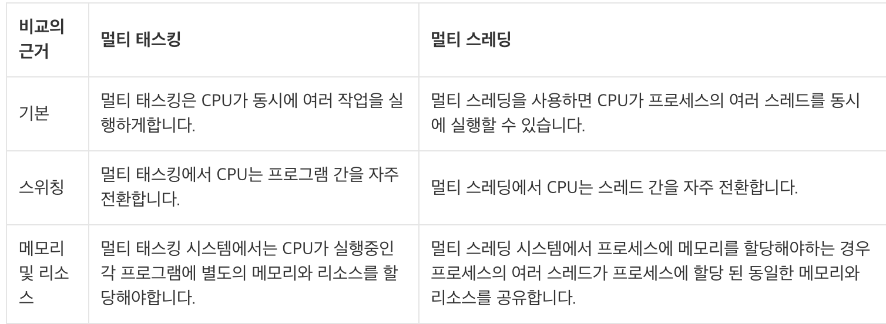

### 멀티쓰레딩의 장단점

**장점**

- cpu의 사용률을 향상시킨다.
- 자원을 보다 효율적으로 사용할 수 있다.
- 사용자에 대한 응답성이 향상된다.
- 작업이 분리되어 코드가 간결해진다.
- 서버 프로그램의 경우 멀티 쓰레드로 작성하는 것은 필수적
    - 하나의 서버 프로세스가 여러 개의 쓰레드를 생성해서 쓰레드와 사용자의 요청이 일대일로 처리되도록 프로그래밍 해야 한다.
    - 싱글쓰레드로 서버 프로그램을 작성한다면 사용자의 요청 마다 새로운 프로세스를 생성할  것이고, 이는 쓰레드에 비해 많은 시간과 메모리 공간이 필요하기 때문에 많은 사용자 요청 서비스하기 어렵다

**단점**

- 프로세스 내에서 자원을 공유하면서 작업을 하기 때문에 동기화에 주의
- 교착상태가 발생하지 않도록 주의
- 각 쓰레드가 효율적으로 실행될 수 있게 해야한다.

### 쓰레드의 구현과 실행

1. Thread 클래스를 상속받는 방법
    - 다른 클래스를 상속받을 수 없다.

    ```java
    class MyThread extends Thread {
    		@Override
    		public void run() { ... }
    }
    ```

2. Runnable 인터페이스를 구현하는 방법
    - 일반적
    - 재사용성이 높고 코드의 일관성을 유지할 수 있다.

    ```java
    class MyThread2 implements Runnable {
    		public void run() { ... }
    }
    ```

- Runnable 인터페이스는 오로지 run()만 정의되어 있는 인터페이스
- 쓰레드를 구현한다는 것은 두 방법 모두 쓰레드를 통해 작업하고자 하는 내용으로 run()의 바디를 채우는 것일 뿐이다.
- ex1

    ```java
    class ThreadEx1 {
    	public static void main(String args[]) {
    		ThreadEx1_1 t1 = new ThreadEx1_1();

    		Runnable r  = new ThreadEx1_2();
    		Thread   t2 = new Thread(r);	  // 생성자 Thread(Runnable target)

    		t1.start();
    		t2.start();
    	}
    }

    class ThreadEx1_1 extends Thread {
    	public void run() {
    		for(int i=0; i < 5; i++) {
    			System.out.println(getName()); // 조상인 Thread의 getName()을 호출
    		}
    	}
    }

    class ThreadEx1_2 implements Runnable {
    	public void run() {
    		for(int i=0; i < 5; i++) {
    			// Thread.currentThread() - 현재 실행중인 Thread를 반환한다.
    		    System.out.println(Thread.currentThread().getName());
    		}
    	}
    }

    실행결과
    Thread-0
    Thread-0
    Thread-0
    Thread-0
    Thread-0
    Thread-1
    Thread-1
    Thread-1
    Thread-1
    Thread-1
    ```

    - Thread 클래스 상속한 경우의 인스턴스 생성 방법
        - Thread의 자손클래스의 인스턴스를 생성
        - 자손 클래스에서 조상인 Thread 클래스의 메서드를 직접 호출 가능
    - Runnable 인터페이스 구현한 경우의 인스턴스 생성 방법
        - Runnable 인터페이스를 구현한 클래스의 인스턴스를 생성한 다음
        - 이 인스턴스를 Thread 클래스의 생성자의 매개변수로 제공
        - 실제 Thread 클래스 코드

            ```java
            class Thread implements Runnable {
            	private Runnable target;

            	private Thread(ThreadGroup g, Runnable target, String name, ...) {
            		this.target = target;
            	}

            	@Override
              public void run() {
            		if (target != null) {
            			target.run();
            		}
            	}
            }
            ```

            - 인스턴스 변수로 Runnable타입의 변수 target을 선언해 놓고 생성자를 통해서 해당 인스턴스를 참조하도록 되어 있다.
            - 그리고 run()을 호출하면 참조변수 target을 통해서 Runnable인터페이스를 구현한 인스턴스의 run()이 호출된다.
            - 이렇게함으로써 run()을 오버라이딩하지 않고도 외부로부터 run()을 제공받을 수 있게 된다.
        - Thread 클래스의 static 메서드인 currentThread()를 호출하여 쓰레드에 대한 참조를 얻어 와야한 호출이 가능
            - `static native Thread currentThread()` : 현재 실행중인 쓰레드의 참조를 반환
            - `String final getName()` : 쓰레드의 이름 반환

### 쓰레드의 실행 - start()

- 쓰레드는 start()를 호출해야만 쓰레드가 실행된다.
- 바로 실행되는 것이 아니라, 실행대기 상태에 있다가 자신의 차례가 되어야 실행된다.
- 쓰레드의 실행순서는 OS의 스케쥴러가 작성한 스케쥴에 의해 결정된다.
- 한 번 실행이 종료된 쓰레드는 다시 실행할 수 없다.
    - 즉 하나의 쓰레드의 대해 start()가 한 번만 호출될 수 있다는 듯

```java
ThreadEx1_1 t1 = new ThreadEx1_1();
t1.start();
t1.start(); // 예외 발생

ThreadEx1_1 t1 = new ThreadEx1_1();
t1.start();
t1 = new ThreadEx1_1();
t1.start(); // ok
```

### start()와 run()

- 왜 쓰레드를 실행시킬 때 run()이 아닌 start()??
- main메서드에서 run()을 호출하는 것은 생성된 쓰레드를 싱행시키는 것이 아니라 단순히 클래스에 선언된 메서드를 호출하는 것일 뿐이다.

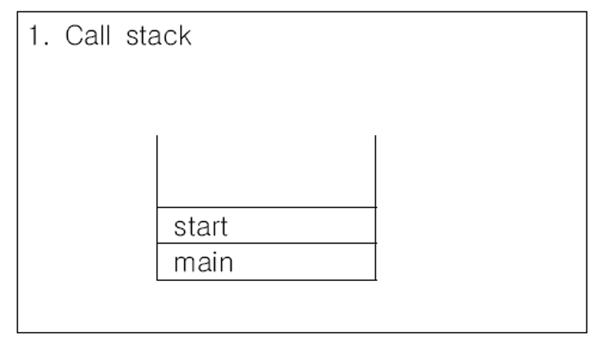

- 반면에 start()는 새로운 쓰레드가 작업을 실행하는데 필요한 call stack을 생성한 다음에 run()을 호출해서, 생성된 호출스택에 run()이 첫 번째로 올라가게 한다.
    - 모든 쓰레드는 독립적인 작업을 수행하기 위해 자신만의 call stack을 필요로 하기 때문에, 새로운 쓰레드를 생성하고 실행시킬 때마다 새로운 call stack이 생성되고 쓰레드가 종료되면 작업에 사용된 call stack은 소멸된다.

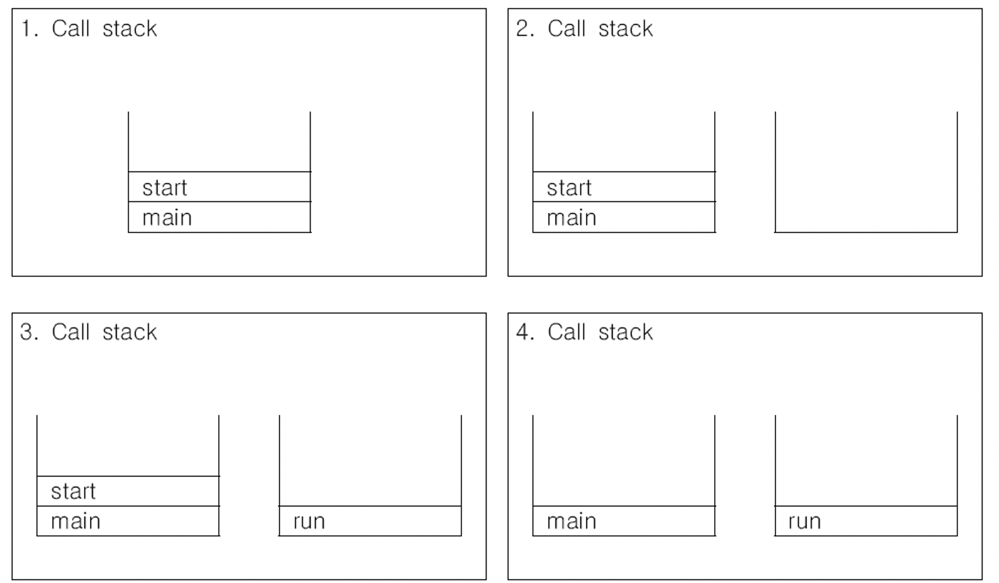

        1. main 메서드에서 쓰레드의 start() 호출
        2. start()는 새로운 쓰레드를 생성하고, call stack 생성
        3. 새로 생성된 호출스택에 run()이 호출되어, 독립된 공간에서 작업 수행
        4. call stack이 2개이므로 스케줄러가 정한 순서에 의해서 번갈아 가면서 실행
- 결국 main메서드의 작업을 수행하는 것도 쓰레드이며, 이를 main 쓰레드라고 한다.
    - main메서드가 수행을 마치면 프로그램이 종료되었지만, 다른 쓰레드가 아직 작업을 마치지 않은 상태라면 프로그램이 종료되지 않는다.
    - 즉 `실행 중인 사용자 쓰레드가 하나도 없을 때 프로그램은 종료`되는 것
- 쓰레드의 종류
    - 사용자 쓰레드
    - 데몬 쓰레드
- ex2

    ```java
    class ThreadEx2 {
    	public static void main(String args[]) throws Exception {
    		ThreadEx2_1 t1 = new ThreadEx2_1();
    		t1.start();
    	}
    }

    class ThreadEx2_1 extends Thread {
    	public void run() {
    		throwException();
    	}

    	public void throwException() {
    		try {
    			throw new Exception();		
    		} catch(Exception e) {
    			e.printStackTrace();	
    		}
    	}
    }

    실행결과
    java.lang.Exception
    	at com.programmers.java.ThreadEx2_1.throwException(Test.java:20)
    	at com.programmers.java.ThreadEx2_1.run(Test.java:15)
    ```

    - 호출스택의 첫 번째 메서드가 main이 아니라 run 메서드이다.
    - 한 쓰레드가 예외가 발생해서 죵로되어도 다른 쓰레드의 실해에는 영향을 미치지 않는다.
    - 메인 쓰레드의 호출스택이 없는 이유는 메인 쓰레드가 이미 종료되었기 때문
- ex3

    ```java
    class ThreadEx3 {
    	public static void main(String args[]) throws Exception {
    		ThreadEx3_1 t1 = new ThreadEx3_1();
    		t1.run();
    	}
    }

    class ThreadEx3_1 extends Thread {
    	public void run() {
    		throwException();
    	}

    	public void throwException() {
    		try {
    			throw new Exception();		
    		} catch(Exception e) {
    			e.printStackTrace();	
    		}
    	}
    }

    실행결과
    java.lang.Exception
    	at com.programmers.java.ThreadEx3_1.throwException(Test.java:20)
    	at com.programmers.java.ThreadEx3_1.run(Test.java:15)
    	at com.programmers.java.ThreadEx3.main(Test.java:9)
    ```

    - 아까와 달리 쓰레드가 생성되지 않았고, 그저 run()이 호출된 것

### 싱글 쓰레드와 멀티 쓰레드

- 두 개의 작업을 하나의 쓰레드(th1)로 처리하는 경우와 두 개의 쓰레드(th1, th2)로  처리하는 경우를 가정해보자(싱글 코어)
- 하나의 쓰레드인 경우 한작업을 마친 후에 다른 작업을 시작한다.
- 두 개의 쓰레드인 경우에는 짧은 시간동안 2개의 쓰레드가 번갈아 가면서 작업을 수행해서 동시에 두 작업이 처리되는 것과 같이 느끼게 한다.

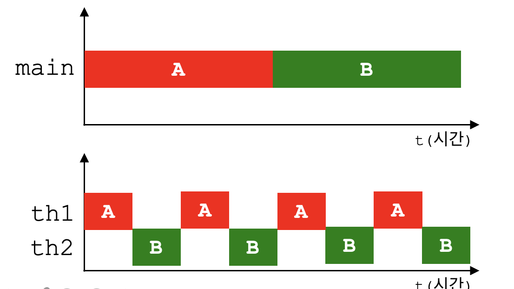

- 작업 수행 시간은 거의 같다.
    - 오히려 두 개의 쓰레드로 작업한 시간이 더 걸린다.
    - 쓰레드간의 context switching에 시간이 걸리기 때문
        - 작업 전환을 할 때는 현재 진행 중인 작업의 상태 등의 정보를 저장하고 읽어 오는 시간이 소요
        - 프로세스의 스위칭은 쓰레드 스위칭보다 더 많은 오버헤드
    - 따라서 싱글코어에서는 cpu만 사용하는 작업이라면 싱글쓰레드가 효율적
    - ex4

        ```java
        class ThreadEx4 {
        	public static void main(String args[]) {
        		long startTime = System.currentTimeMillis();

        		for(int i=0; i < 500; i++)
        			System.out.printf("%s", new String("-"));		

        		System.out.print("소요시간1:" +(System.currentTimeMillis()- startTime)); 

        		for(int i=0; i < 500; i++) 
        			System.out.printf("%s", new String("|"));		

        		System.out.print("소요시간2:"+(System.currentTimeMillis() - startTime));
        	}
        }

        실행결과
        ---------------------------------------------소요시간1:68
        |||||||||||||||||||||||||||||||||||||||||||||소요시간2:117
        ```

    - ex5

        ```java
        class ThreadEx5 {
        	static long startTime = 0;

        	public static void main(String args[]) {
        		ThreadEx5_1 th1 = new ThreadEx5_1();
        		th1.start();
        		startTime = System.currentTimeMillis();

        		for(int i=0; i < 300; i++) {
        			System.out.print("-");
        		}

        		System.out.print("소요시간1:" + (System.currentTimeMillis() - ThreadEx5.startTime));
        	}
        }

        class ThreadEx5_1 extends Thread {
        	public void run() {
        		for(int i=0; i < 300; i++) {
        			System.out.print("|");
        		}

        		System.out.print("소요시간2:" + (System.currentTimeMillis() - ThreadEx5.startTime));
        	}
        }

        실행결과
        싱글코어
        ----|||||-----|||||....소요시간1:25소요시간2:21

        멀티코어
        ---|||----||-|||||--|||||-----||....소요시간2:56-------...소요시간1:62
        ```

        - 더 느린 이유
            1. 앞서 말한 컨텍스트 스위칭 오버헤드
            2. 한 쓰레드가 화면에 출력하고 있는 동안 다른 쓰레드는 출력이 끝나기를 기다려야하는 대기시간

### 싱글코어 vs 멀티코어

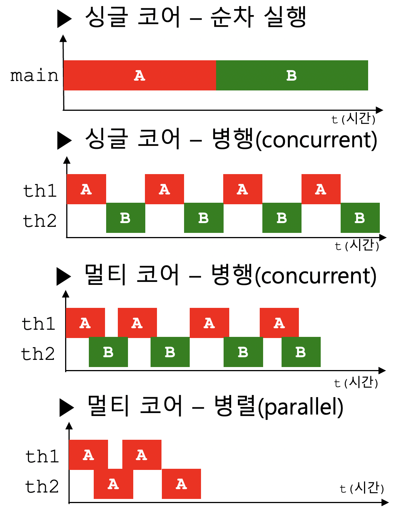

- 싱글 코어인 경우 멀티쓰레드라도 하나의 코어가 번갈아가면서 작업을 수행하는 것이므로 두 작업이 절대 겹치지 않는다.
- 멀티 코어에서는 멀티쓰레드로 두 작업을 수행하면, 동시에 두 쓰레드가 수행될 수 있으므로 3번째 그림 처럼 A와 B가 겹치는 부분 발생
    - 그래서 콘솔이라는 자원을 놓고 두 쓰레드가 경쟁하게 되는 것이다.
- cf) 참고
    - 병행(concurrent) : 여러 쓰레드가 여러 작업을 동시에 진행하는 것을
    - 병렬(parallel) : 하나의 작업을 여러 쓰레드가 나눠서 처리하는 것
- 위의 결과는 실행 중인 예제 프로세스가 OS의 스케줄러의 영향을 받기 때문에 결과가 매번 다를 수 있다.
- JVM의 쓰레드 스케줄러에 의해서 어떤 쓰레드가 얼마동안 실행될 것인지 결정되는 것과 같이 프로세스도 프로세스 스켈줄러에 의해서 실행순서와 실행시간이 결정되기 때문
    - 또한 jvm 종류에 따라 쓰레드 스케줄러의 구현 방법이 다를 수 있다.
- 따라서 쓰레드가 이러한 불확실성을 가지고 있다는 것을 알아야 한다.
- 자바가 OS(플랫폼) 독립적이라고 하지만 종속적인 부분이 있는데 쓰레드도 그 중 하나.

### blocking

- 두 쓰레드가 서로 다른 자원을 사용하는 작업의 경우에는 싱글쓰레드 프로세스보다 멀티쓰레드 프로세스가 더 효율적이다.
    - ex) 사용자로부터 입력받는 작업, 네트워크 파일 전송, 프린터 출력 등 과 같이 외부기기와의 I/O 작업인 경우

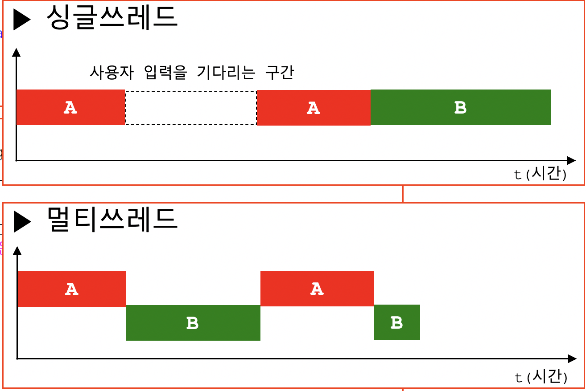

    - A: 사용자 입력받는 작업
    - B: 화면에 출력하는 작업
- ex 6

    ```java
    import javax.swing.JOptionPane;

    class ThreadEx6 {
    	public static void main(String[] args) throws Exception
    	{
    		String input = JOptionPane.showInputDialog("아무 값이나 입력하세요."); 
    		System.out.println("입력하신 값은 " + input + "입니다.");

    		for(int i=10; i > 0; i--) {
    			System.out.println(i);
    			try {
    				Thread.sleep(1000);
    			} catch(Exception e ) {}
    		}
    	}
    }
    ```

    - 입력을 마치지 전까지 화면에 숫자 출력 x
- ex 7

    ```java
    import javax.swing.JOptionPane;

    class ThreadEx7 {
    	public static void main(String[] args) throws Exception 	{
    		ThreadEx7_1 th1 = new ThreadEx7_1();
    		th1.start();

    		String input = JOptionPane.showInputDialog("아무 값이나 입력하세요."); 
    		System.out.println("입력하신 값은 " + input + "입니다.");
    	}
    }

    class ThreadEx7_1 extends Thread {
    	public void run() {
    		for(int i=10; i > 0; i--) {
    			System.out.println(i);
    			try {
    				sleep(1000);
    			} catch(Exception e ) {}
    		}
    	}
    }
    ```

    - 두 개의 쓰레드로나누어서 처리했기 때문에 입력을 마치지 않았어도 화면에 숫자가 출력

### 쓰레드의 우선순위

- 쓰레드는 priority라는 멤버변수를 가지고 있다.
    - 이 값에 따라 쓰레드가 얻는 실행시간이 달라진다.
    - 쓰레드가 수행하는 작업의 중요도에 따라 쓰레드의 우선순위를 서로 다르게 지정하여 특정 쓰레드가 `더 많은 작업시간`을 갖도록 할 수 있다.
- 우선순위 지정하는 법

    ```java
    public final void setPriority(int newPriority)
    public final int getPriority() { return priority; }

    public static final int MIN_PRIORITY = 1; // 최소
    public static final int NORM_PRIORITY = 5; 
    public static final int MAX_PRIORITY = 10; // 최대 우선순위
    ```

    - 1~10 범위, 숫자가 높을수록 우선순위가 높다
    - 쓰레드의 우선순위는 쓰레드를 생성한 쓰레드로부터 상속받는다.
        - main 쓰레드는 우선순위가 5
        - 따라서 main내에서 생성하는 쓰레드의 우선순위는 5

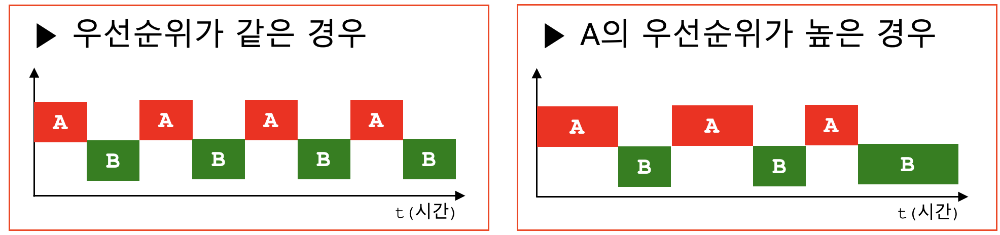

- 싱글코어일때
- `멀티코어`에서는 `쓰레드의 우선순위에 따른 차이가 전혀 없다.`
    - JVM이 우선순위를 완전히 충족하더라도 멀티 코어 CPU는 두 스레드를 동시에 실행할 수 있습니다.
    - 활성 스레드 수가 CPU가 동시에 실행할 수 있는 프로세스 수(하이퍼스레딩 CPU = Core * Core의 스레드 수)를 초과하는 경우에만 우선 순위가 표시됩니다.
    - [https://stackoverflow.com/questions/44559886/why-doesnt-the-thread-with-lesser-priority-executes-after-the-thread-with-highe](https://stackoverflow.com/questions/44559886/why-doesnt-the-thread-with-lesser-priority-executes-after-the-thread-with-highe)
    - 특정 OS의 스케쥴링 정책과 jvm의 구현을 직접 확인해봐야한다.
    - 차라리 우선순위큐를 사용해라

### 쓰레드 그룹

- 서로 관련된 쓰레드를 그룹으로 다루기 위한 것(보안)
    - 다른 쓰레드 그룹의 쓰레드를 변경할 수는 없다.
- 모든 쓰레드는 반드시 하나의 그룹에 포함되어 있어야 한다.
- 쓰레드 그룹을 지정하지 않고 생성한 쓰레드는 `main 쓰레드 그룹` 에 속한다.
- 부모 쓰레드의 그룹과 우선순위를 상속받는다.
- ThreadGroup을 사용해서 생성 가능

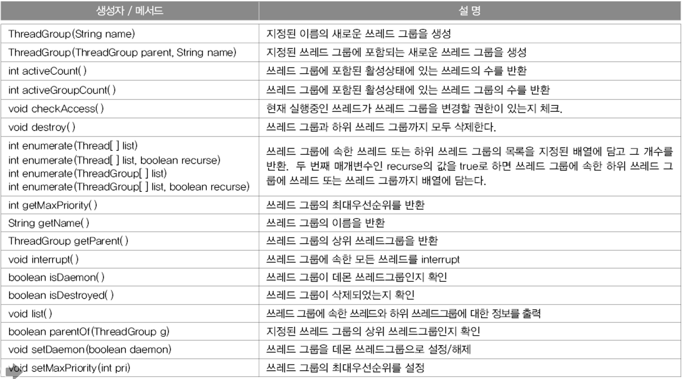

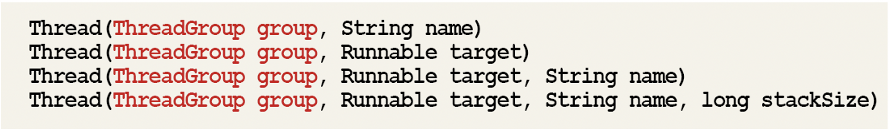

- 자바 어플리케이션이 실행되면 jvm은 main과 system이라는 쓰레드 그룹을 만들고 필요한 쓰레드들을 생성해서 이 쓰레드 그룹에 포함시킨다.
    - ex) 가비지 컬렉션을 수행하는 Finalizer 쓰레드는 system 쓰레드 그룹에 속한다.
- Thread의 쓰레드 그룹과 관련된 메서드

    ```java
    public final ThreadGroup getThreadGroup() {
            return group;
        }
    ```

- ex9

    ```java
    class ThreadEx9 {
    	public static void main(String args[]) throws Exception {
    		ThreadGroup main = Thread.currentThread().getThreadGroup();
    		ThreadGroup grp1 = new ThreadGroup("Group1");
    		ThreadGroup grp2 = new ThreadGroup("Group2");

    		// ThreadGroup(ThreadGroup parent, String name) 
    		ThreadGroup subGrp1 = new ThreadGroup(grp1,"SubGroup1"); 

    		grp1.setMaxPriority(3);	// 쓰레드 그룹 grp1의 최대우선순위를 3으로 변경.
    		
    		Runnable r = new Runnable() {
    			public void run() {
    				try { 
    					Thread.sleep(1000); // 쓰레드를 1초간 멈추게 한다.
    				} catch(InterruptedException e) {}
    			}	
    		};

             // Thread(ThreadGroup tg, Runnable r, String name)
    		Thread th1 = new Thread(grp1,     r, "th1"); 
    		Thread th2 = new Thread(subGrp1,  r, "th2");
    		Thread th3 = new Thread(grp2,     r, "th3");   

    		th1.start();
    		th2.start();
    		th3.start();

    		System.out.println(">>List of ThreadGroup : "+ main.getName() 
                               +", Active ThreadGroup: " + main.activeGroupCount()
                               +", Active Thread: "      + main.activeCount());
    		main.list();
    	}
    }

    실행결과
    >>List of ThreadGroup : main, Active ThreadGroup: 3, Active Thread: 4
    java.lang.ThreadGroup[name=main,maxpri=10]
        Thread[main,5,main]
        java.lang.ThreadGroup[name=Group1,maxpri=3]
            Thread[th1,3,Group1]
            java.lang.ThreadGroup[name=SubGroup1,maxpri=3]
                Thread[th2,3,SubGroup1]
        java.lang.ThreadGroup[name=Group2,maxpri=10]
            Thread[th3,5,Group2]
    ```

    - 새로 생성한 모든 쓰레드 그룹은 main 쓰레드 그룹의 하위 쓰레드 그룹으로 포함되어 있다.
    - setMaxPriority()는 쓰레드가 쓰레드 그룹에 추가되기 이전에 호출되어야 한다.
    - 참조변수 없이 쓰레드를 생성해서 실행시켜도 가바지 컬렉터의 제거 대상이 되지 않는다.
        - 쓰레드의  참조가 쓰레드 그룹에 저장
        - 되어 있기 때문

### 데몬 쓰레드

- 다른 일반 쓰레드(데몬 쓰레드가 아닌 쓰레드)의 작업을 돕는 보조적인 역할을 수행하는 쓰레드
- 일반 쓰레드가 모두 종료되면 데몬 쓰레드는 강제적으로 자동 종료
    - 일반 쓰레드의 보조 역할이므로 존재할 이유가 없다.
- Ex) 가바지 컬렉터, 워드프로세서의 자동저장, 화면자동갱신 등
- 데몬 쓰레드는 무한루프와 조건문을 이용해서 실행 후 대기하고 있다가 특정 조건이 만족되면 작업을 수행하고 다시 대기하도록 작성한다.
    - 일반 스레드의 작성방법과 실행방법은 같다.
    - 하지만 쓰레드 생성 후 실행하기전에 setDaemon(true) 호출
    - 데몬 쓰레드가 생성한 쓰레드는 자동적으로 데몬 쓰레드

    ```java
    private boolean daemon = false;

    public final boolean isDaemon() {
        return daemon;
    }

    public final void setDaemon(boolean on) {
            checkAccess();
            if (isAlive()) {
                throw new IllegalThreadStateException();
            }
            daemon = on;
        }
    ```

- ex 10

    ```java
    class ThreadEx10 implements Runnable  {
    	static boolean autoSave = false;

    	public static void main(String[] args) {
    		Thread t = new Thread(new ThreadEx10());
    		t.setDaemon(true);		// 이 부분이 없으면 종료되지 않는다.
    		t.start();

    		for(int i=1; i <= 10; i++) {
    			try{
    				Thread.sleep(1000);
    			} catch(InterruptedException e) {}
    			System.out.println(i);
    			
    			if(i==5)
    				autoSave = true;
    		}

    		System.out.println("프로그램을 종료합니다.");
    	}

    	public void run() {
    		while(true) {
    			try { 
    				Thread.sleep(3 * 1000);	// 3초마다
    			} catch(InterruptedException e) {}	

    			// autoSave의 값이 true이면 autoSave()를 호출한다.
    			if(autoSave) {
    				autoSave();
    			}
    		}
    	}

    	public void autoSave() {
    		System.out.println("작업파일이 자동저장되었습니다.");
    	}
    }

    실행결과
    1
    2
    3
    4
    5
    작업파일이 자동저장되었습니다.
    6
    7
    8
    작업파일이 자동저장되었습니다.
    9
    10
    프로그램을 종료합니다.
    ```

### 쓰레드의 실행제어

- 쓰레드 프로그래밍이 어려운 이유는 동기화와 스케줄링
- 정교한 스케줄링을 통해 효율적으로 해야한다.
- resume(), stop(), suspend()는 쓰레드를 교착상태로 만들기 쉽기 때문에 deprecated

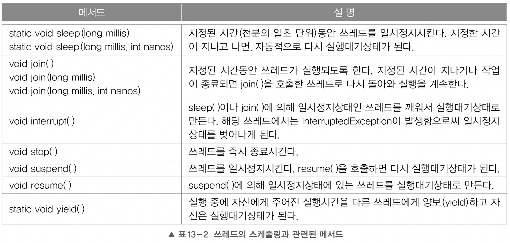

### 쓰레드의 상태

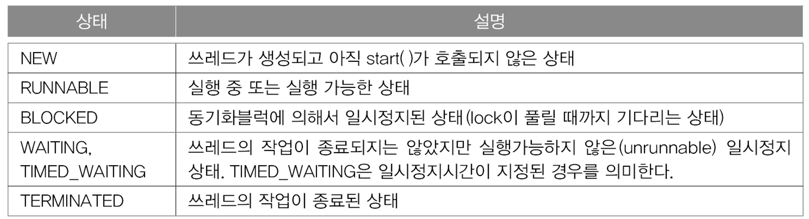

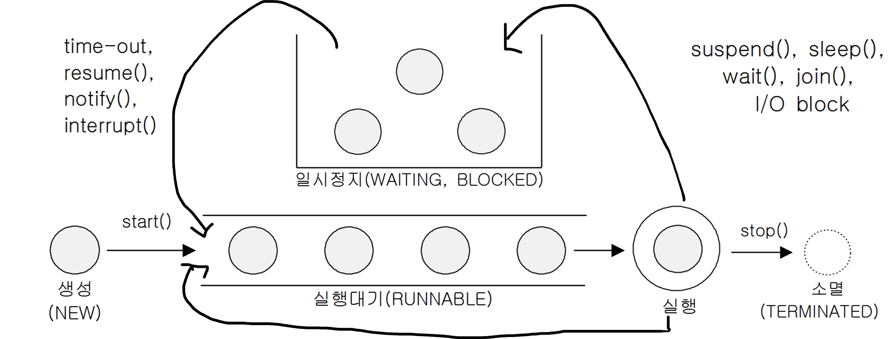

- 쓰레드를 생성하고 start()를 호출하면 실행대기열에 저장되어 기다린다.
    - 대기열은 큐와 같은 구조
- 실행대기상태에 있다가 자신의 차례가 되면 실행상태가 된다.
- 주어진 실행시간이 다되거나 yield()를 만나면 다시 실행대기 상태
- 실행중에 suspend, sleep, wait, join, i/o block에 의해 일시정지상태가 될 수 있다.
    - i/o block은 입출력작업에서 발생하는 지연상태
- 일시정지시간이 다되거나, notifiy, resume, interrupt가 호출되면 다시 실행대기열에 저장
- 실행을 모두 마치거나 stop이 호출되면 쓰레드 소멸

### sleep(long millis)

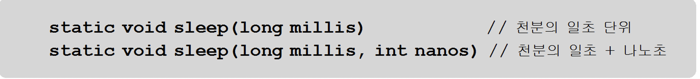

- 현재 쓰레드를 지정된 시간동안 멈춘다.
- 예외처리를 해야한다.
- 특정 쓰레드를 지정해서 멈출수는 없다.

### interrupt(), interrupted()


- 쓰레드의 작업을 취소한다.
    - 멈추라고 요청만 하는 것일 뿐 강제 종료 x
    - interrupted라는 인스턴스 변수를 바꾸는 것뿐
- 대기상태인 쓰레드를 실행대기 상태로 변경

### suspend(), resume(), stop()


- 쓰레드의 상태를 일시정지, 재개, 완전정지 시킨다.
- 교착상태가 일어나기 쉬워 deprecated

### yeild()

- 남은 시간을 다음 쓰레드에게 양보, 자신은 실행대기 상태 변경
- yeild와 intterupt를 적절히 사용하면 응답성과 효율성 높일 수 있다.

### join()


- 지정된 시간동안 특정 쓰레드가 작업하는 것을 기다린다.
- 예외처리를 해야한다.

### 쓰레드의 동기화

- 멀티 쓰레드 프로세스의 경우 여러 쓰레드가 같은 프로세스 내의 자원을 공유해서 작업하기 때문에 서로의 작업에 영향을 주게 된다.
    - 만약 쓰레드 A가 작업하던 도중에 다른 쓰레드 B에게 제어권이 넘어갔을 때
    - 쓰레드 A가 작업하던 공유 데이터를 B가 변경하였고
    - A가 제어권을 받아서 나머지 작업을 마쳤을 때, 원래 의도했던 것과는 다른 결과를 얻을 수 있다.
- 이처럼 임계영역에 락을 걸어 한 쓰레드가 진행 중인 작업을 다른 쓰레드가 간섭하지 못하도록 막는 것을 `'쓰레드의 동기화'` 라고 한다.
    - 자바에서는 synchronized
    - jdk 1.5부터 `'java.util.concurrent.locks'` 와 `'java.util.concurrent.atomic'` 패키지를 통해서 다양한 방식으로 동기화를 구현할 수 있다.

### synchronized를 이용한 동기화


- 키워드를 메서드에 붙이면 메서드 전체가 임계 영역으로 설정된다.
    - 쓰레드는 메서드가 호출된 시점부터 해당 메서드가 포함된 객체의 Lock을 얻어 작업을 수행하다가 메서드가 종료되면 lock을 반환한다.
- 메서드 내의 코드 일부를 블럭으로 감싸고 블럭 앞에 키워드(참조변수)를 붙이는 것
    - 이 때 참조변수는 락을 걸고자하는 객체를 참조하는 것이어야 한다.
    - synchronized 블럭이라고 부르며, 이 블럭의 영역 안으로 들어가면서 부터는 쓰레드는 지정된 객체의 lock을 얻게 되고, 블럭을 벗어나면 lock 반납한다.
- 모든 객체는 lock을 하나씩 가지고 있으며, 해당 객체의 lock을 가지고 있는 쓰레드만 임계 영역의 코드를 수행할 수 있다.
- 다른 쓰레드들은 lock을 얻을 때 까지 기다리게 된다.
- 임계 영역은 멀티쓰레드 프로그램의 성능을 좌우하기 때문에 가능하면 임계영역을 최소화해야 한다.
- Ex 21

    ```java
    class ThreadEx21 {
    	public static void main(String args[]) {
    		Runnable r = new RunnableEx21();
    		new Thread(r).start(); // ThreadGroup에 의해 참조되므로 gc대상이 아니다.
    		new Thread(r).start(); // ThreadGroup에 의해 참조되므로 gc대상이 아니다.
    	}
    }

    class Account {
    	private int balance = 1000;

    	public  int getBalance() {
    		return balance;
    	}

    	public void withdraw(int money){
    		if(balance >= money) {
    			try { Thread.sleep(1000);} catch(InterruptedException e) {}
    			balance -= money;
    		}
    	} // withdraw
    }

    class RunnableEx21 implements Runnable {
    	Account acc = new Account();

    	public void run() {
    		while(acc.getBalance() > 0) {
    			// 100, 200, 300중의 한 값을 임으로 선택해서 출금(withdraw)
    			int money = (int)(Math.random() * 3 + 1) * 100;
    			acc.withdraw(money);
    			System.out.println("balance:"+acc.getBalance());
    		}
    	} // run()
    }

    실행결과
    balance:800
    balance:800
    balance:500
    balance:200
    balance:100
    balance:100
    balance:-200
    balance:-300
    ```

    - 200원 남았을 때 100원 출금하려 했을 때 따른 쓰레드가 끼어들어 200원 출금하고 그 후 100원을 출금하는 경우가 있기 때문
    - 임계 영역으로 묶어야 한다.

        ```java
        public synchronized void withdraw(int money)

        or

        synchronized(this) {
            if (balance >= money) {
                try {
                    Thread.sleep(1000);
                } catch (InterruptedException e) {
                }
                balance -= money;
            }
        }
        ```

### wait()과 notify()

- 동기화의 효율을 높이기 위해 사용
- Object 클래스에 정의되어 있으며, 동기화 블록 내에서만 사용할 수 있다.
- wait() : 객체의 lock을 반납하고 쓰레드를 해당 객체의 waiting pool에 넣는다.
- notify(): waiting pool에서 대기중인 쓰레드 중의 하나를 깨운다.
- norifyAll(): waiting pool에서 대기중인 모든 쓰레드를 깨운다.
    - waiting pool은 객체마다 존재하는 것이므로 모든 객체의 waiting pool에 있는 쓰레드가 깨워지는 것은 아니다.
    - norifyAll이 호출된 객체의 wating pool에 대기중인 쓰레드만 해당
- 하지만 오래 기다린 쓰레드가 락을 얻는다는 보장이 없다.
    - lock을 얻을 수 있는 것은 하나일 뿐

### 쓰레드 동기화 예제

- 첫 번쨰

    ```java
    import java.util.ArrayList;

    class ThreadWaitEx1 {
    	public static void main(String[] args) throws Exception {
    		Table table = new Table(); // 여러 쓰레드가 공유하는 객체

    		new Thread(new Cook(table), "COOK1").start();
    		new Thread(new Customer(table, "donut"),  "CUST1").start();
    		new Thread(new Customer(table, "burger"), "CUST2").start();
    	
    		// 0.1초(100 밀리 세컨드) 후에 강제 종료시킨다.
    		Thread.sleep(100);
    		System.exit(0);
    	}
    }

    // customer
    class Customer implements Runnable {
    	private Table table;
    	private String food;

    	Customer(Table table, String food) {
    		this.table = table;  
    		this.food  = food;
    	}

    	public void run() {
    		while(true) {
    			try { Thread.sleep(10);} catch(InterruptedException e) {}
    			String name = Thread.currentThread().getName();
    			
    			if(eatFood())
    				System.out.println(name + " ate a " + food);
    			else 
    				System.out.println(name + " failed to eat. :(");
    		} // while
    	}

    	boolean eatFood() { return table.remove(food); }
    }

    // cook
    class Cook implements Runnable {
    	private Table table;
    	
    	Cook(Table table) {	this.table = table; }

    	public void run() {
    		while(true) {
    			// 임의의 요리를 하나 선택해서 table에 추가한다.
    			int idx = (int)(Math.random()*table.dishNum());
    			table.add(table.dishNames[idx]);

    			try { Thread.sleep(1);} catch(InterruptedException e) {}
    		} // while
    	}
    }

    // table
    class Table {
    	String[] dishNames = { "donut","donut","burger" }; // donut이 더 자주 나온다.
    	final int MAX_FOOD = 6;  // 테이블에 놓을 수 있는 최대 음식의 개수
    	
    private ArrayList<String> dishes = new ArrayList<>();

    	public void add(String dish) {
    		// 테이블에 음식이 가득찼으면, 테이블에 음식을 추가하지 않는다.
    		if(dishes.size() >= MAX_FOOD)	
    			return;
    		dishes.add(dish);
    		System.out.println("Dishes:" + dishes.toString());
    	}

    	public boolean remove(String dishName) {
    		// 지정된 요리와 일치하는 요리를 테이블에서 제거한다. 
    		for(int i=0; i<dishes.size();i++)
    			if(dishName.equals(dishes.get(i))) {
    				dishes.remove(i);
    				return true;
    			}

    		return false;
    	}

    	public int dishNum() { return dishNames.length; }
    }
    ```

    - 요리사 쓰레드가 테이블에 음식을 추가하는 와중에, 손님 쓰레드가 음식을 가져가려하기 때문에 발생하는 예외(ConcurrentModificationException)
    - 손님 쓰레드가 마지막 음식을 삭제하는 와중에 다른 손님 쓰레드가 음식을 가져가서 발생하는 예외(IndexOutOfBoundsException)
- 두번째 시도 - synchronized

    ```java
    import java.util.ArrayList;

    class Customer implements Runnable {
    	private Table table;
    	private String food;

    	Customer(Table table, String food) {
    		this.table = table;  
    		this.food  = food;
    	}

    	public void run() {
    		while(true) {
    			try { Thread.sleep(10);} catch(InterruptedException e) {}
    			String name = Thread.currentThread().getName();
    			
    			if(eatFood())
    				System.out.println(name + " ate a " + food);
    			else 
    				System.out.println(name + " failed to eat. :(");
    		} // while
    	}

    	boolean eatFood() { return table.remove(food); }
    }

    class Cook implements Runnable {
    	private Table table;
    	
    	Cook(Table table) {	this.table = table; }

    	public void run() {
    		while(true) {
    			int idx = (int)(Math.random()*table.dishNum());
    			table.add(table.dishNames[idx]);
    			try { Thread.sleep(100);} catch(InterruptedException e) {}
    		} // while
    	}
    }

    class Table {
    	String[] dishNames = { "donut","donut","burger" };
    	final int MAX_FOOD = 6;
    	private ArrayList<String> dishes = new ArrayList<>();

    	public synchronized void add(String dish) { // synchronized를 추가
    		if(dishes.size() >= MAX_FOOD)	
    			return;
    		dishes.add(dish);
    		System.out.println("Dishes:" + dishes.toString());
    	}

    	public boolean remove(String dishName) {
    		synchronized(this) {	
    			while(dishes.size()==0) {
    				String name = Thread.currentThread().getName();
    				System.out.println(name+" is waiting.");
    				try { Thread.sleep(500);} catch(InterruptedException e) {}	
    			}

    			for(int i=0; i<dishes.size();i++)
    				if(dishName.equals(dishes.get(i))) {
    					dishes.remove(i);
    					return true;
    				}
    		} // synchronized

    		return false;
    	}

    	public int dishNum() { return dishNames.length; }
    }

    class ThreadWaitEx2 {
    	public static void main(String[] args) throws Exception {
    		Table table = new Table(); // 여러 쓰레드가 공유하는 객체

    		new Thread(new Cook(table), "COOK1").start();
    		new Thread(new Customer(table, "donut"),  "CUST1").start();
    		new Thread(new Customer(table, "burger"), "CUST2").start();
    	
    		Thread.sleep(5000);
    		System.exit(0);
    	}
    }

    실행결과
    Dishes:[burger]
    CUST1 is waiting.
    CUST2 ate a burger
    CUST1 is waiting.
    CUST1 is waiting.
    CUST1 is waiting.
    CUST1 is waiting.
    CUST1 is waiting.
    CUST1 is waiting.
    CUST1 is waiting.
    CUST1 is waiting.
    CUST1 is waiting.
    ```

    - 테이블 클래스의 add()와 remove() 동기화하였다.
    - 하지만 실행해보면 요리사 쓰레드는 음식을 추가하지 않고 손님 쓰레드는 계속 기다린다.
    - 손님 쓰레드가 테이블 객체의 lockd을 쥐고 기다리기 때문

        ```java
        public boolean remove(String dishName) {
        		synchronized(this) {	
        			while(dishes.size()==0) {
        				String name = Thread.currentThread().getName();
        				System.out.println(name+" is waiting.");
        				try { Thread.sleep(500);} catch(InterruptedException e) {}	
        			}

        			for(int i=0; i<dishes.size();i++)
        				if(dishName.equals(dishes.get(i))) {
        					dishes.remove(i);
        					return true;
        				}
        		} // synchronized

        		return false;
        	}
        ```

        - 요리사 쓰레드가 음식을 추가하려고 해도 테이블 객체의 lock을 얻을 수가 없어서 불가능
- wait & notify 사용

    ```java
    import java.util.ArrayList;

    class Customer implements Runnable {
    	private Table table;
    	private String food;

    	Customer(Table table, String food) {
    		this.table = table;  
    		this.food  = food;
    	}

    	public void run() {
    		while(true) {
    			try { Thread.sleep(100);} catch(InterruptedException e) {}
    			String name = Thread.currentThread().getName();
    			
    			table.remove(food);
    			System.out.println(name + " ate a " + food);
    		} // while
    	}
    }

    class Cook implements Runnable {
    	private Table table;
    	
    	Cook(Table table) {	this.table = table; }

    	public void run() {
    		while(true) {
    			int idx = (int)(Math.random()*table.dishNum());
    			table.add(table.dishNames[idx]);
    			try { Thread.sleep(10);} catch(InterruptedException e) {}
    		} // while
    	}
    }

    class Table {
    	String[] dishNames = { "donut","donut","burger" }; // donut의 확률을 높인다.
    	final int MAX_FOOD = 6;
    	private ArrayList<String> dishes = new ArrayList<>();

    	public synchronized void add(String dish) {
    		while(dishes.size() >= MAX_FOOD) {
    				String name = Thread.currentThread().getName();
    				System.out.println(name+" is waiting.");
    				try {
    					wait(); // COOK쓰레드를 기다리게 한다.
    					Thread.sleep(500);
    				} catch(InterruptedException e) {}	
    		}
    		dishes.add(dish);
    		notify();  // 기다리고 있는 CUST를 깨우기 위함.
    		System.out.println("Dishes:" + dishes.toString());
    	}

    	public void remove(String dishName) {

    		synchronized(this) {	
    			String name = Thread.currentThread().getName();

    			while(dishes.size()==0) {
    					System.out.println(name+" is waiting.");
    					try {
    						wait(); // CUST쓰레드를 기다리게 한다.
    						Thread.sleep(500);
    					} catch(InterruptedException e) {}	
    			}

    			while(true) {
    				for(int i=0; i<dishes.size();i++) {
    					if(dishName.equals(dishes.get(i))) {
    						dishes.remove(i);
    						notify(); // 잠자고 있는 COOK을 깨우기 위함 
    						return;
    					}
    				} // for문의 끝

    				try {
    					System.out.println(name+" is waiting.");
    					wait(); // 원하는 음식이 없는 CUST쓰레드를 기다리게 한다.
    					Thread.sleep(500);
    				} catch(InterruptedException e) {}	
    			} // while(true)
    		} // synchronized
    	}

    	public int dishNum() { return dishNames.length; }
    }

    class ThreadWaitEx3 {
    	public static void main(String[] args) throws Exception {
    		Table table = new Table();

    		new Thread(new Cook(table), "COOK1").start();
    		new Thread(new Customer(table, "donut"),  "CUST1").start();
    		new Thread(new Customer(table, "burger"), "CUST2").start();
    	
    		Thread.sleep(2000);
    		System.exit(0);
    	}
    }
    ```

    - 하지만 테이블 객체의 waiting pool에 요리사 쓰레드와 손님 쓰레드가 같이 기다리는 것이다.
        - 그래서 notify()가 호출되었을 때, 요리사 쓰레드와 손님 쓰레드 중에서 누가 통지를 받을지 알 수 없다.
    - 만약 테이블의 음식이 줄어들어서 notify()가 호출되었다면, 요리사 쓰레드가 통지를 받아야 한다.
        - 하지만 랜덤 통지
        - 손님 쓰레드가 통지를 받으면 lock을 얻어도 여전히 음식이 없어서 다시 waiting pool에 들어간다.

### 기아 현상과 경쟁 상태

- 위의 예제에서 운이 나쁘면 요리사 쓰레드는 계속 통지를 받지 못하고 오랫동안 기다리게 된다.
    - 이것을 기아 현상이라고 한다.
- 기아현상을 막으려면 notify → notifyAll()을 사용해야 한다.
    - 일단 모든 쓰레드에게 통지를 하면, 손님 쓰레드는 다시 waiting pool에 들어가더라도
    - 요리사는 결국 lock을 얻어서 작업을 진행할 수 있기 때문
- 기아 현상은 막았지만 손님 쓰레드까지 텅지를 받아서 요리사 쓰레드와 lock을 얻기 위해 경쟁하게 된다.
    - 이처럼 여러 쓰레드가 lock을 얻기 위해 서로 경쟁하는 것을 경쟁 상태라고 한다.
    - 따라서 요리사 쓰레드와 손님 쓰레드를 구별해서 통지하느 것이 필요하다.
    - lock 과 condition

### Lock과 Condition을 이용한 동기화

- java.util.concurrent.locks 패키지를 이용한 동기화(jdk 1.5)

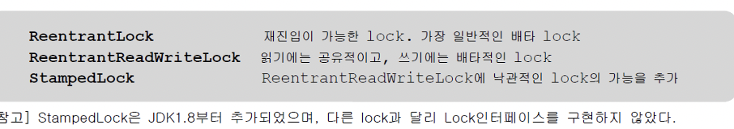

- ReentrantLock
    - 특정 조건에서 lock을 풀고 나중에 다시 lock을 얻고 임계영역으로 들어와서 이후의 작업을 수행할 수 있다.
- ReentrantReadWritLock
    - 읽기 lock이 걸려있으면, 다른 쓰레드가 읽기 lock을 중복해서 걸고 읽기를 수행할 수 있다.
    - 그러나 읽기 lock이 걸린 상태에서 쓰기 lock을 거는 것은 허용되지 않는다.
        - 반대도 마찬가지
- StrampedLock
    - lock을 걸거나 해지할 때 `'스탬프(long 정수값)'` 를 사용하며, 읽기와 쓰기를 위한 Lock외에 `낙관적 읽기 lock` 이 추가된 것
    - 낙관적 읽기 lock은 해당 lock이 걸려있어도 쓰기 lock에 의해 바로 풀린다.
        - 따라서 낙관적 읽기에 실패하면, 읽기 lock을 얻어서 다시 읽어 와야 한다.
        - 무조건 읽기 lock을 걸지 않고, 쓰기와 읽기가 충돌할 때만 쓰기가 끝난 후에 읽기 lock을 거는 것

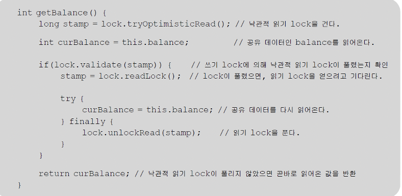

### ReentrantLock을 이용한 동기화

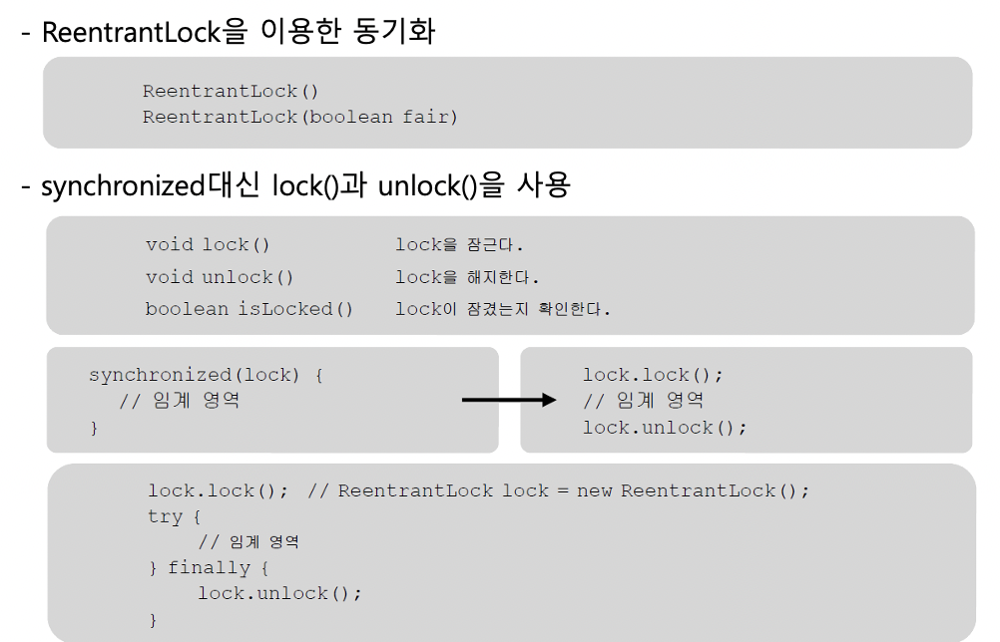

- 생성자에 true를 주면 lock이 풀렸을 때 가장 오래 기다린 쓰레드가 lock을 획득할 수 있게, 공정하게 처리한다.
    - 당연히 성능이 떨어진다.
- 임게 영역 내에서 예외 또는 return으로 빠져 나가게 되면 lock이 풀리지 않을 수 있으므로 unlock은 일반적으로 try - finally
- `boolean tryLock()`
    - lock()은 lock을 얻을 때까지 쓰레드를 블락시키므로 응답성이 나빠질 수 있다.
    - 다른 쓰레드에 의해 lock이 걸려있으면 lock을 얻으려고 기다리지 않는다. 또는 지정된 시간만큼만 기다린다.
    - lock을 얻으면 true
- ex 4

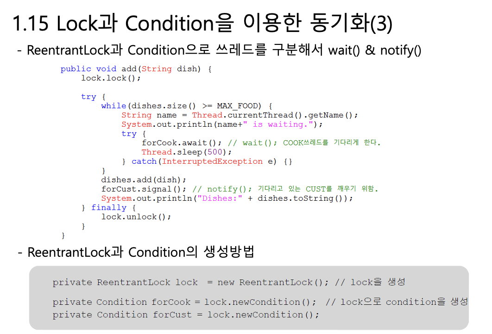

    ```java
    import java.util.ArrayList;
    import java.util.concurrent.locks.ReentrantLock;
    import java.util.concurrent.locks.Condition;

    class Customer implements Runnable {
    	private Table table;
    	private String food;

    	Customer(Table table, String food) {
    		this.table = table;  
    		this.food  = food;
    	}

    	public void run() {
    		while(true) {
    			try { Thread.sleep(100);} catch(InterruptedException e) {}
    			String name = Thread.currentThread().getName();
    			
    			table.remove(food);
    			System.out.println(name + " ate a " + food);
    		} // while
    	}
    }

    class Cook implements Runnable {
    	private Table table;
    	
    	Cook(Table table) {	this.table = table; }

    	public void run() {
    		while(true) {
    			int idx = (int)(Math.random()*table.dishNum());
    			table.add(table.dishNames[idx]);
    			try { Thread.sleep(10);} catch(InterruptedException e) {}
    		} // while
    	}
    }

    class Table {
    	String[] dishNames = { "donut","donut","burger" }; // donut의 확률을 높인다.
    	final int MAX_FOOD = 6;
    	private ArrayList<String> dishes = new ArrayList<>();

    	private ReentrantLock lock = new ReentrantLock();
    	private Condition forCook = lock.newCondition();
    	private Condition forCust  = lock.newCondition();

    	public void add(String dish) {
    		lock.lock();

    		try {
    			while(dishes.size() >= MAX_FOOD) {
    					String name = Thread.currentThread().getName();
    					System.out.println(name+" is waiting.");
    					try {
    						forCook.await(); // wait(); COOK쓰레드를 기다리게 한다.
    						Thread.sleep(500);
    					} catch(InterruptedException e) {}	
    			}

    			dishes.add(dish);
    			forCust.signal(); // notify();  기다리고 있는 CUST를 깨우기 위함.
    			System.out.println("Dishes:" + dishes.toString());
    		} finally {
    			lock.unlock();
    		}
    	}

    	public void remove(String dishName) {
    		lock.lock(); //		synchronized(this) {	
    		String name = Thread.currentThread().getName();

    		try {
    			while(dishes.size()==0) {
    					System.out.println(name+" is waiting.");
    					try {
    						forCust.await(); // wait(); CUST쓰레드를 기다리게 한다.
    						Thread.sleep(500);
    					} catch(InterruptedException e) {}	
    			}

    			while(true) {
    				for(int i=0; i<dishes.size();i++) {
    					if(dishName.equals(dishes.get(i))) {
    						dishes.remove(i);
    						forCook.signal(); // notify();잠자고 있는 COOK을 깨움
    						return;
    					}
    				} // for문의 끝

    				try {
    					System.out.println(name+" is waiting.");
    					forCust.await(); // wait(); // CUST쓰레드를 기다리게 한다.
    					Thread.sleep(500);
    				} catch(InterruptedException e) {}	
    			} // while(true)
    			 // } // synchronized
    		} finally {
    			lock.unlock();
    		}
    	}

    	public int dishNum() { return dishNames.length; }
    }

    class ThreadWaitEx4 {
    	public static void main(String[] args) throws Exception {
    		Table table = new Table();

    		new Thread(new Cook(table), "COOK1").start();
    		new Thread(new Customer(table, "donut"),  "CUST1").start();
    		new Thread(new Customer(table, "burger"), "CUST2").start();
    	
    		Thread.sleep(2000);
    		System.exit(0);
    	}
    }
    ```

    - forCust.await(); // wait(); // CUST쓰레드를 기다리게 한다.
    - forCust.await(); // wait(); CUST쓰레드를 기다리게 한다.

### volatile

- 캐쉬와 메모리간의 불일치 해소
- 멀티 코어 프로세서에서는 코어마다 별도의 캐시를 가진다.
    - 코어는 메모리에서 읽어온 값을 캐시에 저장하고 캐시에서 값을 읽어서 작업한다.
    - 다시 같은 값을 읽어올 때는 먼저 캐시에 있는지 확인하고 없을 때만 메모리에서 읽어온다.
    - 그러다 보니 도중에 메모리에 저장된 변수의 값이 변경되었는데도 캐시에 저장된 값이 갱신되지 않아서 메모리에 저장된 값과 다른 경우가 발생

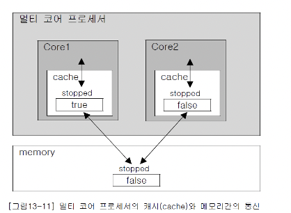

- 하지만 아래의 사진처럼 volatile을 붙이면 코어가 변수의 값을 읽어올 때 캐시가 아닌 메모리에서 읽어오기 때문에 불일치가 해결된다.

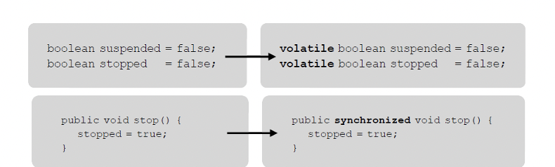

    - volatile 대신 synchronized 블럭도 같은 효과
    - 쓰레드가 synchronized 블럭으로 들어갈 때와 나올 때, 캐시와 메모리간의 동기화가 이루어지기 때문이다.
- jvm은 데이터를 4 byte 단위로 처리하기 때문에 int보다 작은 타입들은 한번에 읽거나 쓰기가 가능
    - 즉 하나의 명령어로 가능
    - 하지만 큰 타입들은 그럴 수 없어서 다른 쓰레드가 끼어들 여지가 있다
    - 그럴 때도 사용하는 키워드
    - 해당 변수에 대한 읽기나 쓰기가 원자화 된다.

### fork & join 프레임워크

- 작업을 여러 쓰레드가 나눠서 처리하는 것을 쉽게 해준다
    - jdk 1.7
- RecursiveAction 또는 RecursiveTask를 상속받아서 구현


    - 두 클래스 모두 compute()라는 추상 메서드를 가지고 있는데, 우리는 상속을 통해 이 추상 메서드를 구현하기만 하면 된다.

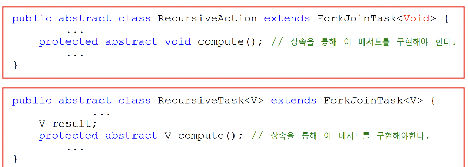

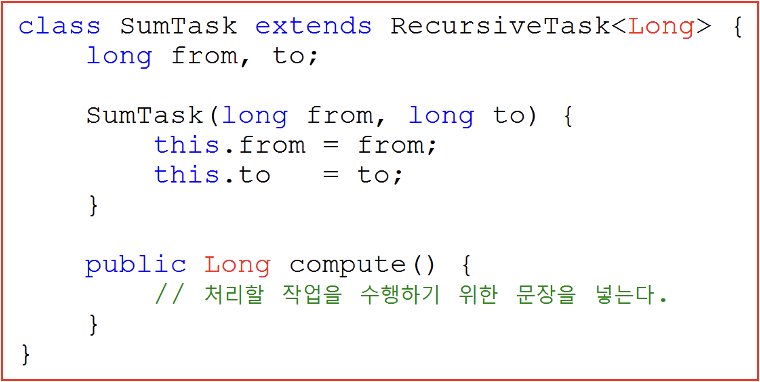

    - 그 다음에는 쓰레드풀과 수행할 작업을 생성하고 `invoke()`로 작업을 시작한다.

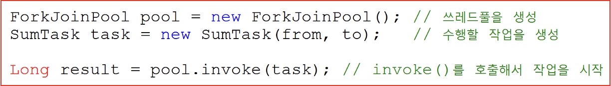

    - ForkJoinPool은 fork & join 프레임웤에서 제공하는 쓰레드 풀로, 지정된 수의 쓰레드를 생성해서 미리 만들어 놓고 반복해서 재사용할 수 있게 한다.
    - 쓰레드를 반복생성하지 않아도 된다는 장점과 너무 많은 쓰레드가 생성되어 성능이 저하되는 것을 막아준다는 장점
    - 쓰레드 풀은 쓰레드가 수행해야하는 작업이 담긴 큐를 제공하며, 각 쓰레드는 자신의 작업 큐에 담긴 작업을 순서대로 처리한다.
    - 기본적으로 코어의 개수와 동일한 개수의 쓰레드 생성

### compute()의 구현

- compute()구현할 때는 수행할 작업 외에도 작업을 어떻게 나눌 것인가에 대해서도 알려줘야 한다.

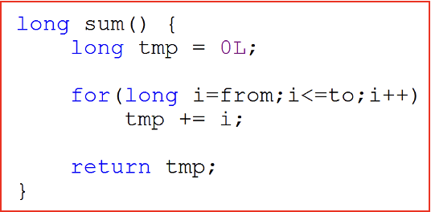

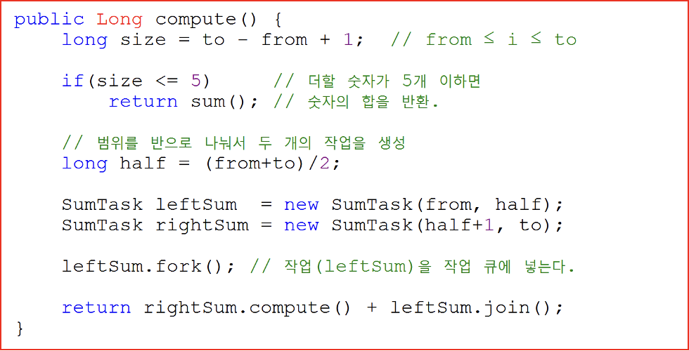


    - sum()을 제외한 나머지 코드들은 작업의 범위를 반으로 나눠서 새로운 작업을 생성해서 실행시키기 위한 것
    - compute()가 호출되면 반으로 나눠서 한 쪽에는 fork()를 호출해서 작업 큐에 저장
    - 하나의 쓰레드는 compute()를 재귀호출하면서 작업을 계속해서 반으로 나누고, 다른 쓰레드는 fork()에 의해 작업 큐에 추가된 작업을 수행한다.

### 작업 훔치기

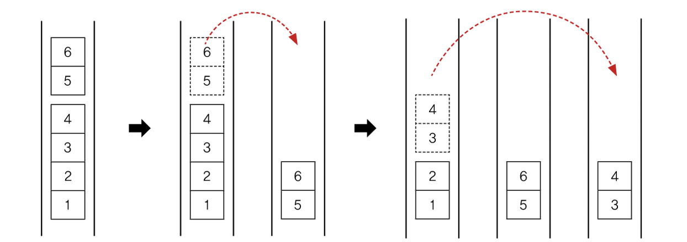

- fork()가 호출되어 작업 큐에 추가된 작업 역시, compute()에 의해 더 이상 나눌 수 없을 때까지 반복해서 나뉘고, 자신의 작업 큐가 비어있는 쓰레드는 다른 쓰레드의 작업 큐에서 작업을 가져와서 수행한다.
- 이것을 작업 훔쳐오기라고 하며, 이 과정은 모두 쓰레드풀에 의해 자동적으로 이루어진다.

### fork()와 join()

- compute()는 작업을 나누고, fork()는 작업을 큐에 넣는다. (반복)
- join()으로 작업의 결과를 합친다. (반복)
- fork와 join의 차이점

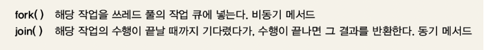

- 비동기 메서드는 메서드를 호출만 할 뿐, 그 결과를 기다리지 않는다.
    - 내부적으로는 다른 쓰레드에게 작업을 수행하도록 지시만 하고 결과를 기다리지 않고 돌아오는 것
- ex 1

    ```java
    import java.util.concurrent.*;

    class ForkJoinEx1 {
    	static final ForkJoinPool pool = new ForkJoinPool();  // 쓰레드풀을 생성

    	public static void main(String[] args) {
    		long from = 1L;
    		long to   = 100_000_000L;

    		SumTask task = new SumTask(from, to);

    		long start = System.currentTimeMillis(); // 시작시간 초기화
    		Long result = pool.invoke(task);

    		System.out.println("Elapsed time(4 Core):"+(System.currentTimeMillis()-start));
    		System.out.printf("sum of %d~%d=%d%n", from, to, result);
    		System.out.println();

    		result = 0L;
    		start = System.currentTimeMillis(); // 시작시간 초기화
    		for(long i=from;i<=to;i++)
    			result += i;

    		System.out.println("Elapsed time(1 Core):"+(System.currentTimeMillis()-start));
    		System.out.printf("sum of %d~%d=%d%n", from, to, result);
    	} // main의 끝
    }

    class SumTask extends RecursiveTask<Long> {
    	long from;
    	long to;

    	SumTask(long from, long to) {
    		this.from = from;
    		this.to    = to;
    	}

    	public Long compute() {
    		long size = to - from;

    		if(size <= 5)     // 더할 숫자가 5개 이하면
    			return sum(); // 숫자의 합을 반환

    		long half = (from+to)/2;

    		// 범위를 반으로 나눠서 두 개의 작업을 생성
    		SumTask leftSum  = new SumTask(from, half);
    		SumTask rightSum = new SumTask(half+1, to);

    		leftSum.fork();

    		return rightSum.compute() + leftSum.join();
    	}

    	long sum() { // from~to의 모든 숫자를 더한 결과를 반환
    		long tmp = 0L; 

    		for(long i=from;i<=to;i++)
    			tmp += i;

    		return tmp;
    	}
    }

    실행결과
    Elapsed time(4 Core):563
    sum of 1~100000000=5000000050000000

    Elapsed time(1 Core):217
    sum of 1~100000000=5000000050000000
    ```

    - for문이 빠르다
    - 작업을 나누가 다시 합치는데 걸리는 시간이 있기 때문
    - 항상 멀티쓰레드가 빠르다고 생각해서는 안된다...~!!~!~@