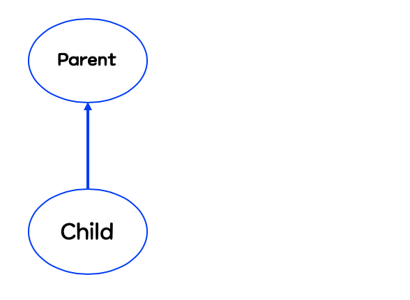

# chap7 객체지향 프로그래밍2

### 상속(inheritance)

- 상속이란, 기존의 클래스를 재사용하여 새로운 클래스를 작성하는 것
- 코드의 추가 및 변경에 매우 용이하다.
- 따라서 코드의 재사용성을 높이고 코드의 중복을 제거하여 프로그램의 생산성과 유지보수성을 높인다.
- 키워드: extends(확장)

    ```java
    class Parent {}
    class Childe extends Parent {}
    ```

    - 이 두 클래스는 서로 상속 관계에 있다고 하며, 상속해주는 클래스를 '조상 클래스', 상속 받는 클래스를 '자손 클래스'
        - 조상 클래스: 부모 클래스, 상위 클래스, 기반 클래스
        - 자손 클래스: 자식클래스, 하위 클래스, 파생된(derived) 클래스
    - 상속 계층도



    - 자손 클래스는 조상클래스의 모든 멤버를 상속받기 때문에, child 클래스는 parent 클래스의 멤버들을 포함한다고 할 수 있다.


    - child 클래스에 새로운 코드가 추가되어도 조상인 parent 클래스는 아무런 영향도 받지 않는다.


    - 즉 조상 클래스가 변경되면 자손 클래스는 자동적으로 영향을 받게 되지만, 자손 클래스가 변경되는 것은 조상 클래스에 아무런 영향을 주지 못한다.
        - 생성자와 초기화 블럭은 상속되지 않는다. 멤버만 상속된다.
        - 자손 클래스의 멤버 개수는 조상 클래스보다 항상 같거나 많다.
        - cf) 접근 제어자가 private 또는 default인 멤버들은 상속되지 않는다기 보다는 상속은 받지만 자손 클래스로부터의 접근이 제한되는 것이다.
    - 만약 또다른 상속

        ```java
        class Parent {
        		int age;
        }
        class Child extends Parent {}
        class Child2 extends Parent {}
        class GrandChild extends Child {}
        ```

        - child 클래스는 grand child 클래스의 직접 조상이고, parent 클래스는 grand child 클래스의 간접 조상, 그래서 parent <> grand child 클래스는 간접적인 상속 관계에 있다고 할 수 있다.
        - 추가된 멤버변수 age는 parent 클래스의 모든 자손에 추가된다.
            - 즉 자손 클래스의 인스턴스를 생성하면 조상 클래스의 멤버와 자손 클래스의 멤버가 합쳐진 하나의 인스턴스로 생성된다.

### 클래스간의 관계 - 포함관계

- 상속이외에도 클래스를 재사용하는 또 다른 방법 존재
- 클래스간에 '포함(composite)' 관계를 맺어 주는 것이다.
    - 클래스 간의 포함관계를 맺어 주는 것은 한 클래스의 멤버변수로 다른 클래스 타입의 참조변수를 선언하는 것을 뜻한다.
    - 이처럼 단위 클래스들을 포함관계로 재사용하면 보다 간결하고 손쉽게 클래스를 작성할 수 있다.
    - 또한 작성된 단위 클래스들은 다른 클래스를 작성하는데 재사용될 수 있을 것이다.

    ```java
    class Circle {
    		int x;
    		int y;
    		int r;
    }

    class Point {
    		int x;
    		int y;
    }

    class Circle {
    		Point c = new Point();
    		int r;

    }
    ```

### 클래스간의 관계 결정하기

- 상속 관계인지 포함 관계인지 혼돈스러울 수 있다.
- is-a 관계인지 has-a 관계인지 생각해서 파악하기
    - circle은 point이다 (circle is a point)
    - circle은 point를 가지고 있다. (circle has a point) >> 정답
- 상속관계 : '~은 ~이다.' (is-a)
- 포함관계: '~은 ~을 가지고 있다.' (has-a)

단일 상속

- 자바에서는 오직 단일 상속만을 허용한다.
- 다중상속은 복합적인 기능을 가진 클래스를 쉽게 작성할 수 있지만
    - 클래스간의 관계가 매우 복잡
    - 서로 다른 클래스로부터 상속받은 멤버간의 이름이 같은 경우 구별할 수 있는 방법이 없음

### Object 클래스 - 모든 클래스의 조상

- Object 클래스는 모든 클래스 상속 계층도의 최상위에 있는 조상클래스이다.
- 다른 클래스로부터 상속 받지 않는 모든 클래스들은 자동적으로 Object 클래스로부터 상속받게 함으로써 이것을 가능하게 한다.
- 그동안 toString()이나 equals(Object o)와 같은 메서드를 따로 정의하지 않고도 사용할 수 있었던 이유는 이 메서드들이 Object 클래스에 정의된 것들이기 때문이다.
    - 11개의 메서드가 정의, 9장에서 학습

### 오버라이딩

- 조상 클래스로부터 상속받은 메서드의 내용을 변경하는 것을 오버라이딩이라고 한다.
- ovveride: ~위에 덮어쓰다
- 조건 - 자손클래스에서 오버라이딩하는 메서드는 조상 클래스의 메서드와
    - 이름이 같아야 한다.
    - 매개변수가 같아야 한다.
    - 반환타입이 같아야 한다.
- 즉 선언부가 서로 일치해야 한다.
- 접근자와 예외는 제한된 조건하에서만 다르게 변경 가능
    1. 접근 제어자는 조상 클래스의 메서드보다 좁은 범위로 변경 할 수 없다.
        - 만약 조상 클래스 메서드의 정의된 접근 제어가 protected라면 이를 오버라이딩하는 자손 클래스의 메서드는 접근 제어자가 protected나 public이어야 한다.
        - 넓은 것에서 좁은 순: public - protected - (default) - private
    2. 조상 클래스의 메서드보다 많은 수의 예외를 선언할 수 없다.

        ```java
        class Parent {
        		void parentMethod() throws IOException, SQLException {}
        }

        // ok
        class Child extends Parent {
        		void parentMethod() throws IOException {} 
        }

        // error
        // Exception은 모든 예외의 최고 조상이므로 가장 많은 개수의 예외를 던진 것
        class Child extends Parent {
        		void parentMethod() throws Exception {} 
        }
        ```

    3. 인스턴스 메서드를 static 메서드로 또는 그 반대로 변경할 수 없다.
        - 만약 조상 클래스에 정의된 static 메서드를 자손 클래스에서 똑같은 이름의 static 메서드로 정의할 수 있나요?
            - okay,
            - 하지만 이것은 각 클래스에 별개의 static 메서드를 정의한 것일 뿐 오버라이딩이 아니다.
            - 각 메서드는 클래스 이름으로 구별될 수 있으며 '클래스이름.메서드이름()'으로 호출하는 것이 바람직
            - static 멤버들은 자신들이 정의된 클래스에 묶여있다고 생각하는 것이 좋음

### 오버로딩 vs 오버라이딩

- 오버로딩: 기존에 없는 새로운 메서드를 정의하는 것, new
- 오버라이딩: 상속받은 메서드의 내용을 변경하는것, change/modify

```java
class Parent {
		void parentMethod() {}
}

class Child extends Parent {
		void parentMethod() {}       // 오버라이딩
		void parentMethod(int i) {}  // 오버로딩

		void childMethod() {}
		void childMethod(int i) {}   // 오버로딩
		void childMethod() {}        // error, 중복정의
}
```

### super

- super는 자손 클래스에서 조상 클래스로부터 상속받은 멤버를 참조하는데 사용되는 참조 변수
- 조상 클래스부터 상속받은 멤버도 자손 클래스 자신의 멤버이므로 this로 사용할 수 있다. 그래서 중복 정의되어 서로 구별해야하는 경우에만 super를 사용하는 것이 좋다.
- 모든 인스턴스 메서드에는 자신이 속한 인스턴스의 주소가 지역변수로 저장되는데, 이것이 참조변수인 this와 super의 값이 된다.
- static 메서드는 인스턴스와 관련 없으므로 super 역시 this처럼 사용 불가능, 인스턴스 메서드에서만 사용 가능

```java
class Point {
		int x;
		int y;
		
		String getLocation() {
				return "x: " + x + ", y :" +  y; 
		}
}

class Point3D extends Point {
		int z;
		String getLocation() {
				return super.getLocation() + ", z :" + z; 
		}
}
```

- 이런식으로 super를 사용해서 조사클래스의 메서드를 포함시키는 것이 좋다.
- 후에 조상클래스의 메서드가 변경되더라도 변경된 내용이 자손클래스의 메서드에 자동적으로 반영될 것이기 때문이다.

### super() - 조상 클래스의 생성자

- this()와 마찬가지로 super()역시 생성자이다.
    - this(): 같은 클래스의 다른 생성자를 호출하는데 사용
    - super(): 조상 클래스의 생성자를 호출하는데 사용
- 생성자의 첫 줄에서 조상클래스의 생성자를 호출해야하는 이유
    - 자손클래스의 멤버가 조상 클래스의 멤버를 사용할 수도 있으므로 조상의 멤버들이 먼저 초기화되어 있어야 한다.
- 이처럼 조상 클래스 생성자의 호출은 클래스의 상속관계를 거슬러 올라가면서 계속 반복
    - 마지막으로 모든 클래스의 최고 조상인 Object 클래스의 생성자인 Object()까지 가서야 끝
- 따라서 Object 클래스를 제외한 모든 클래스의 생성자 첫 줄에 생성자, this() 또는 super()를 호출해야 한다.
    - 그렇지 않으면 컴파일러가 자동적으로 'super();'를 생성자의 첫 줄에 삽입한다.

        ```java
        Point3D(int x, int y, int z) {
        		this.x = x;
        		this.y = y;
        		this.z = z;
        }

        -----------compiler-----------

        Point3D(int x, int y, int z) {
        		super();
        		this.x = x;
        		this.y = y;
        		this.z = z;
        }
        ```

    - 즉 조상 클래스의 멤버변수는 조상의 생성자에 의해 초기화되도록 해야 한다.

### Package

- 패키지란 클래스의 묶음이다.
- 패키지에는 클래스 또는 인터페이스를 포함시킬 수 있으며, 서로 관련된 클래스들끼리 그룹 단위로 묶어 놓음으로써 클래스를 효율적으로 관리할 수 있다.
- 같은 이름의 클래스 일지라도 서로 다른 패키지에 존재 가능하다.
    - 클래스의 실제 이름(full name)은 패키지명을 포함한 것이다.
    - ex) String 클래스의 이름은 java.lang.String
- 클래스는 물리적으로 하나의 클래스파일(.class)
- 패키지는 물리적으로 하나의 디렉토리
- 디렉토리가 하위 디렉토리를 가질 수 있는 것처럼, 패키지도 다른 패키지를 포함할 수 있으며 점('.')으로 구분한다.
- 정리
    - 하나의 소스파일에는 첫 번째 문장으로 단 한 번의 패키지 선언만을 허용한다.
    - 모든 클래스는 반드시 하나의 패키지에 속해야 한다.
    - 패키지는 . 을 구분자로 하여 계층구조로 구성할 수 있다.
    - 패키지는 물리적으로 클래스 파일(.class)을 포함하는 하나의 디렉토리이다.

### 패키지의 선언

- 패키지 선언문은 반드시 소스파일에서 주석과 공백을 제외한 첫 번쨰 문장이어야 한다.
- 허나의 소스파일에 단 한번만 선언 가능
- 해당 소스파일에 포함된 모든 클래스나 인터페이스는 선언된 패키지에 속하게 된다.
- 대소문자를 모두 허용하지만, 클래스명과 쉽게 구분하기 위해서 소문자로 하는 것을 원칙
- 모든 클래스는 반드시 하나의 패키지에 포함되어야 한다
    - 소스파일에서 패키지를 지정하지 않은 클래스는 자바에서 기본적으로 제공하는 '이름없는 패키지(unnamed package)' 때문이다.

```java
package 패키지명;
```

### import 문

- 패키지명이 생략된 클래스 이름을 사용하기 위한 선언문
- 역할: 컴파일러에게 소스파일에 사용된 클래스의 패키지에 대한 정보를 제공하는 것
    - 컴파일 시에 컴파일러는 import문을 통해 소스파일에 사용된 클래스들의 패키지를 알아낸 다음, 이름앞에 패키지명을 붙여준다.

### import문의 선언

- 모든 소스파일에서 import문은 package문 다음에, 그리고 클래스 선언문 이전에 위치해야 한다.
- 여러 번 선언 가능
- 일반적인 소스파일의 구성
    1. package문
    2. import문
    3. 클래스 선언
- 선언법
    1. import 패키지명.클래스명;
    2. import 패키지명.*;
        - 하위 패키지의 클래스까지 포함하는 것은 아니다
    - 실행 시 성능상의 차이는 전혀 없다.
- 모든 소스파일에는 묵시적으로 java.lange.* 패키지 선언되어 있다.

    ```java
    import java.lang.*;
    ```

### static import문

- static import 문을 사용하면 static 멤버를 호출할 때 클래스 이름을 생략할 수 있다.

```java
import static java.lang.Integer.*;
import static java.lang.Math.random;
import static java.lang.System.out;

System.out.println(Math.random());

to

out.println(Math.random());
```

### 제어자(modifier)

- 제어자는 클래스, 변수, 또는 메서드의 선언부에 함께 사용되어 부가적인 의미를 부여
    - 접근 제어자: public, protected, default, private
    - 그 외: static, final, abstract, native, transient, synchrozied, volatile, stricfp
- 제어자는 주로 클래스나 멤버변수와 메서드에 사용, 여러 제어자 조합 가능
- 접근 제어자는 4가지 중 하나만 사용 가능

### static - 클래스의, 공통적인

- '클래스의' 또는 '공통적인'의 의미
- 사용될 수 있는 곳: 멤버변수, 메서드, 초기화 블럭

### final - 마지막의, 변경될 수 없는

- 사용될 수 있는 곳: 클래스, 메서드, 멤버변수, 지역변수
- 클래스
    - 변경될 수 없는 클래스, 확장될 수 없는 클래스가 된다.
    - 이 클래스를 다른 클래스들이 상속불가
    - ex) String, Math 클래스
- 메서드
    - 변경될 수 없는 메서드, 오버라이딩을 통해 재정의 될 수 없다.
- 멤버변수 & 지역변수
    - 값을 변경할 수 없는 상수가 된다.
    - 인스턴스 변수의 경우 생성자에서 초기화 되도록 할 수 있다.

    ```java
    class Card {
    		final int NUMBER;
    		final String KIND;
    		static int width = 100;
    		static int height = 250;

    		Card(String kind, int num) {
    				KIND = kind;
    				NUMBER = number;
    		}
    }
    ```

### abstract - 추상의, 미완성의

- 사용될 수 있는 곳: 클래스, 메서드
- 클래스
    - 클래스 내에 추상 메서드가 선언되어 있음을 의미한다.
- 메서드
    - 선언부만 작성하고 실제 수행내용은 구현하지 않은 추상 메서드를 선언하는데 사용
- 추상 클래스는 미완성 메서드가 존재하는 클래스이므로 인스턴스를 생성할 수 없다.

### 접근 제어자

- 접근 제어자가 사용될 수 있는 곳 - 클래스, 멤버변수, 메서드, 생성자
- 종류
    - private - 같은 클래스 내에서만 접근이 가능하다
    - default - 같은 패키지 내에서만 접근이 가능하다.
    - protected - 같은 패키지 내에서, 그리고 다른 패키지의 자손클래스에서 접근이 가능하다.
    - public - 접근 제한이 없다.
- 범위가 넓은 쪽에서 좁은 쪽의 순서
    - public > protected > (default) > private
- 사용가능한 접근 제어자
    - 클래스: public, default
    - 메서드, 멤버변수: public, protected, default, private
    - 지역변수: 없음
- cf) 하나의 소스파일에는 public 클래스가 단 하나만 존재할 수 있으며, 소스파일의 이름은 반드시 public 클래스의 이름과 같아야 한다


### 접근 제어자를 이용한 캡슐화

- 접근제어자 사용이유
    1. 외부로부터 데이터를 보호하기 위해서
        - 데이터를 유효한 값을 유지하도록 외부에서 변경하지 못하게
        - data hiding, 객체지향개념의 캡슐화
    2. 외부에는 불필요한, 내부적으로만 사용되는, 부분을 감추기 위해서

```java
public class Time {
		private int hour;
		private int minute;
		private int second;

		public int getHour() { return hour; }
		public void setHour() {
				if(hour < 0 || hour > 23) return;
				this.hour = hour;
		}
}
```

- 만약 상속을 통해 확장될 것이 예상되는 클래스라면 private 대신 protected

### 생성자의 접근 제어자

- 생성자에 접근 제어자를 사용함으로써 인스턴스의 생성을 제한 가능
- 보통 생성자의 접근 제어자는 클래스의 접근 제어자와 같지만 다르게 지정 가능
- 생성자가 private인 클래스는 다른 클래스의 조상이 될 수 없다.
    - 생성자의 접근 제어자가 private이므로 자손클래스에서 호출 불가능
    - 따라서 final을 더 추가하여 상속할 수 없는 클래스라는 것을 알리는 것이 좋다.
- ex) 싱글턴

```java
final class Singleton {
		private static Singleton s = new Sington();
		private Singleton() {}

		public static Singleton getInstance() {
				return s;
		}
}
```

### 제어자의 조합

- 클래스: public, default, final, abstract
- 메서드: 모든 접근 제어자, final, abstract, static
- 멤버변수: 모든 접근 제어자, final, static
- 지역변수: final
- 주의사항
    1. 메서드에 static과 abstract를 함께 사용 불가
        - static 메서드는 몸통이 있는 메서드에만 사용 가능
    2. 클래스에 abstract와 final 동시 사용 불가
    3. abstract 메서드의 접근 제어자가 private일 수 없다.
    4. 메서드에 private와 final을 같이 사용할 필요는 없다.
        - 오버라이딩될 수 없기 때문

### 다형성

- 여러 가지 형태를 가질 수 있는 능력
- 자바에서는 조상클래스 타입의 참조변수로 자손클래스의 인스턴스를 참조할 수 있도록 하였다.

```java
class Tv {
		boolean power;
		int channel;

		void power() { power = !power; }
		void channelUp() { ++channel; }
		void channelDown() { --channel; }
}

class CaptionTv extends Tv {
		String text;
		void caption() {}
}
```

```java
Tv t = new Tv();

// 조상 타입의 참조변수로 자손 인스턴스를 참조
Tv t = new CaptionTv();
CaptionTv c = new CaptionTv();
```

- 참조변수 t로는 CaptionTv 인스턴스의 모든 멤버를 사용할 수 없다.
    - Tv 클래스의 멤버(상속받은 멤버포함)들만 사용 가능
    - t.text, t.caption() 사용 불가
- 반대로 자손타입의 참조변수로 조상타입의 인스턴스를 참조하는 것은 가능할까?
    - CaptionTv c = new Tv();
    - 불가능, 실제 인스턴스인 Tv의 멤버 개수보다 참조변수 c가 사용할 수 있는 멤버 개수가 더 많기 때문이다.
- 즉 참조변수가 사용할 수 있는 멤버의 개수는 인스턴스의 멤버 개수보다 같거나 적어야 한다.


- 결론
    - 조상타입의 참조변수로 자손타입의 인스턴스를 참조할 수 있다.
    - 반대로 자손타입의 참조변수로 조상타입의 인스턴스 참조 불가능

### 참조변수의 형변환

- 서로 상속관계에 있는 클래스 사이에서만 가능
    - 자손타입 → 조상타입(Up-casting): 형변환 생략가능
    - 조상타입 → 자손타입(Down-casting): 형변환 생략불가

```java
class Car {}
class FireEngine extends Car { void water() {} }
class Ambulance extends Car {}
```

```java
// a, f는 서로 형변환 불가
FireEngine f;
Ambulance a;

Car car = null;
FireEngine fe = new FireEngine();
FireEngine fe2 = null;

car = fe;                 // car = (Car)fe;에서 형변환 생략, 업캐스팅
fe2 = (FireEngine)car;    // 형변환 생략불가, 다운 캐스팅
```

- 업 캐스팅 생략 가능 이유
    - Car 타입의 참조변수 c가 있다고 가정
    - c가 참조하고 있는 인스턴스는 아마도 Car 인스턴스이거나 자손은 FireEngine 인스턴스일 것
    - Car타입의 참조변수 c를 조상인 Object 타입의 참조변수로 형변환 하는 것은 참조변수가 다룰 수 있는 멤버의 개수가 실제 인스턴스가 갖고 있는 멤버의 개수보다 적으므로 가능
- 다운 캐스팅 생략 불가능
    - Car 타입의 참조변수 c를 FireEngine 타입으로 변환하는 것은 참조변수가 다룰 수 있는 멤버의 개수를 늘리는 것이므로 불가능
    - 따라서 instanceof 연산자를 사용해서 타입을 확인하고 형변환 하는 것이 안전
- 형변환은 참조변수의 타입을 변환하는 것이지 인스턴스를 변환하는 것은 아니다.
    - 따라서 참조변수의 형변환은 인스턴스에 아무런 영향 미치지 않는다.
    - 단지 참조하고 있는 인스턴스에서 사용할 수 있는 멤버의 범위(개수)를 조절하는 것 뿐

```java
Car car = null;
FireEngine fe = new FireEngine();
FireEngine fe2 = null;

car = fe;                 // car = (Car)fe;에서 형변환 생략, 업캐스팅
car.water();              // 컴파일 에러, Car 타입의 참조변수로는 water() 사용불가능
fe2 = (FireEngine)car;    // 다운 캐스팅
fe2.water();
```

```java
Car car = new Car();
FireEngine fe = null;
FireEngine fe2 = null;

fe = (FireEngine)car;    // 컴파일 성공, 런타임 에러
```

- 참조변수 car이 참조하고 있는 인스턴스가 Car 타입의 인스턴스
    - 조상타입의 인스턴스는 자손타입의 참조변수로 참조 허용 x
    - 컴파일 시에는 참조변수간의 타입만 체크하기 때문에 실행 시 생성될 인스턴스의 타입에 대해서는 전혀 알지 못한다.
- 결론
    - 서로 상속관계에 있는 타입간의 형변환은 양방향으로 자유롭게 수행 가능
    - but 참조변수가 가리키는 인스턴스의 자손타입으로 형변환은 허용되지 않는다.
    - 따라서 참조변수가 가리키는 인스턴스의 타입이 무엇인지 확인하는 것이 중요

### instanceof 연산자

- 참조변수가 참조하고 있는 인스턴스의 실제 타입을 알아보기 위한 연산자
- 주로 조건문에서 사용, 왼쪽에는 참조변수 오른쪽에는 타입
- 연산의 결과로 boolean 값
- 연산의 결과가 True 라면 참조변수가 검사한 타입으로 형변환 가능하다는 것을 뜻한다.

```java
void doWork(Car c) {
		if(c instanceof FireEngine) {
				FireEngine fe = (FireEngine)c;
				fe.water();
		} 
		else if (c instanceof Ambulance) {
				Ambulance a = (Ambulance)c;
				a.siren();
		}

}
```

- 조상타입의 참조변수로 자손타입의 인스턴스를 참조 가능
- 조상타입의 참조변수로는 자손 인스턴스의 멤버들 사용 불가능
    - 따라서 형변환을 해야만 인스턴스의 모든 멤버들을 사용 가능

```java
FireEngine fe = new FireEngine();

if (fe instanceof FireEngine) {
		System.out.println("this is a fireengine instance")
}
if (fe instanceof Car) {
		System.out.println("this is a car instance")
}
if (fe instanceof Object) {
		System.out.println("this is an object instance")
}
System.out.println(fe.getClass().getName());
```

```json
실행 결과

this is a fireengine instance
this is a car instance
this is an object instance
FireEngine
```

- 생성된 인스턴스는 FireEngine 타입인데도 모두 true
- 그 이유는 FireEngine 클래스는 object 클래스와 Car 클래스의 자손 클래스이므로 조상의 멤버들을 상속받았기 때문에, FireEngine 인스턴스는 Object 인스턴스와 Car 인스턴스를 포함하고 있는 셈이기 때문이다.
- 따라서 조상타입의 instanceof 연산에도 true를 결과로 얻는다
    - 연산의 결과가 true 라는 것은 검사한 타입으로 형변환을 해도 아무런 문제가 없다는 뜻

### 참조변수와 인스턴스의 연결

- 멤버변수의 경우 조상 클래스에 선언된 멤버변수와 같은 이름의 인스턴스 변수를 자손클래스의 중복 정의 하는 경우
    - 조상타입의 참조변수로 참조하는 경우와 자손타입의 참조변수로 참조하는 경우는 서로 다른 결과
    - super와 this로 구분가능
- 메서드의 경우 조상 클래스의 메서드를 자손의 클래스에서 오버라이딩한 경우
    - 참조 변수의 타입에 관계없이 실제 인스턴스의 메서드(오버라이딩된 메서드)가 호출된다
- 중복이 아닌경우 선택의 여지가 없기 때문에 결과 같다.

```java
class parent {
		int x = 100;
		
		void method() {
				System.out.println("parent");
		}
}

class Child extends Parent {
		int x = 200;
		
		void method() {
				System.out.println("child");
		}
}

Parent p = new Child();
Child c = new Child();

System.out.println(p.x);
p.method();
System.out.println(c.x);
c.method();
```

```java
실행결과

100
child
200
child
```

### 매개변수의 다형성

- 참조변수의 다형적인 특징은 매개변수에도 적용
- 매개변수가 Product 타입의 참조변수라는 것은, 매개변수로 Product 클래스의 자손타입의 참조변수면 어느 것이나 매개변수로 받아들일 수 있다는 뜻이다.

```java
void buy(Product P) {
		money = money - p.price;
		bonusPoint -= p.bonusPoint;

}
```

### 여러 종류의 객체를 배열로 다루기

- 조상타입의 참조변수 배열을 사용하면, 공통의 조상을 가진 서로 다른 종류의 객체를 배열로 묶어서 다룰 수 있다.
- 또는 묶어서 다루고싶은 객체들의 상속관계를 따져서 가장 가까운 공통 조상 클래스 타입의 참조변수 배열을 생성해서 객체들을 저장하면 된다.

```java
Product[] p = new Product[3];
p[0] = new Tv();
p[1] = new Computer();
p[2] = new Audio();
```

### 추상 클래스

- 추상메서드를 포함하고 있는 클래스
- 새로운 클래스를 작성하는데 있어서 바탕이 되는 조상클래스로서 중요한 의미
- 인스턴스를 생성할 수 없다
- cf) 추상메서드를 포함하고 있지 않은 클래스에도 'abstract' 키워드로 추상클래스로 지정 가능

```java
abstract class 클래스이름 {}
```

### 추상메서드

- 선언부만 작성하고 구현부는 작성하지 않은 채로 남겨 둔 것이 추상메서드
- 메서드를 사용하는 쪽에서는 메서드가 실제로 구현되어 있는지 몰라도 메서드의 이름과 매개변수, 리턴타입, 즉 선언부만 알고 있으면 되므로 추상메서드를 사용하는 코드 작성 가능
- 추상클래스로부터 상속받는 자손클래스는 오버라이딩을 통해 조상인 추상클래스의 추상메서드를 모두 구현해주어야 한다.
    - 하나라도 구현하지 않는다면, 자손클래스 역시 추상클래스로 지정해 주어야 한다.

```java
// 주석을 통해 어떤 기능을 수행할 목적으로 작성하였는지 설명하는것이 일반적
abstract 리턴타입 메서드이름();
```

### 추상클래스의 작성

- 추상화: 클래스간의 공통점을 찾아내서 공통의 조상을 만드는 작업
- 구체화: 상속을 통해 클래스를 구현, 확장하는 작업
- 추상메서드를 사용하는 이유는 자손 클래스를 작성할 때 이들이 추상메서드이므로 내용을 구현해주어야 한다는 사실을 인식시키는 것

### 인터페이스란

- 일종의 추상클래스
- 추상클래스처럼 추상메서드를 갖지만 추상클래스보다 추상화 정도가 높아서 추상 클래스와 달리 몸통을 갖춘 일반 메서드 또는 멤버변수를 구성원으로 가질 수 없다.
    - 오직 추상메서드와 상수만을 멤버로 가질 수 있다.
- 다른 클래스를 작성하는데 도움 줄 목적으로 작성된다.

### 인터페이스의 작성

- class 대신 interface 키워드
- 접근제어자 가능 - public, default
- 제약사항
    - 모든 멤버변수는 public static final 이어야 하며, 생략할 수 있다.
    - 모든 메서드는 public abstract 이어야 하며, 이를 생략할 수 있다.
        - 단 static 메서드와 디폴트 메서드는 예외(jdk 1.8)

```java
interface 인터페이스이름 {
		public static final 타입 상수이름 = 값;
		public abstract 리턴타입(?) 메서드이름(매개변수목록);
}
```

### 인터페이스의 상속

- 인터페이스는 인터페이스로부터만 상속받을 수 있으며, 클래스와 달리 다중상속 가능

```java
interface Movable {
		void move(int x, int y);
}
interface Attackable {
		void attack(Unit u);
}

interface Fightable extends Movable, Attackable {}
```

- Fightable 인터페이스 자체에는 정의된 멤버가 하나도 없지만 조상 인터페이스로부터 상속받은 두 개의 추상메서드(move(), attack())을 멤버로 갖게 된다.

### 인터페이스의 구현

- 인터페이스도 추상클래스처럼 그 자체로는 인스턴스 생성 불가
- 인터페이스도 자신에 정의된 추상메서드의 몸통을 만들어주는 클래스를 작성해야한다
    - 확장의 상속이 아닌 구현한다는 의미의 키워드 'implements'
- cf) 인터페이스의 이름에는 주로 '~을 할 수 있는'의 의미인 'able'로 끝나는 것들이 많은데, 그 이유는 어떠한 기능 또는 행위를 하는데 필요한 메서드를 제공한다는 의미를 강조하기 위해서이다, 또한 그 인터페이스를 구현한 클래스는 '~를 할 수 있는' 능력을 갖추었다는 의미이기도 하다. 꼭 able로 지어야하는건 아니다.

```java
class Fighter implements Fightable {
		public void move(int x, int y) {}
		public void attact(Unit u) {}
}

// 만약 구현하는 인터페이스의 메서드 중 일부만 구현한다면 abstract 클래스로 선언해야 한다.
abstract class Fighter implements Fightable {
		public void move(int x, int y) {}
}
// 상속과 구현 동시에 가능
class Fighter extends Unit implements Fightable {
		public void move(int x, int y) {}
		public void attact(Unit u) {}
}
```

### 인터페이스를 이용한 다중상속

- 실제로 인터페이스로 다중상속을 구현하는 경우는 거의 없다.
- 인터페이스의 참의미를 파악
- 만약 Tv 클래스와 VCR 두 클래스를 다중 상속 받고 싶은 경우에는 한쪽만 선택하여 상속하고 나머지 한 쪽은 클래스 내에 포함시켜서 내부적으로 인스턴스를 생성해서 사용한다.

```java
public class Tv {}
public class VCR {
		protected int counter;
	
		public void play() {}
		public void stop() {}
		public void reset() {}
}

// VCR 클래스에 정의된 메서드와 일치하는 추상메서드를 갖는 인터페이스를 작성
public interface IVCR {
		public void play();
		public void stop();
		public void reset();

}
```

```java
public class TVCR extends Tv implements IVCR {
		VCR vcr = new VCR();

		public void play() { vcr.play(); }
		public void stop() { vcr.stop(); }
		public void reset() { vcr.reset(); }

}
```

### 인터페이스를 이용한 다형성

- 자손클래스의 인스턴스를 조상타입의 참조변수로 참조 가능
- 인터페이스 역시, 인터페이스 타입의 참조변수로 이를 구현한 클래스의 인스턴스를 참조할 수 있으며, 인ㄴ터페이스 타입으로의 형변환도 가능

```java
// 마찬가지로 Fightable 타입의 참조변수로는 인터페이스 Fightable에 정의한 멤버들만 호출가능
Fightable f = (Fightable)new Fighter();
Fightable f = new Fighter();
```

```java
void attack(Fightable f) {}
```

- 따라서 메서드의 매개변수의 타입으로 사용 가능
    - 이것이 의미하는 것은 메서드 호출 시 해당 인터페이스를 구현한 클래스의 인스턴스를 매개변수로 제공해야 한다느 뜻
    - 매개변수로 Fightable 인터페이스를 구현한 클래스의 인스턴스를 넘겨주어야 한다

```java
Fightable method() {
		return new Fighter();
}
```

- 메서드의 리턴타입으로 인터페이스의 타입을 지정하는 것 역시 가능
    - 이것의 의미는 메서드가 해당 인터페이스를 구현한 클래스의 인스턴스를 반환한다는 것을 의미

```java
interface Parseable {
	// 구문 분석작업을 수행한다.
	public abstract void parse(String fileName);
}

class ParserManager {
	// 리턴타입이 Parseable인터페이스이다.
	public static Parseable getParser(String type) {
		if(type.equals("XML")) {
			return new XMLParser();
		} else {
			Parseable p = new HTMLParser();
			return p;
			// return new HTMLParser();
		}
	}
}

class XMLParser implements Parseable {
	public void parse(String fileName) {
		/* 구문 분석작업을 수행하는 코드를 적는다. */
		System.out.println(fileName + "- XML parsing completed.");
	}
}

class HTMLParser implements Parseable {
	public void parse(String fileName) {
		/* 구문 분석작업을 수행하는 코드를 적는다. */
		System.out.println(fileName + "-HTML parsing completed.");
	}
}

class ParserTest {
	public static void main(String args[]) {
		Parseable parser = ParserManager.getParser("XML");
		parser.parse("document.xml");
		parser = ParserManager.getParser("HTML");
		parser.parse("document2.html");
	}
}
```

- 새로운 종류의 파서가 나오면 파서매니저 클래스에 getParser 메서드만 수정하면 된다
- 이러한 장접은 분산환경 프로그래밍에서 장점이 크다
    - 사용자의 설치된 프로그램을 변경하지 않고 서버측의 변경만으로도 새로 개정된 프로그램 사용 가능

### 인터페이스의 장점

- 개발시간을 단축시킬 수 있다.
    - 인터페이스가 작성되면 이를 사용해서 프로그램 작성 가능
    - 메서드를 호출하는 쪽에서는 메서드의 내용에 관계없이 선언부만 알면 된다.
    - 동시에 다른 한 쪽에서는 인터페이스를 구현하는 클래스를 작성하게 되면, 인터페이스를 구현하는 클래스가 작성될 때까지 기다리지 않고도 양쪽에서 동시에 개발을 진행할 수 있다.
- 표준화가 가능하다
    - 프로젝트에 사용되는 기본 틀을 인터페이스로 작성한 다음
    - 개발자들에게 인터페이스를 구현하여 보다 일관되고 정형화된 프로그램 개발 가능
- 서로 관계없는 클래스들에게 관계를 맺어 줄 수 있다.
    - 서로 상속관계에 있지도 않고, 같은 조상클래스를 가지고 있지 않은 서로 아무런 관계도 없는 클래스들에게 하나의 인터페이스를 공통적으로 구현하도록 함으로써 관계를 맺어 줄 수 있다.
- 독립적인 프로그래밍이 가능하다.
    - 인터페이스를 이용하면 클래스의 선언과 구현을 분리시킬 수 있기 때문에 실제구현에 독립적인 프로그램 작성 가능
    - 클래스와 클래스간의 직접적인 관계를 인터페이스를 이용해서 간접적인 관계로 변경하면, 한 클래스의 변경이 관련된 다른 클래스에 영향을 미치지 않는 독립적인 프로그래밍 가능

```java
class RepairableTest{
	public static void main(String[] args) {
		Tank tank = new Tank();
		Dropship dropship = new Dropship();

		Marine marine = new Marine();
		SCV	scv = new SCV();

		scv.repair(tank);	// SCV가 Tank를 수리하도록 한다.
		scv.repair(dropship);
//		scv.repair(marine);	
	}
}

interface Repairable {}
class GroundUnit extends Unit {
	GroundUnit(int hp) {
		super(hp);
	}
}

class AirUnit extends Unit {
	AirUnit(int hp) {
		super(hp);
	}
}

class Unit {
	int hitPoint;
	final int MAX_HP;
	Unit(int hp) {
		MAX_HP = hp;
	}
	//...
}

class Tank extends GroundUnit implements Repairable {
	Tank() {
		super(150);		// Tank의 HP는 150이다.
		hitPoint = MAX_HP;
	}

	public String toString() {
		return "Tank";
	}
	//...
}

class Dropship extends AirUnit implements Repairable {
	Dropship() {
		super(125);		// Dropship의 HP는 125이다.
		hitPoint = MAX_HP;
	}

	public String toString() {
		return "Dropship";
	}
	//...
}

class Marine extends GroundUnit {
	Marine() {
		super(40);
		hitPoint = MAX_HP;
	}
	//...
}
------------------------------------------------------------------------

class SCV extends GroundUnit implements Repairable{
	SCV() {
		super(60);
		hitPoint = MAX_HP;
	}

	void repair(Repairable r) {
		if (r instanceof Unit) {
			Unit u = (Unit)r;
			while(u.hitPoint!=u.MAX_HP) {
				/* Unit의 HP를 증가시킨다. */
				u.hitPoint++;
			}
			System.out.println( u.toString() + "의 수리가 끝났습니다.");
		}
	}	
	//...
}
```

```java
interface Liftable {
		void liftOff();
		void move(int x, int y);
		void stop();
		void land();
}

class LiftableImpl implements Liftable {
		public void liftOff() {}
		public void move(int x, int y) {}
		public void stop() {}
		public void land() {}
}
```

```java
class Barrack extends Building implements Liftable {
		LiftableImpl l = new LiftableImpl();
		public void liftOff() { l.liftOff(); }
		public void move(int x, int y) { l.move(); }
		public void stop() { l.stop(); }
		public void land() { l.land();}
}

class Factory extends Building implements Liftable {
		LiftableImpl l = new LiftableImpl();
		public void liftOff() { l.liftOff(); }
		public void move(int x, int y) { l.move(); }
		public void stop() { l.stop(); }
		public void land() { l.land();}
}
```

- 이렇게 함으로써 같은 내용의 코드를 배럭 클래스와 팩토리 클래스에서 각기 작성하지 않고 LiftableImpl 클래스 한곳에서 관리 가능
- LiftableImpl 클래스는 후에 다시 재사용 가능

### 인터페이스의 이해

- 인터페이스를 이해하기 위한 두 가지 사항
    1. 클래스를 사용하는 쪽(User)과 클래스를 제공하는 쪽(Provider)이 있다.
    2. 메서드를 사용(호출)하는 쪽(User)에서는 사용하려는 메서드(Provider)의 선언부만 알면 된다.( 내용은 몰라도 된다)
- test1

    ```java
    class A {
          public void methodA(B b) { 
                b.methodB(); 
          } 
    } 

    class B { 
          public void methodB() { 
                System.out.println("methodB()"); 
          } 
    } 

    class InterfaceTest { 
          public static void main(String args[]) { 
                A a = new A(); 
                a.methodA(new B()); 
          } 
    }
    ```

    - 클래스 A(User) → 클래스 B(Provider)
        - 클래스 a는 클래스 b의 인스턴스를 생성하고 메서드를 호출한다
        - 서로 직접적인 관계에 있다.
        - A - B
    - 이런 경우 클래스 a를 작성하려면 클래스 b가 이미 작성되어 있어야 한다.
        - 그리고 클래스 b의 메서드 b의 선언부가 변경되면 이를 사용하는 클래스 a도 변경되어야 한다.
        - 이처럼 직접적인 관계의 두 클래스는 한 쪽(provider)이 변경되면 다른 한 쪽(user)도 변경되어야 한다는 단점이 있다.
    - 두 클래스간의 관계를 간접적으로 변경하기 위해서는 먼저 인터페이스를 이용해서 클래스 b(provider)의 선선과 구현을 분리해야 한다.

    ```java
    interface I {
    		public abstract void methodB();
    }

    class B implements I {
    		public void methodB() {
    				System.out.println("method b")
    		}
    }
    ```

    ```java
    class A {
          public void methodA(I i) { 
                i.methodB(); 
          } 
    } 
    ```

    - 이제 클래스 a는 클래스 b 대신 인터페이스 I를 사용해서 작성할 수 있다.
        - 클래스 a를 작성하는데 있어서 클래스 b가 사용되지 않았다.
        - A - B 직접 관계에서 'A - I - B'의 간접적인 관계로 바뀐 것이다.
- test2

    ```java
    class A {
        void autoPlay(I i) {
              i.play();
         }
     }

     interface I {
          public abstract void play();
     }

     class B implements I {
         public void play() {
              System.out.println("play in B class");
         }
     }

     class C implements I {
         public void play() {
              System.out.println("play in C class");
         }
     }

    class InterfaceTest2 {
    	public static void main(String[] args) {
    		A a = new A();
    		a.autoPlay(new B()); // void autoPlay(I i)È£Ãâ
    		a.autoPlay(new C()); // void autoPlay(I i)È£Ãâ
    	}
    }
    ```

    - 클래스 a가 인터페이스 i를 사용해서 작성되긴 하였지만, 이처럼 매개변수를 통해서 인터페이스 i를 구현한 클래스의 인스턴스를 동적으로 제공받아야 한다.
        - 클래스 Thread의 생성자인 Thread(Runnable target)이 이런 방식으로 되어 있다.
        - Runnable은 인터페이스이다.
- test3

    ```java
    class InterfaceTest3 {
    		public static void main(String[] args) {
    				A a = new A();
    				a.methodA();
    		}
    }

    class A {
    		void methodA() {
    				I i = InstanceManager.getInstance();
    				i.methodB();
    				System.out.println(i.toString()); // i로 Object클래스의 메서드 호출가능
        }
    }

    interface I {
    		public abstract void methodB();
    }

    class B implements I {
    		public void methodB() {
    				System.out.println("methodB in B class");
        }
    	  public String toString() { return "class B"; }
    }

    class InstanceManager {
    		public static I getInstance() {
    				return new B();     // 다른 인스턴스로 바꾸려면 여기만 변경하면 됨.
    		}
    }
    ```

    - 다음과 같이 제3의 클래스를 통해서 제공받을 수있다.
        - jdbc의 DriverManager 클래스가 이런 방식
        - 인스턴스를 직접생성하지 않고, getInstance()라는 메서드를 통해 제공받는다
        - 이렇게 하면, 나중에 다른 클래스의 인스턴스로 변경되어도 A클래스의 변경없이 getInstance()만 변경하면 된다는 장점

    ### 디폴트 메서드와 static 메서드

    - 인터페이스에 jdk 1.8 부터 디폴트 메서드와 static 메서드도 추가 가능
        - static메서드는 인스턴스와 관계가 없는 독립적인 메서드이기 때문에 이전부터 추가하지 못할 이유가 없었다.
        - 하지만 규칙에 예외를 두지 않기 위해 금지, 따라서 java.util.Collection 인터페이스에 관련 statice 메서드들은 Collections라는 클래스에 들어가게 되었다.
    - 인터페이스의 static 메서드 역시 항상 public이며 생략 가능

    ### 디폴트 메서드

    - 결국 인터페스도 변경이 발생하기 때문에 디폴트 메서드를 고안해 냈다.
    - 디폴트 메서드는 추상 메서드의 기본적인 구현을 제공하는 메서드로, 추상 메서드가 아니기 때문에 디폴트 메서드가 새로 추가되어도 해당 인터페이스를 구현한 클래스를 변경하지 않아도 된다.
    - 새로 추가한 디폴트 메서드가 기존의 메서드와 이름이 중복되어 충돌하는 경우
        1. 여러 인터페이스의 디폴트 메서드 간의 충돌
            - 인터페이스를 구현한 클래스에서 디폴트 메서드를 오버라이딩
        2. 다폴트 메서드와 조상 클래스의 메서드 간의 충돌
            - 조상 클래스의 메서드가 상속되고, 디폴트 메서드는 무시된다.
    - 헷갈리는 경우, 필요한 쪽의 메서드와 같은 내용으로 오버라이딩

    ```java
    class DefaultMethodTest {
    	public static void main(String[] args) {
    		Child c = new Child();
    		c.method1();       // case1
    		c.method2();       // case2
    		MyInterface.staticMethod(); 
    		MyInterface2.staticMethod();
    	}
    }

    class Child extends Parent implements MyInterface, MyInterface2 {
    	public void method1() {	
    		System.out.println("method1() in Child"); // 오버라이딩
    	}			
    }

    class Parent {
    	public void method2() {	
    		System.out.println("method2() in Parent");
    	}
    }

    interface MyInterface {
    	default void method1() { 
    		System.out.println("method1() in MyInterface");
    	}
    	
    	default void method2() { 
    		System.out.println("method2() in MyInterface");
    	}

    	static  void staticMethod() { 
    		System.out.println("staticMethod() in MyInterface");
    	}
    }

    interface MyInterface2 {
    	default void method1() { 
    		System.out.println("method1() in MyInterface2");
    	}

    	static  void staticMethod() { 
    		System.out.println("staticMethod() in MyInterface2");
    	}
    }
    ```

    ```java
    실행 결과

    method1() in Child
    method1() in Parent
    staticMethod() in MyInterface
    staticMethod() in MyInterface2
    ```

    ### 내부 클래스(inner class)

    - 클래스 내에 선언된 클래스
    - 일반 클래스와 다르지 않다.
    - 사용빈도가 높지 않다.
    - 사용 이유
        - 두 클래스가 서로 긴밀한 관계에 있기 때문
    - 장점
        - 내부 클래스에서 외부 클래스의 멤버들을 쉽게 접근할 수 있다.
        - 코드의 복잡성을 줄일 수 있다(캡슐화)

    ```java
    class A {  // 외부 클래스
    		class B {  // 내부 클래스, 내부 클래스 b는 a를 제외하고는 잘 사용되지 않아야 한다.

    		}
    }
    ```

    ### 내부 클래스의 종류와 특징

    - 내부 클래스의 종류는 변수의 선언위치에 따른 종류와 같다.
    - 인스턴스 클래스
        - 외부 클래스의 멤버변수 선언위치에 선언
        - 외부 클래스의 인스턴스멤버 처럼 다루어진다.
        - 주로 외부 클래스의 인스턴스 멤버들과 관련된 작업에 사용될 목적으로 선언
    - 스태틱 클래스
        - 외부 클래스의 멤버변수 선언위치에 선언하며, 외부 클래스의 static 멤버처럼 다루어진다.
        - 주로 외부 클래스의 static 멤버, 특히 static 메서드에서 사용될 목적으로 선언
    - 지역 클래스
        - 외부 클래스의 메서드나 초기화블럭 안에 선언한다
        - 선언된 영역 내부에서만 사용될 수 있다.
    - 익명 클래스
        - 클래스의 선언과 객체의 생성을 동시에 하는 이름없는 클래스(일회용)

    ```java
    class Outer {
    		class InstanceInner {}
    		static StaticInner {}

    		void myMethod() {
    				class LocalInner {}
    		}
    }
    ```

    ### 내부 클래스의 제어자와 접근성

    - 내부 클래스가 외부 클래스의 멤버와 같이 간주되고, 인스턴스멤버와 static 멤버 간의 규칙이 똑같이 적용
    - 또한 abstract나 final 같은 제어자 사용 가능,
    - 멤버변수들처럼 privaate, protected과 접근 제어자 사용 가능
    - 내부 클래스 중에서 스태틱 클래스만 스태틱 멤버를 가질 수 있다.
    - final static은 상수이므로 모든 내부 클래스에서 정의 가능

    ```java
    class InnerEx2 {
    	class InstanceInner {}
    	static class StaticInner {}

    	// 인스턴스멤버 간에는 서로 직접 접근이 가능하다.
    	InstanceInner iv = new InstanceInner();
    	// static 멤버 간에는 서로 직접 접근이 가능하다.
    	static StaticInner cv = new StaticInner();

    	static void staticMethod() {
     // static멤버는 인스턴스멤버에 직접 접근할 수 없다.
    //	InstanceInner obj1 = new InstanceInner();	
    		StaticInner obj2 = new StaticInner();

    //	굳이 접근하려면 아래와 같이 객체를 생성해야 한다.
     //	인스턴스클래스는 외부 클래스를 먼저 생성해야만 생성할 수 있다.
    		InnerEx2 outer = new InnerEx2();
    		InstanceInner obj1 = outer.new InstanceInner();
    	}

    	void instanceMethod() {
     // 인스턴스메서드에서는 인스턴스멤버와 static멤버 모두 접근 가능하다.
    		InstanceInner obj1 = new InstanceInner();
    		StaticInner obj2 = new StaticInner();
     // 메서드 내에 지역적으로 선언된 내부 클래스는 외부에서 접근할 수 없다.
    //	LocalInner lv = new LocalInner();
    	}

    	void myMethod() {
    		class LocalInner {}
    		LocalInner lv = new LocalInner();
    	}
    }
    ```

    - 인스턴스 클래스는 외부 클래스의 인스턴스멤버를 객체생성 없이 바로 사용 가능
    - 스태틱 클래스는 외부 클래스의 인스턴스 멤버를 객체생성 없이 사용 불가
    - 인스턴스 클래스는 스태틱 클래스의 멤버들을 객체생성 없이 사용 가능
    - 스태틱 클래스에서는 인스턴스클래스의 멤버들을 객체생성 없이 사용 불가

    ```java
    class InnerEx3 {
    	private int outerIv = 0;
    	static int outerCv = 0;

    	class InstanceInner {
    		int iiv  = outerIv;  // 외부 클래스의 private멤버도 접근가능하다.
    		int iiv2 = outerCv;
    	}

    	static class StaticInner {
    //  스태틱 클래스는 외부 클래스의 인스턴스멤버에 접근할 수 없다.
    //  int siv = outerIv;
    		static int scv = outerCv;
    	}

    	void myMethod() {
    		int lv = 0;
    		final int LV = 0;  // JDK1.8부터 final 생략 가능
    	
    		class LocalInner {
    			int liv = outerIv;
    			int liv2 = outerCv;
    //	  외부 클래스의 지역변수는 final이 붙은 변수(상수)만 접근가능하다.
    //		int liv3 = lv;	// 에러!!!(JDK1.8부터 에러 아님)
    			int liv4 = LV;	// OK
    		}
    	}
    }
    ```

    - 인스턴스 클래스는 외부 클래스의 인스턴스 멤버이기 때문에 인스턴스 변수, static 변수 모두 사용 가능
        - private 일지라도
    - 스태틱 클래스는 외부 클래스의 스태틱 멤버이기 때문에 외부 클래스의 인스턴스 멤버 사용 불가
        - 스태틱 멤버만 사용 가능
    - 지역 클래스는 외부 클래스의 인스턴스 멤버와 static 멤버를 모두 사용 가능
        - 지역 클래스가 포함된 메서드에 정의된 지역변수도 사용 가능
        - 단 final만 붙은 지역변수만 접근 가능
            - 그 이유는 메서드가 수행을 마쳐서 지역변수가 소멸된 시점에도, 지역 클래스의 인스턴스가 소멸된 지역변수를 참조하려는 경우가 발생할 수 있기 때문
            - jdk 1.8 이후 지역 클래스에서 접근하는 지역 변수 앞에 final 생략 가능
            - 하지만 변수의 값이 바뀌는 문장이 있으면 컴파일 에러

    ```java
    class Outer {
    	class InstanceInner {
    		int iv=100;
    	}
    	static class StaticInner {
    		int iv=200;
    		static int cv=300;
    	}

    	void myMethod() {
    		class LocalInner {
    			int iv=400;
    		}
    	}
    }

    class InnerEx4 {
    	public static void main(String[] args) {
    		// 인스턴스클래스의 인스턴스를 생성하려면
    		// 외부 클래스의 인스턴스를 먼저 생성해야 한다.
    		Outer oc = new Outer();
    		Outer.InstanceInner ii = oc.new InstanceInner();

    		System.out.println("ii.iv : "+ ii.iv);
    		System.out.println("Outer.StaticInner.cv : " + Outer.StaticInner.cv);

    	     // 스태틱 내부 클래스의 인스턴스는 외부 클래스를 먼저 생성하지 않아도 된다.
    		Outer.StaticInner si = new Outer.StaticInner();
    		System.out.println("si.iv : "+ si.iv);
    	}
    }
    ```

    ```java
    class Outer {
    	int value=10;	// Outer.this.value				

    	class Inner {
    		int value=20;	// this.value

    		void method1() {
    			int value=30;
    			System.out.println("           value :" + value);
    			System.out.println("      this.value :" + this.value);
    			System.out.println("Outer.this.value :" + Outer.this.value);
    		}
    	} // Inner클래스의 끝
    } // Outer클래스의 끝

    class InnerEx5 {
    	public static void main(String args[]) {
    		Outer outer = new Outer();
    		Outer.Inner inner = outer.new Inner();
    		inner.method1();
    	}
    } // InnerEx5 끝
    ```

### 익명 클래스

- 이름이 없고 클래스의 선언과 객체의 생성을 동시에 하는 클래스
- 단 한번만 사용될 수 있고 오직 하나의 객체만을 생성할 수 있는 일회용 클래스

```java
new 조상클래스이름() {

}
```

```java
new 구현인터페이스이름() {

}
```

- 이름이 없기 때문에 생성자도 없다
- 오로지 단 하나의 클래스를 상속받거나 단 하나의 인터페이스를 구현할 수 있다.

```java
class InnerEx6 {
	Object iv = new Object(){ void method(){} };		// 익명클래스
	static Object cv = new Object(){ void method(){} };	// 익명클래스

	void myMethod() {
		Object lv = new Object(){ void method(){} };	// 익명클래스
	}
}
```

```java
import java.awt.*;
import java.awt.event.*;

class  InnerEx7{
	public static void main(String[] args) {
		Button b = new Button("Start");
		b.addActionListener(new EventHandler());
	}
}

class EventHandler implements ActionListener {
	public void actionPerformed(ActionEvent e) {
		System.out.println("ActionEvent occurred!!!");
	}
}
```

```java
import java.awt.*;
import java.awt.event.*;

class  InnerEx8 {
	public static void main(String[] args) {
		Button b = new Button("Start");
		b.addActionListener(new ActionListener() {
				public void actionPerformed(ActionEvent e) {
					System.out.println("ActionEvent occurred!!!");
				}
			} // 익명 클래스의 끝
		);
	} // main메서드의 끝
} // InnerEx8클래스의 끝
```