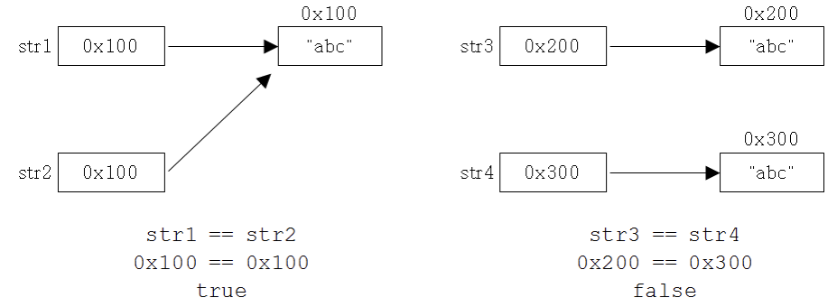
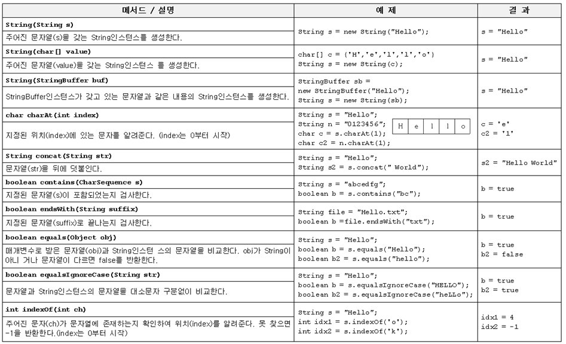
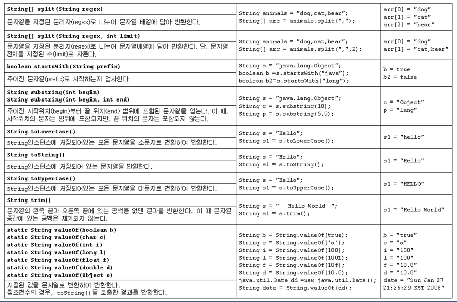
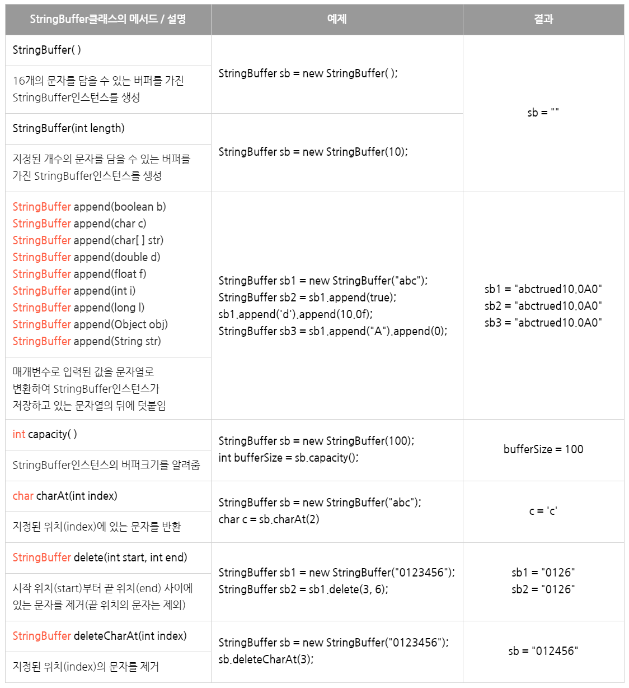
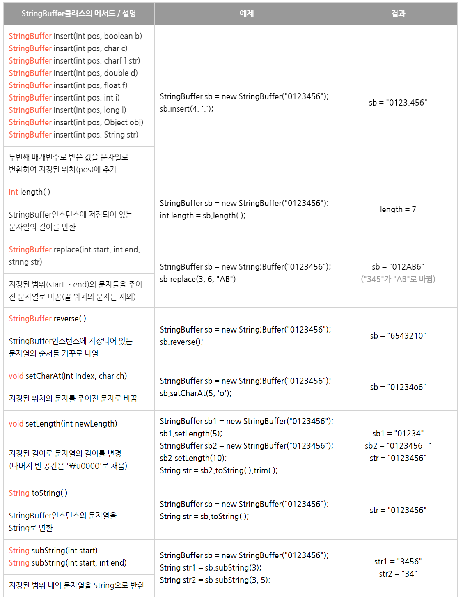
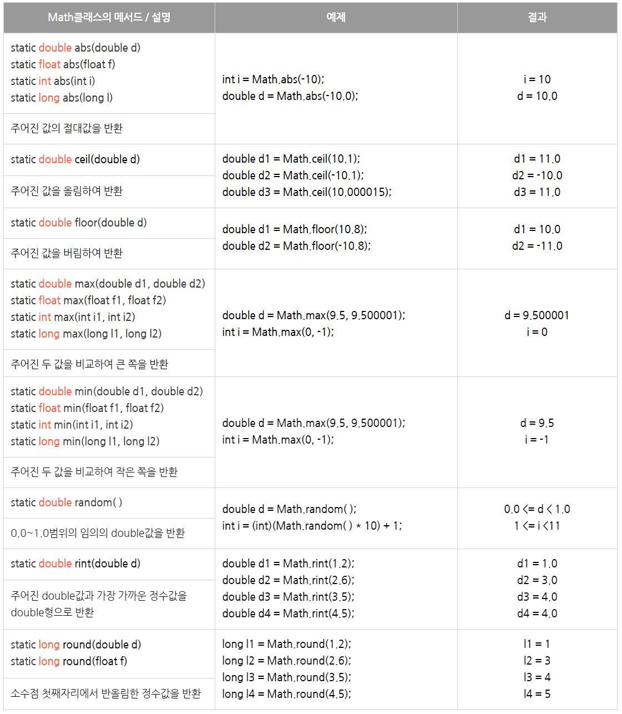
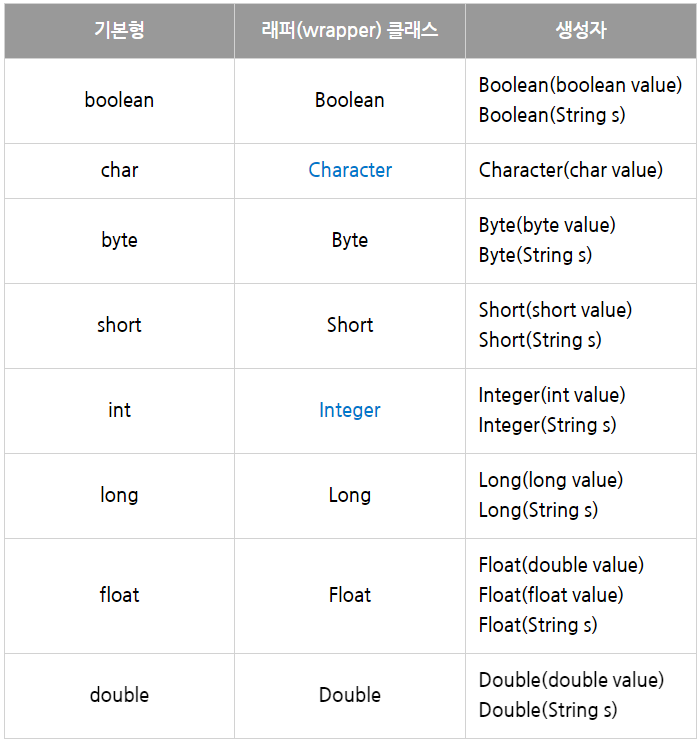
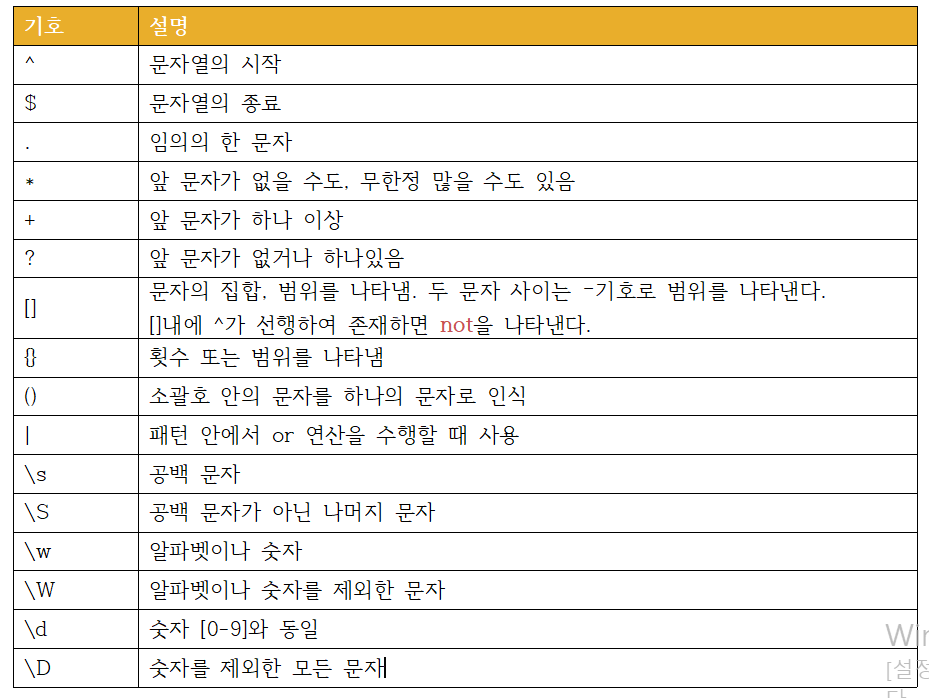

# chap9 java.lang 패키지와 유용한 클래스

### java.lang 패키지

- 자바프로그래밍의 가장 기본이 되는 클래스들을 포함하고 있다.
- 따라서 import 없이 사용 가능

### Object 클래스

- 모든 클래스의 최고 조상이기 때문에 Object 클래스의 멤버들은 모든 클래스에서 바로 사용 가능
- 멤버변수는 없고 오직 11개의 메서드만 가지고 있다.

[주요 메서드](https://www.notion.so/f14e9a29bb7f4b5a93eca1c901271ae7)

### equals(Object obj)

- 매개변수로 객체의 참조변수를 받아서 그 결과를 boolean값으로 알려 주는 역할
- 실제코드
    - 두 객체의 같고 다름을 참조변수의 값으로 판단
    - 즉 두 참조변수에 저장된 주소값이 같은지를 판단하는 기능

```java
public boolean equals(Object obj) {
		return (this==obj)
}
```

```java
class EqualsEx1 {
	public static void main(String[] args) {
		Value v1 = new Value(10);
		Value v2 = new Value(10);		

		if (v1.equals(v2)) {
			System.out.println("v1과 v2는 같습니다.");
		} else {
			System.out.println("v1과 v2는 다릅니다.");		
		}

		v2 = v1;

		if (v1.equals(v2)) {
			System.out.println("v1과 v2는 같습니다.");
		} else {
			System.out.println("v1과 v2는 다릅니다.");		
		}
	} // main
} 

class Value {
	int value;

	Value(int value) {
		this.value = value;
	}
}
--------------------------------------------------
실행결과
v1과 v2는 다릅니다.
v1과 v2는 같습니다.
```

- 클래스의 인스턴스변수 값으로 객체의 같고 다름을 비교하게 하고 싶다면 오버라이딩을 하면된다
    - String class의 equals 메서드도 오버라이딩을 통해 String 인스턴스가 갖는 문자열 값을 비교하도록 되어 있다.
    - String, Date, File, wrapper 클래스(Integer, Double 등)
    - example

    ```java
    class Person {
    		long id;
    		
    		Person(long id) {
    				this.id = id;
    		}
    		public boolean equals(Object obj) {
    				if(obj != null && obj instanceof Person) { 
    						return id == ((Person)obj).id
    				} else {
    						return falsel;
    				}
    		}
    }
    ```

### hashCode()

- 해싱기법에 사용되는 해시함수를 구현한 것이다.
- 해싱
    - 데이터관리 기법 중 하나
    - 다량의 데이터를 저장하고 검색하는데 유용
- 해시함수
    - 찾고자하는 값을 입력하면, 그 값이 저장된 위치를 알려주는 해시코드를 반환한다.
- 일반적으로 해시코드가 같은 두 객체가 존재하는 것이 가능하지만, Object 클래스에 정의된 hashCode 메서드는 객체의 주소값으로 해시코드를 만들어 반환하기 때문에 32 bit jvm에서는 서로 다른 두 객체는 결코 같은 해시코드를 가질 수 없었다.
- 하지만 64bit jvm에서는 8 byte 주소값으로 해시코드(4byte)를 만들기 때문에 해시코드가 중복될 수 있다.
- 마찬가지로 클래스의 인스턴스변수 값으로 객체의 같고 다름을 판단해야하는 경우라면 equals 메서드 뿐만 아니라 hashCode 메서드도 적절히 오버라이딩해야 한다.
    - 같은 객체라면 hashCode 메서드를 호출했을 때의 결과값인 해시코드도 같아야 하기 때문
    - ex) HashMap, HashSet 클래스
- example
    - String 클래스는 문자열의 내용이 같으면, 동일한 해시코드를 반환하도록 오버라이딩되어 있기 때문에 내용이 같은 경우 항상 동일한 해시코드값
    - identityHashCode(Object obj)는 Object 클래스의 hashCode 메서드처럼 객체의 주소값으로 해시코드를 생성

```java
class HashCodeEx1 {
	public static void main(String[] args) {
		String str1 = new String("abc");
		String str2 = new String("abc");

		System.out.println(str1.equals(str2));
		System.out.println(str1.hashCode());
		System.out.println(str2.hashCode());
		System.out.println(System.identityHashCode(str1));
		System.out.println(System.identityHashCode(str2));
	}
}
--------------------------------------------------------
실행결과
true
96354
96354
271334973
1284693
```

### toString()

- 인스턴스에 대한 정보를 문자열로 제공할 목적의 정의
- 대부분의 경우 인스턴스 변수에 저장된 값들을 문자열로 표현
- Object class의 toString()

```java
public String toString() {
		return getClass().getName()+"@"+Integer.toHexString(hashCode());
}
```

### Clone()

- 자신을 복제하여 새로운 인스턴스를 생성하는 일을 한다
- 원래의 인스턴스는 보존하고 clone메서드를 통해 새로운 인스턴스를 생성하여 작업을 하면 작업이전의 값이 보존되므로 작업에 실패해서 원래의 상태로 되돌리거나 변경되기 전의 값을 참고하는데 도움이 된다
- Object 클래스에 정의된 clone()은 단순히 인스턴스변수의 값만 복사하기 때문에 참조타입의 인스턴스 변수가 있는 클래스는 완전한 인스턴스 복제가 이루어지지 않는다.
    - ex) 배열의 경우, 복제된 인스턴스도 같은 배열의 주소를 갖기 때문에 복제된 인스턴스의 작업이 원래의 인스턴스에 영향을 미치게 된다.
    - 이런 경우 마찬가지로 오버라이딩해서 새로운 배열을 생성하고 배열의 내용을 복사하도록 해야 한다.
- example
    - 복제할 클래스가 Cloneable 인터페이스를 구현한 클래스에서만 clone() 호출 가능
    - 그리고 접근제어자를 protected에서 public으로 변경
    - 마지막으로 조상클래스의 clone()을 호출하는 코드가 포함된 try - catch문 작성

```java
class Point implements Cloneable {
	int x;
	int y;

	Point(int x, int y) {
		this.x = x;
		this.y = y;
	}

	public String toString() {
		return "x="+x +", y="+y;
	}

	public Object clone() {
		Object obj = null;
		try {
			obj = super.clone();  // clone()은 반드시 예외처리를 해주어야 한다.
		} catch(CloneNotSupportedException e) {}
		return obj;
	}
}

class CloneEx1 {
	public static void main(String[] args){
		Point original = new Point(3, 5);
		Point copy = (Point)original.clone(); // 복제(clone)해서 새로운 객체를 생성
		System.out.println(original);
		System.out.println(copy);
	}
}
----------
실행결과
x=3, y=5
x=3, y=5
```

- 공변 반환타입(covariant return type)
    - jdk 1.5부터 추가된 기능
    - 오버라이딩할 때 조상 메서드의 반환타입을 자손 클래스의 타입으로 변경을 허용하는 것
    - 이처럼 조상의 타입이 아닌, 실제로 반환되는 자손 객체의 타입으로 반환할 수 있어서 번거로운 형변환이 줄어드는 장점

    ```java
    	public Point clone() {
    		Object obj = null;
    		try {
    			obj = super.clone();  // clone()은 반드시 예외처리를 해주어야 한다.
    		} catch(CloneNotSupportedException e) {}
    		return (Point)obj;
    	}
    ```

    ```java
    // Point copy = (Point)original.clone();
    Point copy = original.clone();
    ```

    ### 배열 복사

    - 배열도 객체이기 때문에 Object 클래스를 상속받으며, 동시에 Cloneable, Serializable 인터페이스가 구현되어 있다.
    - 또한 clone 메서드가  public으로 오버라이딩되어 있다.

    ```java
    import java.util.*;

    class CloneEx2 {
    	public static void main(String[] args){
    		int[] arr = {1,2,3,4,5};

            // 배열 arr을 복제해서 같은 내용의 새로운 배열을 만든다.
    		int[] arrClone = arr.clone(); 
    		arrClone[0]= 6;

    		System.out.println(Arrays.toString(arr));
    		System.out.println(Arrays.toString(arrClone));
    	}
    }
    ------------------
    실행결과
    [1, 2, 3, 4, 5]
    [6, 2, 3, 4, 5]
    ```

    ```java
    int[] arr = {1, 2, 3};

    // case1
    int[] arrClone = arr.clone();
    // case2
    int[] arrClone2 = new int[arr.length];
    System.arraycopy(arr, 0, arrClone2, 0, arr.length);
    ```

    - 일반적으로 배열을 복사할 때, 같은 길이의 새로운 배열을 생성한 다음에 System.arraycopy()를 이용해서 내용을 복사하지만, 이처럼 clone()이용도 가능, 같은 결과

    ```java
    ArrayList list = new ArrayList();
    ArrayList list2 = (ArrayList)list.clone();
    ```

    - 배열 뿐만 아니라 java.util 패키지의 Vector, ArrayList, LinkedList, HashSet, TreeSet, HashMap, TreeMap, Calendar, Date와 같은 클래스들이 이와 같은 방식으로 복제가 가능하다.

    ### 얕은 복사와 깊은 복사

    - clone()은 단순히 객체에 저장된 값을 그대로 복제할 뿐, 객체가 참조하고 있는 객체까지 복제하지는 않는다.
    - 기본형 배열인 경우에는 아무런 문제가 없지만, 객체배열을 clone()으로 복제하는 경우에는 원본과 복제본이 같은 객체를 공유하므로 완전한 복제라고 보기 어렵다.
        - 이러한 복제를 얕은 복사라고 한다, shallow copy
        - 얕은 복사는 원본을 변경하면 복사본도 영향을 받는다.
    - 반면에 원본이 참조하고 있는 객체까지 복제하는 것을 깊은 복사, deep copy
        - 깊은 복사에서는 원본과 복사본이 서로 다른 객체를 참조하기 때문에 원본의 변경이 복사본에 영향을 미치지 않는다.


    - example

    ```java
    import java.util.*;

    class Circle implements Cloneable {
    	Point p;  // 원점
    	double r; // 반지름

    	Circle(Point p, double r) {
    		this.p = p;
    		this.r = r;
    	}

    	public Circle shallowCopy() { // 얕은 복사
    		Object obj = null;

    		try {
    			obj = super.clone();
    		} catch (CloneNotSupportedException e) {}

    		return (Circle)obj;
    	}

    	public Circle deepCopy() { // 깊은 복사
    		Object obj = null;

    		try {
    			obj = super.clone();
    		} catch (CloneNotSupportedException e) {}

    		Circle c = (Circle)obj; 
    		c.p = new Point(this.p.x, this.p.y); 

    		return c;
    	}

    	public String toString() {
    		return "[p=" + p + ", r="+ r +"]";
    	}
    }

    class Point {
    	int x;
    	int y;

    	Point(int x, int y) {
    		this.x = x;
    		this.y = y;
    	}

    	public String toString() {
    		return "("+x +", "+y+")";
    	}
    }

    class ShallowCopy {
    	public static void main(String[] args) {
    		Circle c1 = new Circle(new Point(1, 1), 2.0);
    		Circle c2 = c1.shallowCopy();
    		Circle c3 = c1.deepCopy();
    	
    		System.out.println("c1="+c1);
    		System.out.println("c2="+c2);
    		System.out.println("c3="+c3);
    		c1.p.x = 9;
    		c1.p.y = 9;
    		System.out.println("= c1의 변경 후 =");
    		System.out.println("c1="+c1);
    		System.out.println("c2="+c2);
    		System.out.println("c3="+c3);
    	}
    }
    ---------------------------------
    실행결과
    c1=[p=(1, 1), r=2.0]
    c2=[p=(1, 1), r=2.0]
    c3=[p=(1, 1), r=2.0]
    = c1의 변경 후 =
    c1=[p=(9, 9), r=2.0]
    c1=[p=(9, 9), r=2.0]
    c1=[p=(1, 1), r=2.0]
    ```

    ### getClass()

    - 자신이 속한 클래스의 Class 객체를 반환하는 메서드
    - Class 객체는 이름이 'Class'인 클래스 객체이다.
    - 다음과 같이 정의

        ```java
        public final class Class implements ... {

        }
        ```

    - 클래스 객체는 클래스의 모든 정보를 담고 있으며, 클래스 당 1개만 존재
    - 클래스 파일이 '클래스 로더(ClassLoader)'에 의해 메모리에 올라갈 때, 자동으로 생성
        - 클래스 로더는 실행 시에 필요한 클래스를 동적으로 메모리에 로드하는 역할
        - 먼저 기존에 생성된 클래스 객체가 메모리에 존재하는지 확인하고
            - 있으면 클래스 객체의 참조를 반환
            - 없으면 클래스 패스에 지정된 경로를 따라서 클래스 파일을 찾는다.
                - 못찾으면  ClassNotFoundException 발생
                - 찾으면 해당 클래스 파일을 읽어서 Class 객체로 변환
    - 즉 파일 형태로 저장되어 있는 클래스를 읽어서 Class 클래스에 정의된 형식으로 변환하는 것
    - 따라서 클래스 파일을 읽어서 사용하기 편한 형태로 저장해 놓은 것이 클래스 객체이다.

    ### Class 객체를 얻는 방법

    - 클래스의 정보가 필요할 때, 먼저 Class 객체에 대한 참조를 얻어 와야 하는데, 해당 Class 객체에 대한 참조를 얻는 방법으로 여러 가지가 있다.

        ```java
        // case1: 생성된 객체로부터 얻는 방법
        Class cObj = new Card().getClass(); 

        // case2: 클래스 리터럴(*.class)로 부터 얻는 방법
        Class cObj = Card.class;
         
        // case3: 클래스 이름으로 부터 얻는 방법
        // 특히 클래스 파일, 예를 들어 데이터베이스 드라이버를 메모리에 올릴 때 주로 사용
        Class cObj = Class.forName("Card");
        ```

    - 클래스 객체를 이용하면 클래스에 정의된 멤버의 이름이나 개수 등, 클래스에 대한 모든 정보를 얻을 수 있기 때문에 Class 객체를 통해서 객체를 생성하고 메서드를 호출하는 등 보다 동적인 코드 작성 가능

        ```java
        Card c = new Card();                  // new 연산자를 이용한 객체 생성
        Card c = Card.class.newInstance();    // Class객체를 이용한 객체 생성
        ```

    - example

        ```java
        final class Card {
        	String kind;
        	int num;

        	Card() {
        		this("SPADE", 1);
        	}

        	Card(String kind, int num) {
        		this.kind = kind;
        		this.num  = num;
        	}

        	public String toString() {
        		return kind + ":" + num;
        	}
        }

        class ClassEx1 {
        	public static void main(String[] args) throws Exception {
        		Card c  = new Card("HEART", 3);       // new연산자로 객체 생성
        		Card c2 = Card.class.newInstance();   // Class객체를 통해서 객체 생성

        		Class cObj = c.getClass();

        		System.out.println(c);
        		System.out.println(c2);
        		System.out.println(cObj.getName());
        		System.out.println(cObj.toGenericString());
        		System.out.println(cObj.toString());		
        	}
        }
        --------------------------
        실행결과
        HEART: 3
        SPADE: 1
        Card
        final class Card
        class Card
        ```

    ### String 클래스

    - 문자열을 위한 클래스
    - 문자열을 저장하고 이를 다루는데 필요한 메서드를 함께 제공

    ### 변경 불가능한 클래스

    - String 클래스에는 문자열을 저장하기 위해서 문자형 배열 참조변수(char[]) value를 인스턴스 변수로 정의해놓고 있다.
    - 인스턴스 생성 시 생성자의 매개변수로 입력받는 문자열은 이 인스턴스변수에 문자형 배열로 저장되는 것이다.

    ```java
    public final class String implements java.io.Serializable, Comparable {
    		private char[] value;
    }
    ```

    - 한번 생성된 String 인스턴스가 갖고 있는 문자열은 읽어 올 수만 있고, 변경할 수는 없다.
        - 아래처럼 +로 결합하는 경우 새로운 문자열("ab")이 담긴 String 인스턴스가 생성되는 것이다.

    ```java
    String a = "a";
    String b = "b";

    a = a + b;
    ```

    - 이처럼 문자열을 결합하는 것은 매 연산 시마다 새로운 문자열을 가진 String 인스턴스가 생성되어 메모리공간을 차지하게 되므로 가능한 한 결합횟수를 줄이는 것이 좋다.
    - 문자열간의 결합이나 추출 등 문자열을 다루는 작업이 많이 필요한 경우에는 String 클래스 대신 StringBuffer 클래스를 사용하는 것이 좋다.
        - StringBuffer 인스턴스에 저장된 문자열은 변경이 가능하므로 하나의 StringBuffer 인스턴스만으로도 문자열을 다루는 것이 가능하다.

    ### 문자열의 비교

    - 문자열을 만들때는 두가지 방법이 있다.
        1. 문자열 리터럴을 지정하는 방법
        2. String 클래스의 생성자를 사용해서 만드는 방법
    - String  클래스의 생성자를 이용한 경우에는 new 연산자에 의해서 메모리할당이 이루어지기 때문에 항상 새로운 String 인스턴스가 생성된다.
    - 문자열 리터럴은 이미 존재하는 것을 재사용하는 것이다.
        - cf) 문자열 리터럴은 클래스가 메모리에 로드될 때 자동적으로 미리 생성

    ```java
    String str1 = "abc";
    String str2 = "abc";

    String str3 = new String("abc");
    String str4 = new String("abc");
    ```



    - equals()를 사용했을 때는 문자열의 내용을 비교하기 때문에 true이지만 인스턴스의 주소를 ==로 비교했을 때는 결과가 다르다.

### 문자열 리터럴

- 자바 소스파일에 포함된 모든 문자열 리터럴은 컴파일 시에 클래스 파일(*.class)에 저장된다.
- 이 때 같은 내용의 문자열 리터럴은 한번만 저장된다. 문자열 리터럴도 String 인스턴스이고, 한번 생성하면 내용을 변경할 수 없으니 하나의 인스턴스를 공유하면 되기 때문이다.
- 이와 같이 String 리터럴들은 컴파일시에 클래스파일에 저장되며 아래의 예제를 실행하면 "AAA"를 담고 있는 String 인스턴스가 하나 생성된 후, 참조변수 s1, 2, 3가 모두 이 스트링 인스턴스를 참조하게 된다.
- 클래스 파일에는 소스파일에 포함된 모든 리터럴의 목록이 있다.
    - 해당 클래스 파일이 클래스 로더에 의해 메모리에 올라갈 때, 이 리터럴의 목록에 있는 리터럴들이 jvm 내에 있는 '상수 저장소(constant pool)'에 저장된다.
    - 이 때, 이곳에 "AAA"와 같은 문자열 리터럴이 자동적으로 생성되어 저장되는 것이다.

```java
class StringEx2 {
	public static void main(String args[]) {
		String s1 = "AAA";
		String s2 = "AAA";
		String s3 = "AAA";
		String s4 = "BBB";
	}
}
```

### 빈 문자열

- 길이가 0인 배열 존재 가능? >> yes
- char 배열도 길이가 0인 배열을 생성할 수 있고, 이 배열을 내부적으로 가지고 있는 문자열이 바로 빈 문자열이다.
- String s= ""; 과 같은 문장이 있을 때, 참조변수 s가 참조하고 있는 String 인스턴스는 내부에 new char[0]과 같이 길이가 0인 char형 배열을 저장하고 있는 것이다.
- 하지만 char c = '';와 같은 표현도 가능한 것은 아니다. 반드시 하나의 문자를 지정해야 한다.

```java
String s = null;   ==> String s = "";  // 빈 문자열로 초기화
char c = '\u0000'l ==> char c = ' ';   // 공백으로 초기화
```

- String은 빈 문자열로, char은 공백으로 초기화 하는 것이 보통

### String 클래스의 생성자와 메서드

- 자주 사용되는 메서드




- replace vs replaceAll

    String str = "aaabbbccccabcddddabcdeeee";

    String result1 = str.replace("a", "왕").replace("b", "왕").replace("c", "왕");

    String result2 = str.replaceAll("[abc]", "왕");



### join()과 StringJoiner

- join()은 여러 문자열 사이에 구분자를 넣어서 결합한다. 구분자로 문자열을 자르는 split()과 반대의 작업을 한다고 생각하면 이해하기 쉽다.

    ```java
    String animals = "dog,cat,bear";
    String[] arr = animals.split(",");
    String str = String.join("-", arr);
    str: dog-cat-bear
    ```

- java.util.StringJoiner 클래스를 사용해서 문자열을 결합할 수도 있다.

    ```java
    StringJoiner sj = new StringJoiner(",", "[" , "]");
    String[] strArr = {"aaa", "bbb", "ccc"};

    for(String s: strArr)
    	sj.add(s.toUpperCase());

    System.out.println(sj.toString());
    // [AAA,BBB,CCC]
    ```

### 유니코드의 보충문자

- 스트링 클래스의 메서드 중에 매개변수의 타입이 char, int 인 것들도 있다.
- 문자를 다루는 메서드라서 매개변수의 타입이 char일 것 같은데 왜 int일까?
    - 확장된 유니코드를 다루기 위해서
- 유니코드는 원래 2 byte, 16비트 문자인데, 20비트로 확장하게 되었다.
- 그래서 하나의 문자를 char타입으로 다루지 못하고, int 타입으로 다룰 수 밖에 없다.
- 확장에 의해 새로 추가된 문자들을 '보충 문자'라고 하는데, String 클래스의 메서드 중에서는 보충 문자를 지원하는 것이 있고 지원하지 않는 것도 있다.
    - 구별법은 매개변수가 int ch인 것들은 지원하는 것들, char ch인 것들은 지원하지 않는 것들이다.

### 문자 인코딩 변환

- getBytes(String charsetName)을 사용하면, 문자열의 문자 인코딩을 다른 인코딩으로 변경할 수 있다.
- 자바가 utf-16을 사용하지만, 문자열 리터럴에 포함되는 문자들은 os의 인코딩을 사용한다. 한글 윈도우즈의 경우 문자 인코딩으로 CP949를 사용하며, UTF-8로 변경하려면 아래와 같이 한다.
    - utf-8은 한글 한글자를 3 byte, cp949는 2 byte로 표현
    - cf) 사용가능한 문자 인코딩의 목록은 System.out.println(java.nio.charset.Cahrset.availableCharsets());

    ```java
    byte[] utf8_str = "가".getBytes("UTF-8");    // 문자열을 utf-8로 변환
    String str = new String(utf8_str, "UTF-8"); // byte배열을 문자열로 변환
    ```

- example

    ```java
    import java.util.StringJoiner;

    class StringEx5 {
    	public static void main(String[] args) throws Exception {
    		String str = "가";

    		byte[] bArr  = str.getBytes("UTF-8");
    		byte[] bArr2 = str.getBytes("CP949");

    		System.out.println("UTF-8:" + joinByteArr(bArr));
    		System.out.println("CP949:" + joinByteArr(bArr2));

    		System.out.println("UTF-8:" + new String(bArr,  "UTF-8"));
    		System.out.println("CP949:" + new String(bArr2, "CP949"));
    	}

    	static String joinByteArr(byte[] bArr) {
    		 StringJoiner sj = new StringJoiner(":", "[", "]");

    		for(byte b : bArr)
    			sj.add(String.format("%02X",b));

    		return sj.toString();
    	}
    }
    -------------------------------------------
    실행결과
    utf-8:[EA:B0:80]
    cp949:[B0:A1]
    utf-8:가
    cp949:가
    ```

### String.format()

- format()은 형식화된 문자열을 만들어내는 간단한 방법

```java
String str = String.format("%d 더하기 %d는 %d입니다.", 3, 5, 3+5)
Sytem.out.prinln(str); // 3 더하기 5는 8입니다.
```

### 기본형 값을 String으로 변환

- 숫자로 이루어진 문자열을 숫자로, 또는 그 반대로 변환하는 경우가 자주 있다.
- 방법은 간다하다. 숫자에 빈 문자열을 더해주면 된다
- 이외에도 valueOf()를 사용하는 방법도 있다.
    - 성능은 valueOf()가 더 좋다.

```java
int i = 100;
String str1 = i + "";
String str2 = String.valueOf(i);
```

### String을 기본형 값으로 변환

- valueOf()를 사용하거나
    - 리턴 타입은 Interger인데 오토박싱에 의해 int로 자동 변환된다.
    - 해당 메서드는 메서드 내부에서 parserInt()를 호출할 뿐이므로 반환 타입만 다르지 같은 메서드이다.
- parserInt() 사용
    - parserBoolean(), parserByte(), ... parserDouble()
    - cf) byte, short을 문자열로 변경할 떄는 String valueOf(int i)를 사용
    - cf) 문자열 "A"를 문자 'A로 변환하려면 char ch = "A".charAt(0);
    - Boolean, Byte와 같이 기본형 타입의 이름이 첫 글자가 대문자인 것은 래퍼 클래스이다.
        - 기본형 값을 감싸고 있는 클래스라는 뜻에서 붙여진 이름으로 기본형을 클래스로 표현한 것

```java
int i = Integer.parserInt("100");
int i2 = Integer.valueOf("100");
```

```java
public static Integer valueOf(String s) throws NumberFormatException {
		return Integer.valueOf(parseInt(s, 10));  // 10진수
}
```

- exmaple

    ```java
    class StringEx6 {
    	public static void main(String[] args) {
    		int iVal = 100;
    		String strVal = String.valueOf(iVal);	// int를 String으로 변환한다.
    		
    		double dVal = 200.0;
    		String strVal2 = dVal + "";	// int를 String으로 변환하는 또 다른 방법

    		double sum  = Integer.parseInt("+"+strVal)+Double.parseDouble(strVal2);
    		double sum2 = Integer.valueOf(strVal) + Double.valueOf(strVal2);

    		System.out.println(String.join("",strVal,"+",strVal2,"=")+sum);
    		System.out.println(strVal+"+"+strVal2+"="+sum2);
    	}
    }

    ---------------
    실행결과
    100+200.0=300.0
    100+200.0=300.0
    ```

    - parsetInt()같은 메서드는 문자열에 공백 또는 문자가 포함되어 있는 경우 변환 시 예외(NumberFormatException)가 발생할 수 있으므로 주의해아한다.
    - 그래서 문자열 양끝의 공백을 제거해주는 trim()을 사용하면 좋다.
    - 그러나 부호를 의미하는 '+'나 소수점을 의미하는 '.'와 float형 값을 뜻하는 f와 같은 자료형 접미사는 허용된다.
        - 단 자료형에 알맞은 변환을 하는 경우에만 허용
        - '1.0f'를 Integer.parsetInt() 사용하면 예외, Float.parserFlaoat()은 문제 없다
    - parseInt(String s , int radix)를 이용하여 진수 값으로 표현된 문자열도 변환 가능

### StringBuffer 클래스

- StringBuffer 클래스는 스트링 클래스와 달리 지정된 문자열을 변경할 수 있다.
- 내부적으로 문자열 편집을 위한 버퍼를 가지고 있으며 인스턴스를 생성할 때 그 크기를 지정할 수 있다.
    - 버퍼의 길이를 충분히 잡아주는 것이 좋다.
    - 편집 중인 문자열입 버퍼의 길이를 넘어서게 되면 버퍼의 길이를 늘려주는 작업이 추가로 수행되어야하기 때문이다.

- 스트링 클래스처럼 문자열을 저장하기 위한 char 배열의 참조변수를 인스턴스 변수로 선언해놓고 있다.

```java
public final class StringBuffer implements java.io.Serializable {
		private char[] value;
}
```

### StringBuffer의 생성자

- 클래스의 인스턴스를 생성할 때, 적절한 길이의 char형 배열이 생성되고 이 배열은 문자열을 저장하고 편집하기 위한 공간(버퍼)로 사용된다.
- 버퍼의 크기를 지정해주지 않으면 16개의 문자를 저장할 수 있는 크기의 버퍼를 생성한다.

```java
public StringBuffer(int length) {
		value = new char[length];
		shared = false;
}
public StringBuffer() {
		this(16);
}
public StringBuffer(String str) {
		this(str.length() + 16);
		append(str);
}
```

### StringBuffer의 변경

- 스트링 클래스와 달리 내용 변경 가능


- append()는 반환타입이 스트링버퍼인데 자신의 주소를 반환
    - 따라서 연속적으로 append() 호출 가능
    - sb.append("123").append("ZZ");

### StringBuffer의 비교

- 스트링 클래스와 달리 equals() 메서드를 오버라이딩하지 않아 ==로 비교한 것과 같은 결과를 얻는다.
- toString()은 오버라이딩되어 있어서 StringBuffer 인스턴스에 toString()을 호출하면, 담고있는 문자열 String으로 반환한다.
- 따라서 문자열을 비교하기 위해서는 인스턴스에 toString()을 호출해서 String 인스턴스를 얻은 다음, 여기에 equals메서드를 사용해서 비교

```java
class StringBufferEx1 {
	public static void main(String[] args) {
		StringBuffer sb  = new StringBuffer("abc");
		StringBuffer sb2 = new StringBuffer("abc");

		System.out.println("sb == sb2 ? " + (sb == sb2));
		System.out.println("sb.equals(sb2) ? " + sb.equals(sb2));
		
		// StringBuffer의 내용을 String으로 변환한다.
		String s  = sb.toString();	// String s = new String(sb);와 같다.
		String s2 = sb2.toString();

		System.out.println("s.equals(s2) ? " + s.equals(s2));
	}
}
----------------------------------------------
실행결과
sb == sb2 ? false
sb.equals(sb2) ? false
s.equals(s2) ? true
```

### StringBuffer 클래스의 생성자와 메서드





### StringBuilder란?

- StringBuffer는 멀티쓰레드에 안전하도록 동기화되어 있다.
- 동기화가 스트링 버퍼 클래스의 성능을 떨어뜨린다.
- 그래서 스트링버퍼에서 쓰레드의 동기화만 뺀 스트링빌더가 새로 추가되었다.
- 스트링 버퍼와 완전히 똑같은 기능으로 작성되어 있다.

### Math 클래스

- math 클래스의 생성자는 접근 제어자가 private이기 때문에 다른 클래스에서 math 인스턴스 생성할 수 없다.
    - 인스턴스 변수가 하나도 없어서 인스턴스를 생성할 필요가 없기 때문이다.
- math 클래스의 메서드는 모두 static이며 아래와 같이 2개의 상수만 정의해 놓았다.

    ```java
    public static final double E = 2.718281828... // 자연로그의 밑
    public static final double PI = 3.141592....  // 원주율
    ```

### 올림, 버림, 반올림

- 소수점 n번째 자리에서 반올림한 값을 얻기 위해서는 round()를 사용해야 하는데, 이 메서드는 항상 소수점 첫째자리에서 반올림을 해서 정수값(long)을 결과로 돌려준다.
    1. 원래 값에 100을 곱한다
        - 90.7552 * 100 → 9075.52
    2. 결과에 Math.round() 사용
        - Math.round(9075.52) → 9076
    3. 결과에 다시 100.0으로 나눈다.
        - 9076 / 100.0 → 90.76
        - 9076 / 100 → 90
    - 반올림된 소수점 셋째자리가 필요하다면 100대신 1000을 곱하고 1000.0으로 나눈다

```java
import static java.lang.Math.*;
import static java.lang.System.*;

class MathEx1 {
	public static void main(String args[]) {
		double val = 90.7552;
		out.println("round("+ val +")=" + round(val));  // 반올림

		val *= 100;
		out.println("round("+ val +")=" + round(val));  // 반올림

		out.println("round("+ val +")/100  =" + round(val)/100);  // 반올림
		out.println("round("+ val +")/100.0=" + round(val)/100.0);  // 반올림
		out.println();
		out.printf("ceil(%3.1f)=%3.1f%n",  1.1, ceil(1.1));   // 올림
		out.printf("floor(%3.1f)=%3.1f%n", 1.5, floor(1.5));  // 버림
		out.printf("round(%3.1f)=%d%n",    1.1, round(1.1));  // 반올림
		out.printf("round(%3.1f)=%d%n",    1.5, round(1.5));  // 반올림
		out.printf("rint(%3.1f)=%f%n",     1.5, rint(1.5));   // 반올림
		out.printf("round(%3.1f)=%d%n",   -1.5, round(-1.5)); // 반올림
		out.printf("rint(%3.1f)=%f%n",    -1.5, rint(-1.5));  // 반올림
		out.printf("ceil(%3.1f)=%f%n",    -1.5, ceil(-1.5));  // 올림
		out.printf("floor(%3.1f)=%f%n",   -1.5, floor(-1.5)); // 버림
	}
}
```

- rint()도 round()처럼 소수점 첫 째자리에서 반올림이지만, 반환값이 double
    - 정수의 정가운데 있는 값은 가장 가까운 짝수 정수를 반환
    - rint(-1.5); → -2.0

### 예외를 발생시키는 메서드

- 메서드 이름에 'Exac'가 포함된 메서드들이 jdk 1.8부터 새로 추가되었다.
- 이들은 정수형간의 연산에서 발생할 수 있는 오버플로우를 감지하기 위한 것

```java
int addExact(int x, int y)       // x + y
int subtractExac(int x, int y)   // x - y
int multiplyExact(int x, int y)  // x * y
int incrementExact(int a)        // a++
int decrementExact(int a)        // a--
int negateExact(int a)           // -a
int toIntExact(long value)       // (int)value
```

- 연산자는 단지 결과를 반환할 뿐, 오버플로우의 발생여부에 대해 알려주지 않는다.
- 그러나 오버플로우가 발생하면, 예외를 발생시킨다.
- cf) 부호를 반대로 바꾸는 식은 '~a+1'이라 오버플로우 발생할 수 있다.

```java
import static java.lang.Math.*;
import static java.lang.System.*;

class MathEx2 {
	public static void main(String args[]) {
		int i = Integer.MIN_VALUE;

		out.println("i ="+i);
		out.println("-i="+(-i));

		try {
			out.printf("negateExact(%d)= %d%n",  10, negateExact(10));
			out.printf("negateExact(%d)= %d%n", -10, negateExact(-10));

			out.printf("negateExact(%d)= %d%n", i, negateExact(i)); // 예외발생
		} catch(ArithmeticException e) {
			// i를 long타입으로 형변환 다음에 negateExact(long a)를 호출
		     out.printf("negateExact(%d)= %d%n",(long)i,negateExact((long)i));
		}
	} // main의 끝
}

실행결과
i = -2147483648
-i = -2147483648
negateExact(10) = - 10
negateExact(-10) = 10
negateExact(-2147483648) = 2147483648
```

- 변수 i에 부호연산자로 부호를 반대로 바꾸어도 값이 그대로인 이유
    - 정수형의 최소값에 비트전환연산자 '~'를 적용하면, 최대값이 되는데 여기에 1을 더하니까 오버플로우가 발생하는 것
    - 1000000 00000000 00000000 0000000 → int의 최소값
    - ~ 연산 → 01111111 11111111 11111111 11111111 → int의 최대값
    - + 1 → 1000000 00000000 00000000 0000000 → int의 최소값

### 삼각함수와 지수, 로그

- 두 점 (x1, y1) (x2, y2)간의 거리 c는 $\sqrt{(x2-x1)^2+(y2-y1)^2}$
    - 제곱근을 계산해주는 sqrt()와 n제곱을 계산해주는 pow()를 사용

    ```java
    double c = sqrt(pow(x2-x1, 2) + pow(y2-y1, 2));
    ```

- 삼각함수

    ```java
    Math.sin(Math.PI/4);  // 45 degree
    Math.cos(Math.PI/4);
    Math.cos(Math.toRadians(45));
    ```

- 상용로그

    ```java
    Math.log10(x);
    ```

### StrictMath 클래스

- Math 클래스는 최대한의 성능을 얻기 위해 jvm이 설치된 os의 메서드를 호출해서 사용한다
- 즉 os에 의존적인 계산이라 부동소수점 계산의 경우 반올림의 처리방법이 os마다 다를 수 있기 때문에 결과가 다를 수 있다.
- 이러한 차이를 없애기 위해 성능은 다소 포기하는 대신, 어떤 os에서 실행되어도 항상 같은 결과를 얻도록 math 클래스를 새로 작성한 것이 StrictMath 클래스이다.

### Math클래스의 메서드

- 자주 사용하는 메서드들



### 래퍼(wrapper) 클래스

- 객체지향 개념에서 모든 것은 객체로 다루어져야 하지만 자바에서는 8개의 기본형을 객체로 다루지 않는다
    - 파이썬과 대비, 대신 성능을 얻을 수 있었다.
- 때로는 기본형(primitive type) 변수도 객체로 다뤄야 하는 경우가 있다.
    - ex) 매개변수로 객체를 요구할 때, 기본형 값이 아닌 객체로 저장해야할 때, 객체간의 비교가 필요할 때 등등
    - 이런 경우에는 기본형 값들을 객체로 변환하여 작업을 수행해야 한다.
- 이 때 사용하는 것이 래퍼 클래스이다.
    - 8개의 래퍼클래스, 이 클래스들을 이용하면 기본형 값을 객체로 다룰 수 있다.
    - char, int형을 제외한 나머지는 자료형 이름의 첫 글자를 대문자로 한 것
- 래퍼 클래스의 생성자는 매개변수로 문자열이나 각 자료형의 값들을 인자로 받는다.
    - 문자열로 매개변수를 제공할 때, 자료형에 알맞은 문자열을 사용해야 한다.



```java
class WrapperEx1 {
	public static void main(String[] args) {
		Integer i  = new Integer(100);
		Integer i2 = new Integer(100);

		System.out.println("i==i2 ? "+(i==i2));
		System.out.println("i.equals(i2) ? "+i.equals(i2));
		System.out.println("i.compareTo(i2)="+i.compareTo(i2));
		System.out.println("i.toString()="+i.toString());

		System.out.println("MAX_VALUE="+Integer.MAX_VALUE);
		System.out.println("MIN_VALUE="+Integer.MIN_VALUE);
		System.out.println("SIZE=" +Integer.SIZE+" bits");
		System.out.println("BYTES="+Integer.BYTES+" bytes");
		System.out.println("TYPE=" +Integer.TYPE);
	}
}

실행결과
i==i2 ? false
i.equals(i2) ? true
i.compareTo(i2) = 0
i.toString()=100
MAX_VALUE=2147483647
MIN_VALUE=-2147483648
SIZE=32 bits
BYTE+4 bytes
TYPE=int
```

- 래퍼 클래스들은 모두 equals()가 오버라이딩되어 있어서 주소값이 아닌 객체가 가지고 있는 값을 비교
    - 오토박싱이 된다고 해도 Integer 객체에 비교연산자를 사용 x, 대신 compareTo() 사용
        - 오토박싱: 기본 타입이 래퍼클래스로 자동변환 되는 것
        - 오토언박싱: 반대로 자동 변환하는 것
- toString()도 오버라이딩 되어있다.
- 또 래퍼클래스들은  MAX_VALUE, MIN_VALUE, SIZE, BYTES, TYPE 등의 static 상수를 공통적으로 가지고 있다.

### Number 클래스

- 이 클래스는 추상클래스로 내부적으로 숫자를 멤버변수로 갖는 래퍼 클래스들의 조상이다.
- 기본형 중에서 숫자와 관련된 래퍼 클래스들은 모두 Number 클래스의 자손이다.


- BigInteger은 long으로도 다룰 수 없는 큰 범우의 정수를
- BigDecimal은 double로도 다룰 수 없는 큰 범위의 부동 소수점수를 처리하기 위한 것으로 연산자의 역할을 대신하는 다양한 메서드를 제공한다.

### 문자열을 숫자로 변환하기

- 문자열을 숫자로 변환하는 다양한 방법

    ```java
    int i = new Integer("100").intValue(); // floatValue(), longValue()..
    int i2 = Integer.parseInt("100");      // 주로 사용 방법
    Integer i3 = Integer.valueOf("100");
    ```

- 타입.parse타입(String s) 형식의 메서드는 기본형 반환
- 타입.valueOf() 메서드는 래퍼 클래스 타입 반환
- jdk 1.5부터 도입된 오토방식 기능 때문에 반환값이 기본형일 때와 래퍼 클래스일 때의 차이가 없어졌다.
    - valueOf()가 조금 더 느리다
- 문자열이 10진수가 아닌 다른 진법의 숫자일 때도 변환이 가능하다.

    ```java
    static int parseInt(String s, int radix) // 문자열 s를 radix 진법으로 인식
    static Integer valueOf(String s, int radix)
    ```

- exmaple

    ```java
    class WrapperEx2 {
    	public static void main(String[] args) {
    		int		 i  = new Integer("100").intValue();
    		int		 i2 = Integer.parseInt("100");
    		Integer  i3 = Integer.valueOf("100");

    		int i4 = Integer.parseInt("100",2);
    		int i5 = Integer.parseInt("100",8);
    		int i6 = Integer.parseInt("100",16);
    		int i7 = Integer.parseInt("FF", 16);
    //	int i8 = Integer.parseInt("FF");  // NumberFormatException 발생

    		Integer i9 = Integer.valueOf("100",2);
    		Integer i10 = Integer.valueOf("100",8);
    		Integer i11 = Integer.valueOf("100",16);
    		Integer i12 = Integer.valueOf("FF",16);
    //  Integer i13 = Integer.valueOf("FF"); // NumberFormatException 발생

    		System.out.println(i);
    		System.out.println(i2);
    		System.out.println(i3);
    		System.out.println("100(2) -> "+i4);
    		System.out.println("100(8) -> "+i5);
    		System.out.println("100(16)-> "+i6);
    		System.out.println("FF(16) -> "+i7);

    		System.out.println("100(2) -> "+i9);
    		System.out.println("100(8) -> "+i10);
    		System.out.println("100(16)-> "+i11);
    		System.out.println("FF(16) -> "+i12);
    	}
    }

    실행결과
    100
    100
    100
    100(2) -> 4
    100(8) -> 64
    100(16) -> 256
    FF(16) -> 255
    100(2) -> 4
    100(8) -> 64
    100(16) -> 256
    FF(16) -> 255
    ```

### 오토박싱 & 언박싱

- jdk 1.5 이전에는 기본형과 참조형 간의 연산이 불가능했기 때문에, 래퍼 클래스로 기본형을 객체로 만들어서 연산해야 했다.

    ```java
    컴파일 전의 코드

    int i = 5;
    Integer iObj = new Integer(7);
    int sum = i + iObj;  // error, jdk 1.5이전
    ```

- 그러나 이제는 가능하다. 컴파일러가 자동으로 변환하는 코드를 넣어주기 때문이다.

    ```java
    컴파일 후의 코드

    int i = 5;
    Integer iObj = new Integer(7);
    int sum = i + iObj.intValue();  // error, jdk 1.5이전
    ```

- 이 외에도 내부적으로 객체 배열을 가지고 있는 Vector 클래스나 ArrayList 클래스에 기본형 값을 저장해야할 때나 형변환이 필요할 때도 컴파일러가 자동으로 코드를 추가해 준다.
    - 기본형 값 → 래퍼 클래스의 객체로 자동변환 : 오토박싱
    - 반대 변환: 언박싱

    ```java
    ArrayList<Integer> list = new ArrayList<Integer>();
    list.add(10);  // 오토박싱, 10 -> new Integer(10)

    int value = list.get(0); // 언박싱, new Integer(10) -> 10
    ```

- example

    ```java
    class WrapperEx3 {
    	public static void main(String[] args) {
    		int i = 10;

            // 기본형을 참조형으로 형변환(형변환 생략가능)
    		Integer intg = (Integer)i; // Integer intg = Integer.valueOf(i);
    		Object   obj = (Object)i;  // Object obj = (Object)Integer.valueOf(i);

    		Long     lng = 100L;  // Long lng = new Long(100L);

    		int i2 = intg + 10;   // 참조형과 기본형간의 연산 가능
    		long l = intg + lng;  // 참조형 간의 덧셈도 가능

    		Integer intg2 = new Integer(20);
    		int i3 = (int)intg2;  // 참조형을 기본형으로 형변환도 가능(형변환 생략가능)

    		Integer intg3 = intg2 + i3; 

    		System.out.println("i     ="+i);
    		System.out.println("intg  ="+intg);
    		System.out.println("obj   ="+obj);
    		System.out.println("lng   ="+lng);
    		System.out.println("intg + 10  ="+i2);
    		System.out.println("intg + lng ="+l);
    		System.out.println("intg2 ="+intg2);
    		System.out.println("i3    ="+i3);
    		System.out.println("intg2 + i3 ="+intg3);
    	}
    }

    실행결과
    i = 10
    intg = 10
    obj = 10
    lng = 10
    intg + 10 = 20
    intg + lng = 110
    intg2 = 20
    i3 = 20
    intg2 + i3 = 40
    ```

    ```java
    컴파일러가 자동 코드 변경

    Integer intg = (Integer)i; -> Integer intg = Integer.valueOf(i);
    Object obj = (Object)i; -> Object obj = (Object)Intger.valueOf(i);
    Long lng = 100L; -> Long lng = new Long(100L);
    ```

### java.util.Objects 클래스

- Object 클래스의 보조 클래스로, Math 클래스처럼 모든 메서드가 static이다.
- 객체의 비교나 널 체크에 유용하다
- isNull()
    - 해당 객체가 널인지 확인, 널이면 true
- nonNull()
    - isNull()의 반대

```java
static boolean isNull(Object obj)
static boolean nonNull(Object obj)
```

- requireNonNull()
    - 해당 객체가 널이 아니어야 하는 경우에 사용
    - 만일 객체가 널이면, NullPointerException을 발생시킨다.
    - 두 번째 매개변수로 지정하는 문자열은 예외의 문자열
    - cf) 14장에서 배울 람다식과 관련된 것, T는 Object 타입을 의미

```java
static <T> T requrieNonNull(T obj)
static <T> T requrieNonNull(T obj, String message)
static <T> T requrieNonNull(T obj, Supplier<String> messageSupplier)
```

```java
void setName(String name) {
		if(name == null)
				throw new NullPointerException("name must not be null.");
		this.name = name;
}
----------------------------------------------------------------------
void setName(String name) {
		Object.requireNonNull(name, "name must not be null.");
}
```

- comapre()
    - Object 클래스에 두 객체의 등가비교를 위한 equals()만 있기 때문에, 대소비교를 위한 compare()메서드 추가
    - 두 비교대상이 같으면 0, 크면 양수, 작으면 음수 반환

    ```java
    static int compare(Object a, Object b, Comparator c)
    ```

    - a와 b 두 객체를 비교하는데 사용할 비교 기준은 Comparator, 11장에서 배운다
- equals()
    - Object 클래스에 정의된 equals()가 Objects 클래스에도 있는 이유는 null 검사를 하지 않아도 된다.
    - equals() 내부에서 a와 b의 널 검사를 하기 때문이다.
    - a 와 b가 모두 널인 경우에는 참을 반환

    ```java
    if(a!=null && a.eqauls(B)) {} // a가 널인지 반드시 확인해야함
    if(Objects.equals(a, b)) {} // 매개변수의 값이 null인지 확인할 필요가 없다.
    ```

    ```java
    public static boolean equals(Object a, Object b) {
    		return (a == b) || (a != null && a.equals(b));
    }
    ```

- deepEquals()
    - 객체를 재귀적으로 비교하기 때문에 다차원 배열의 비교도 가능
    - 아래와 같이 두 2차원 문자열 배열을 비교할 때, 단순히 equals() 사용 불가, 반복문과 함꼐 써야 하는데 deeqEquals()를 쓰면 간단하다

    ```java
    String[][] str2D = new String[][]{{"aaa", "bbb"}, {"AAA", "BBB"}};
    String[][] str2D2 = new String[][]{{"aaa", "bbb"}, {"AAA", "BBB"}};

    System.out.println(Objects.equals(str2D, str2D2));  // false
    System.out.println(Objects.deeqEquals(str2D, str2D2));  // true

    ```

- toString()
    - 내부적으로 널 검사를 한다는 것 빼고는 특별한 것이 없다.
    - o가 널일 때, 대신 사용할 값을 지정할 수 있다.

    ```java
    static String toString(Object o)
    static String toString(Object o, String nullDefault)
    ```

- hashcode()
    - 마찬가지로 내부적으로 널 검사를 한 후에 Object 클래스의 hashCode() 호출
    - 널일 때는 0을 반환한다.
    - 보통은 클래스에 선언된 인스턴스의 변수들의 hashCode())를 조합해서 반환하도록 hashCode()를 오버라이딩 하는데, 그 대신 매개변수의 타입이 가변인자인 두 번째 메서드를 사용하면 편리하다
    - 11장에서 다시 설명

    ```java
    static int hashCode(Object o)
    static int hashCode(Object... vlaues)
    ```

- example

    ```java
    import java.util.*;
    import static java.util.Objects.*;  // Objects 클래스의 메서드를 static import

    class ObjectsTest {
    	public static void main(String[] args) {
    		String[][] str2D   = new String[][]{{"aaa","bbb"},{"AAA","BBB"}};
    		String[][] str2D_2 = new String[][]{{"aaa","bbb"},{"AAA","BBB"}};

    		System.out.print("str2D  ={");
    		for(String[] tmp : str2D) 
    			System.out.print(Arrays.toString(tmp));
    		System.out.println("}");

    		System.out.print("str2D_2={");
    		for(String[] tmp : str2D_2) 
    			System.out.print(Arrays.toString(tmp));
    		System.out.println("}");

    		System.out.println("equals(str2D, str2D_2)="+Objects.equals(str2D, str2D_2));
    		System.out.println("deepEquals(str2D, str2D_2)="+Objects.deepEquals(str2D, str2D_2));

    		System.out.println("isNull(null) ="+isNull(null));
    		System.out.println("nonNull(null)="+nonNull(null));
    		System.out.println("hashCode(null)="+Objects.hashCode(null));
    		System.out.println("toString(null)="+Objects.toString(null));
    		System.out.println("toString(null, \"\")="+Objects.toString(null, ""));
    	
    		Comparator c = String.CASE_INSENSITIVE_ORDER;  // 대소문자 구분안하는 비교
    			   
             System.out.println("compare(\"aa\",\"bb\")="+compare("aa","bb",c));
    	     System.out.println("compare(\"bb\",\"aa\")="+compare("bb","aa",c));
    	     System.out.println("compare(\"ab\",\"AB\")="+compare("ab","AB",c));
    	}
    }

    실행결과
    str2D = {[aaa, bbb][AAA, BBB]}
    str2D_2 = {[aaa, bbb][AAA, BBB]}
    equals(str2D, str2D_2)=false
    deepEqulas(str2D, str2D_2)=true
    isNull(null)=true
    nonNull(null)=false
    hashCode(null)=0
    toString(null)=null
    toString(null, "")=
    compare("aa", "bb")=-1
    compare("bb", "aa")=1
    compare("ab", "AB")=0
    ```

    - static import문을 사용해도 Object 클래스의 메서드와 이름이 같은 것들은 충돌이 난다.
    - String 클래스에 상수로 정의되어 있는 Comparator가 있어서 사용

### java.util.Random 클래스

- 난수을 얻는 방법은 Math.random()
- 이외에도 Random 클래스를 사용하면 얻을 수 있다.
    - Math.random()은 내부적으로 랜덤 클래스의 인스턴스를 생성해서 사용하는 것이다.

```java
double randNum = Math.random();
double randNum = new Random().nextDouble(); // 위 문장과 동일

// 1~6사이의 정수를 난수로 얻고자 할 때
int num = (int)(Math.random() * 6) + 1;
int num = new Random().nextInt(6) + 1; // nextInt(6): 0~6
```

- math.random()과 random의 가장 큰 차이점은 종자값(seed)을 설정할 수 있다는 점
    - 종자값이 같은 Random 인스턴스들은 항상 같은 난수를 같은 순서대로 반환한다.
    - 종자값은 난수를 만드는 공식에 사용되는 값으로 같은 공식에 같은 값을 넣으면 같은 결과를 얻는 것처럼 같은 종자값을 넣으면 같은 난수를 얻는다.

### Random 클래스의 생성자와 메서드

- 생성자 Random()은 아래와 같이 시드를 System.currentTimeMillis()로 하기 때문에 실행할 때마다 얻는 난수가 달라진다.
- nextBytes()는 BigInteger(int signum, byte[] magnitude)와 함께 사용하면 int의 범위인 '-2^31 ~ 2^31 - 1'보다 넓은 범위의 난수를 얻을 수 있다.

```java
public Random() {
		this(System.currentTimeMillis()); // Random(long seed)를 호출
}
```


- example
    - 자주 사용되는 코드는 메서드로 만들어 놓으면 여러모로 도움이 된다.
    - int[] fillRand(int[] arr, int from, int to)
        - 배열 arr을 from과  to범위의 값들로 채워서 반환한다.
    - int[] fillRand(int[] arr, int[] data)
        - 배열 arr을 배열 data에 있는 값들로 채워서 반환한다.
    - int getRand(int from, int to)
        - from과 to를 포함하는 범위의 정수값을 반환한다.

    ```java
    import java.util.*;

    class RandomEx3 {
    	public static void main(String[] args) {
    		for(int i=0; i < 10;i++)
    			System.out.print(getRand(5, 10)+",");
    		System.out.println();

    		int[] result = fillRand(new int[10], new int[]{ 2, 3, 7, 5});

    		System.out.println(Arrays.toString(result));
    	}

    	public static int[] fillRand(int[] arr, int from, int to) {
    		for(int i=0; i < arr.length; i++) {
    			arr[i] = getRand(from, to);
    		}
     
    		return arr;
    	}

    	public static int[] fillRand(int[] arr, int[] data) {
    		for(int i=0; i < arr.length; i++) {
    			arr[i] = data[getRand(0, data.length-1)];
    		}

    		return arr;
    	}

    	public static int getRand(int from, int to) {
    		return (int)(Math.random() * (Math.abs(to-from)+1)) + Math.min(from, to);
    	}
    }
    ```

### 정규식(regular expresstion) - java.util.regex 패키지

- 정규식이란 텍스트 데이터 중에서 원하는 조건(패턴)과 일치하는 문자열을 찾아 내기 위해 사용하는 것으로 미리 정의된 기호와 문자를 이용해서 작성한 문자열을 말한다.
- 유닉스에서 사용하던 것이고 perl의 강력한 기능이었는데 자바를 비롯한 다양한 언어에서 지원하고 있다.
- 정규식을 이용하면 원하는 데이터를 뽑아낼 수도 있고 입력된 데이터가 형식에 맞는지 체크할 수도 있다.
- example
    1. 정규식을 매개변수로 Pattern 클래스의 static 메서드인 Pattern compile(String regex)을 호출하여 Pattern 인스턴스를 얻는다.
    2. 정규식으로 비교할 대상을 매개변수로 Pattern 클래스의 Matcher matcher(CharSequence input)를 호출해서 Matcher 인스턴스를 얻는다.
        - CharSequence는 인터페이스로, 이를 구현 클래스는 CharBuffer, String, StringBuffer
    3. Matcher 인스턴스의 boolean matches()를 호출해서 정규식에 부합하는지 확인한다.

    ```java
    import java.util.regex.*;	// Pattern과 Matcher가 속한 패키지

    class RegularEx1 {
    	public static void main(String[] args) 
    	{
    		String[] data = {"bat", "baby", "bonus",
    				    "cA","ca", "co", "c.", "c0", "car","combat","count",
    				    "date", "disc"};		
    		Pattern p = Pattern.compile("c[a-z]*");	// c로 시작하는 소문자영단어

    		for(int i=0; i < data.length; i++) {
    			Matcher m = p.matcher(data[i]);
    			if(m.matches())
    				System.out.print(data[i] + ",");
    		}
    	}
    }

    실행결과
    ca,co,car,combat,count,
    ```

- exmaple2

    ```java
    import java.util.regex.*;	// Pattern과 Matcher가 속한 패키지

    class RegularEx2 {
    	public static void main(String[] args) {
    		String[] data = {"bat", "baby", "bonus", "c", "cA",
    				        "ca", "co", "c.", "c0", "c#",
    					"car","combat","count", "date", "disc"
    						};		
    		String[] pattern = {".*","c[a-z]*","c[a-z]", "c[a-zA-Z]",
                                              "c[a-zA-Z0-9]","c.","c.*","c\\.","c\\w",
                                              "c\\d","c.*t", "[b|c].*", ".*a.*", ".*a.+",
                                              "[b|c].{2}"
                                             };

    		for(int x=0; x < pattern.length; x++) {
    			Pattern p = Pattern.compile(pattern[x]);
    			System.out.print("Pattern : " + pattern[x] + "  °á°ú: ");
    			for(int i=0; i < data.length; i++) {
    				Matcher m = p.matcher(data[i]);
    				if(m.matches())
    					System.out.print(data[i] + ",");
    			}
    			System.out.println();
    		}
    	} // public static void main(String[] args) 
    }

    ```


- 그룹화
    - 정규식의 일부를 괄호로 나누어 묶어서 그룹화할 수 있다.
    - 그룹화된 부분은 하나의 단위로 묶이는 셈이 되어서 한 번 또는 그 이상의 반복을 의미하는 '+'나 '*'가 뒤에 오면 그룹화된 부분이 적용대상이 된다.
    - 그룹화된 부분은 group(int i)를 이용해서 나누어 얻을 수 있다.

    ```java
    import java.util.regex.*;	//

    class RegularEx3{
    	public static void main(String[] args) {
    		String source  = "HP:011-1111-1111, HOME:02-999-9999 ";
    		String pattern = "(0\\d{1,2})-(\\d{3,4})-(\\d{4})";

    		Pattern p = Pattern.compile(pattern);
    		Matcher m = p.matcher(source);

    		int i=0;

    		while(m.find()) {
    			System.out.println( ++i + ": " + m.group() + " -> "+ m.group(1) +", "+ m.group(2)+", "+ m.group(3));		
    		}
    	} // main()
    }

    실행결과
    1: 011-1111-1111 -> 011, 1111, 1111
    2: 02-999-9999 -> 02, 999, 9999
    ```

- find()
    - find()는 주어진 소스 내에서 패턴과 일치하는 부분을 찾아내면 true를 반환하고 찾지 못하면 false를 반환
        - find()를 호출해서 패턴과 일치하는 부분을 찾아낸 다음, 다시 find()를 호출하면 이전에 발견한 패턴과 일치하는 부분의 다음부터 다시 패턴 매칭을 시작한다.
    - 일치하는 부분을 찾으면, 그 위치를 start()와 end()로 알아 낼 수 있고 appendReplacement(StringBuffer sb, String replacement)를 이용해서 원하는 문자열로 치환할 수 있다.
        - 치환된 결과는 스트링버퍼인 sb에 저장된다.

    ```java
    import java.util.regex.*;	// Pattern과 Matcher가 속한 패키지

    class RegularEx4 {
    	public static void main(String[] args) {
    		String source  = "A broken hand works, but not a broken heart.";
    		String pattern = "broken";

    		StringBuffer sb = new StringBuffer();

    		Pattern p = Pattern.compile(pattern);
    		Matcher m = p.matcher(source);
    		System.out.println("source:"+source);

    		int i=0;

    		while(m.find()) {
    			System.out.println(++i + "번째 매칭:" + m.start() + "~"+ m.end());

                // broken을 drunken으로 치환하여 sb에 저장한다.
    			m.appendReplacement(sb, "drunken");  
    		}

    		m.appendTail(sb);
    		System.out.println("Replacement count : " + i);
    		System.out.println("result:"+sb.toString());
    	}
    }

    실행결과
    source:A broken hand works, but not a broken heart.
    1번째 매칭:2~8
    2번째 매칭:31~37
    Replacement count : 2
    result: A drunken hand works, but not a drunken heart.
    ```

    1. 문자열 source에서 broken을 m.find()로 찾은 후 m.appendReplacement()가 호출되면 source의 시작부터 broken을 찾은 위치까지의 내용에 drunken을 더해서 저장한다.
        - sb에 저장된 내용: "A drunken"
    2. m.find()는 첫 번째로 발견된 위치의 끝에서부터 다시 검색을 시작하여 두 번째 "broken"을 찾게 된다. 다시 m.appendReplacement()가 호출
        - sb에 저장된 내용: "A drunken hand works, but not a drunken"
    3. m.appendTail(sb);이 호출되면 마지막으로 치환된 이후의 부분을 sb에 덧붙인다.
        - sb에 저장된 내용: "A drunken hand works, but not a drunken heart"
- 참고





### java.util.Scanner 클래스

- Scanner는 화면, 파일, 문자열과 같은 입력소스로부터 문자데이터를 읽어오는데 도움을 줄 목적으로 jdk1.5 부터 추가되었다.
- 다음과 같은 생성자를 지원하기 때문에 다양한 입력소스로부터 데이터를 읽을 수 있다.

    ```java
    Scanner(String source)
    Scanner(File source)
    Scanner(InputStream source)
    Scanner(Readable source)
    Scanner(ReadableByteChannel source)
    Scanner(Path source)  // jdk 1.7부터 추가
    ```

- 또한 스캐너는 정규식 표현을 이용한 라인단위의 검색을 지원하며 구분자(Delimiter)에도 정규식 표현을 사용할 수 있어서 복잡한 형태의 구분자도 처리가 가능하다.

    ```java
    Scanner useDelimiter(Pattern pattern)
    Scanner useDelimiter(String pattern)
    ```

- Scanner는 jdk 1.5, Console은 1.6 부터 추가되었다. 이 두 클래스는 사용법이나 성능 측면에서 거의 같다.

    ```java
    // jdk 1.5 이전
    BufferReader br = new BufferReader(new InputStreamReader(System.in));
    String input = br.readline();

    // jdk 1.5이후 (java.util.Scanner)
    Scanner s = new Scanner(System.in);
    String input = s.nextLine();  // nextInt(), nextLong(), ...

    // jdk 1.6 이후 (java.io.Console) 이클립스 동작 x
    Console console = System.console();
    String input = console.readLine();
    ```

- example

    ```java
    import java.util.Scanner;
    import java.io.File;

    class ScannerEx3 {
    	public static void main(String[] args) throws Exception {
    		Scanner sc = new Scanner(new File("data3.txt"));
    		int cnt = 0;
    		int totalSum = 0;

    		while (sc.hasNextLine()) {
    			String line = sc.nextLine();
    			Scanner sc2 = new Scanner(line).useDelimiter(","); // 구분자
    			int sum = 0;

    			while(sc2.hasNextInt()) {
    				sum += sc2.nextInt();
    			}
    			System.out.println(line + ", sum = "+ sum);
    			totalSum += sum;
    			cnt++;
    		}
    		System.out.println("Line: " + cnt + ", Total: " + totalSum);
    	}
    }
    ```

### java.util.StringTokenizer 클래스

- StringTokenizer는 긴 문자열을 지정된 구분자를 기준으로 토큰이라는 여러 개의 문자열로 잘라내는데 사용된다.
- StringTokenizer를 이용하는 방법 이외에도 String의 split()이나 Scanner의 useDelimiter()를 사용할 수도 있지만, 이 두 가지 방법은 정규식 표현을 사용해야하므로 StringTokenizer를 사용하는 것이 간단하면서 좋을 수 있다.
- 하지만 구분자로 단 하나의 문자 밖에 사용하지 못하는 단점이 있다.
- 생성자와 메서드


- exmaple

    ```java
    import java.util.*; 

    class StringTokenizerEx1 { 
    	public static void main(String[] args){ 
    		String source = "100,200,300,400";
    		StringTokenizer st = new StringTokenizer(source, ",");

    		while(st.hasMoreTokens()){
    			System.out.println(st.nextToken());
    		}
    	} // mainÀÇ ³¡
    }

    실행결과
    100
    200
    300
    400
    ```

    ```java
    import java.util.*; 

    class StringTokenizerEx2 { 
    	public static void main(String[] args) { 
    		String expression = "x=100*(200+300)/2";
    		StringTokenizer st = new StringTokenizer(expression, "+-*/=()", true);

    		while(st.hasMoreTokens()){
    			System.out.println(st.nextToken());
    		}
    	} // mainÀÇ ³¡
    }

    실행결과
    x
    -
    100
    *
    (
    200
    +
    300
    )
    /
    2
    ```

    - "+-*/=()" 전체가 하나의 구분자가 아니라 각각의 문자가 모두 구분자이다.

    ```java
    import java.util.*;

    class StringTokenizerEx5 {
    	public static void main(String[] args) {
    		String data = "100,,,200,300";

    		String[] result = data.split(",");
    		StringTokenizer st = new StringTokenizer(data, ",");

    		for(int i=0; i < result.length;i++)
    			System.out.print(result[i]+"|");

    		System.out.println("개수:"+result.length);

    		int i=0;
    		for(;st.hasMoreTokens();i++)
    			System.out.print(st.nextToken()+"|");

    		System.out.println("°³¼ö:"+i);
    	} // main
    }

    실행결과
    100|||200|300|개수:5 <- split()
    100|200|300|개수:3 <- StringTokenizer
    ```

    - split()은 빈 문자열도 토큰으로 인식하는 반면 StringTokenizer는 빈 문자열을 토큰으로 인식하지 않는다.
    - split()은 데이터를 토큰으로 잘라낸 결과를 배열에 담아서 반환하기 때문에 데이터를 토큰으로 바로바로 잘라서 반환하는 StringTokenizer보다 성능이 떨어진다.

### java.math.BigInteger 클래스

- BigInteger는 내부적으로 int배열을 사용해서 값을 다루기 때문에 long 타입보다 큰 값을 다룰 수 있다.
- 성능은 long보다 떨어진다.

```java
final int signum; // 부호, 1(양수), 0, -1(음수) 셋 중의 하나
final int[] mag;  // 값(magnitude)
```

- String 처럼 불변이다, 그리고 모든 정수형이 그렇듯이 2의 보수 형태로 표현한다.
    - 부호를 따로 저장하고 배열에는 값 자체만 저장하여 부호가 음수인 경우 2의 보수법에 맞게 mag을 값을 변환해서 처리한다.
    - 그래서 부호만 다른 두 값의 mag는 같고 signum은 다르다

### BigInteger의 생성

- 여러가지 방법이 있으나 문자열로 숫자를 표현하는 것이 일반적
- 정수형 리터럴로는 표현할 수 있는 값의 한계가 있기 때문

```java
BigInteger val;
val = new BigInteger("123456789");    // 문자열로 생성
val = new BigInteger("FFFF", 16);     // n진수의 문자열로 생성
val = BigInteger.valueOf(123456789L); // 숫자로 생성
```

### 다른 타입으로의 변환

- BigInteger를 문자열, 또는 byte 배열로 변환하는 메서드

```java
String toString()           // 문자열로 변환
String toString(int radix)  // 지정된 진법의 문자열로 변환
byte[] toByteArray()        // 숫자로 생성
```

- BigInteger도 Number로부터 상속받은 기본형으로 변환하는 메서드들을 가지고 있다.
    - Exact가 붙은 것들은 변환한 결과가 변환한 타입의 범위에 속하지 않으면 ArithmeticException 발생

```java
int intValue()
long longValue()
float floatValue()
double doubleValue()

byte byteValueExact()
int intValueExact()
long longValueExact()
```

### BigInteger의 연산

- 정수형에 사용할 수 있는 모든 연산자와 수학적인 계산을 쉽게 해주는 메서드들이 정의되어 있다.
- cf) remainder와 mod는 둘 다 나머지를 구하는 메서드지만, mod는 나누는 값이 음수면 ArithmeticException 발생
- BigInteger는 불변이므로, 반환타입이 BigInteger란 얘기는 새로운 인스턴스가 반환된다는 뜻

```java
BigInteger add(BigInteger val)
BigInteger subtract(BigInteger val)
BigInteger muliply(BigInteger val)
BigInteger divide(BigInteger val)
BigInteger remainder(BigInteger val)
```

### 비트 연산 메서드

- 큰 숫자를 다루기 위한 클래스이므로, 성능 향상을 위해 비트단위로 연산을 수행하는 메서드들을 많이 가지고 있다.
- and, or, xor, not과 같이 비트연산자 구현 및 다음과같은 메서드들도 제공
- 가능하면 산술연산 대신 비트연산으로 처리하도록 노력해야 한다.

```java
int bitCount()                 // 2진수로 표현했을 때, 1의 개수(음수는 0의 개수)를 반환
int bitLength()                // 2진수로 표현했을 때, 값을 표현하는데 필요한 비트수
boolean testBit(int n)         // 우측에서 n+1번째 비트가 1이면 true, 0이면 false
BigInteger setBit(int n)       // 우측에서 n+1번째 비트를 1로 변경
BigInteger clearBit(int n)     // 우측에서 n+1번째 비트를 0로 변경
BigInteger flipBit(int n)      // 우측에서 n+1번째 비트를 전환 (1->0, 0->1) 
```

### java.math.BigDecimal 클래스

- double타입으로 표현할 수 있는 값은 상당히 범위가 넓지만, 정밀도가 최대 13자리 밖에 되지 않고 실수형의 특성상 오차를 피할 수 없다.
- BigDecimal은 실수형과 달리 정수를 이용해서 실수를 표현한다.
    - 마찬가지로 불변이다.
- 실수의 오차는 10진 실수를 2진 실수로 정확히 변환할 수 없는 경우가 있기 때문에 발생하는 것이므로, 오차가 없는 2진 정수로 변환하여 다루는 것이다.
- 실수를 정수와 10의 제곱의 곱으로 표현한다.
    - 정수 x 10^-scale
    - scale은 0부터 Integer.MAX_VALUE 사이의의 범위에 있는 값이다. 그리고 BigDecimal은 정수를 저장하는데 BigInteger를 사용한다.

    ```java
    private final BigInteger intVal;    // 정수 unscaled value
    private final int scale;            // 지수 scale
    private transient int precision;    // 정밀도 precision - 정수의 자릿수
    ```

    - 예를 들어 123.45는 12345 x 10^-2로 표현 가능, 이를 BigDecimal에 저장되면, intVal은 12345 scale은 2가 된다.
    - scale은 소수점 이하의 자리수를 의미한다는 것을 알 수 있다.
    - 그리고 precision의 값은 5가 되는데, 이 값은 정수의 전체 자리수를 의미한다.

    ```java
    BigDecimal val = new BigDecimal("123.45");
    val.unscaledValue(); // 12345
    val.scale();         // 2
    val.precision();     // 5
    ```

### BigDecimal의 생성

- 마찬가지로 여러가지 방법이 있는데 문자열로 숫자를 표현하는 것이 일반적
- 기본형 리터럴로는 표현할 수 있는 값의 한계가 있기 때문

```java
BigDecimal val;
val = new BigDecimal("123,45567");   // 문자열로 생성      
val = new BigDecimal(123.456);       // double 타입의 리터럴로 생성
val = new BigDecimal(123456);        // int, long 타입의 리터럴로 생성가능
val = BigDecimal.valueOf(123.456);   // 생성자 대신 valueOf(double) 사용
val = BigDecimal.valueOf(123456);    // 생성자 대신 valueOf(int) 사용
```

- double 타입의 값을 매개변수로 갖는 생성자를 사용하면 오차가 발생할 수 있다.

```java
new BigDecimal(0.1);   // 0.100000000000000000555111...
new BigDecimal("0.1"); // 0.1
```

### 다른 타입으로의 변환

- BigDecimal을 문자열로 변환하는 메서드는 다음과 같다.

```java
String toPlainString()    // 어떤 경우에도 다른 기호없이 숫자로마 표현
String toString()         // 필요하면 지수형태로 표한할 수도 있음
```

- 대부분의 경우 이 두 메서드의 반환결과가 같지만, BigDecimal을 생성할 때 지수형태의 리터럴을 사용했을 때 다른 결과를 얻는 경우가 있다.

```java
BigDecimal val = new BigDecimal(1.0e-22);
val.toPlainString()     // 0.00....0010..
val.toString()          // 1.00000...48..5E-22
```

- BigDecimal도 Number로 부터 상속받은 기본형으로 변환하는 메서드들을 가지고 있다.
    - Exact가 붙은 것들은 변환한 결과가 변환한 타입의 범위에 속하지 않으면 ArithmenticException 발생

```java
int intValue()
long longValue()
float floatValue()
double doubleValue()

byte byteValueExact()
short shortValueExact()
int intValueExact()
long longValueExact()
BigInteger toBigIntegerExact()
```

### BigDecimal의 연산

- BigDecimal에는 실수형에 사용할 수 있는 모든 연산자와 수학적인 계산을 쉽게 해주는 메서드들이 정의되어 있다.

```java
BigDecimal add(BigDecimal val)
BigDecimal subtract(BigDecimal val)
BigDecimal muliply(BigDecimal val)
BigDecimal divide(BigDecimal val)
BigDecimal remainder(BigDecimal val)
```

- 마찬가지로 불변이므로 반환타입이 BigDecimal인 경우 새로운 인스턴스가 반환된다.
- 한 가지 알아둬야 할 것은 연산결과의 정수, 지수, 정밀도가 달라진다는 것이다.
    - 곱셈에서는 두 피연산자의 scale을 더하고, 나눗셈에서는 뺀다.
    - 덧셈과 뺄셈에서는 둘 중에서 자리수가 높은 쪽으로 맞추기 위해서 두 scale 중에서 큰 쪽이 결과가 된다.

```java
// 123456(value), 3(scale), 6(precision)
BigDecimal bd1 = new BigDecimal("123.456");
// 10(value), 1(scale), 2(precision)
BigDecimal bd2 = new BigDecimal("1.0");
// 1234560(value), 4(scale), 7(precision)
BigDecimal bd3 = bd1.multiply(bd2);
```

### 반올림 모드 - divide() setScale()

- 다른 연산과 달리 나눗셈을 처리하기 위한 메서드는 다음과 같이 다양한 버젼 존재
- 나눗셈의 결과를 어떻게 반올림(roundingMode)처리할 것인가와, 몇 번째 자리(scale)에서 반올림할 것인지를 지정할 수 있따.
- BigDecimal이 아무리 오차없이 실수를 저장한다해도 나눗셈에서 발생하는 오차는 어쩔 수 없다.

```java
BigDecimal divide(BigDecimal divisor)
BigDecimal divide(BigDecimal divisor, int roundingMode)
BigDecimal divide(BigDecimal divisor, RoundingMode roundingMode)
BigDecimal divide(BigDecimal divisor, int scale, int roundingMode)
BigDecimal divide(BigDecimal divisor, int scale, RoundingMode roundingMode)
BigDecimal divide(BigDecimal divisor, MathContext mc)
```

- roundingMode는 반올림 처리방법에 대한 것으로 BigDecimal에 정의된 'ROUND_'로 시작하는 상수들 중에 하나를 선택해서 사용하면 된다.
- RoundingMode는 이 상수들을 열거형으로 정의한 것으로 나중에 추가된 것이다. 열거형을 사용하자
    - CEILING - 올림
    - FLOOR - 내림
    - UP - 양수일 때는 올림, 음수일 때는 내림
    - DOWN - 양수일 때는 내림, 음수일 때는 올림
    - HALF_UP - 반올림(5이상 올림, 5미만 버림)
    - HALF_EVEN - 반올림(반올림 자리의 값이 짝수면 HALF_DOWN, 홀수면 HALF_UP)
    - HALF_DOWN - 반올림(6이상 올림, 6미만 버림)
    - UNNECESSARY - 나눗셈의 결과가 딱 떨어지는 수가 아니면, ArithmenticException 발생
- 주의할점은 1.0/3.0 처럼 divide()로 나눗셈한 결과가 무한소수인 경우, 반올림 모드를 지정해주지 않으면 ArithmenticException이 발생

    ```java
    BigDecimal bigd = new BigDecimal("1.0");
    BigDecimal bigd2 = new BigDecimal("3.0");

    bigd.divide(bigd2); // ArithmenticException 발생
    bigd.divide(bigd2, 3, RoundingMode.HALF_UP); // 0.333

    ```

### java.math.MathContext

- 이 클래스는 반올림 모드와 정밀도를 하나로 묶어 놓은 것일 뿐 별다른 것은 없다.
- 한 가지 주의할 점은 divide()에서는 scale이 소수점 이하의 자리수를 의미하는데, MathContext에서는 precision이 정수와 소수점 이하를 모두 포함한 자리수를 의미한다.

```java
BigDecimal bd1 = new BigDecimal("123.456");
BigDecimal bd2 = new BigDecimal("1.0");

bd1.divide(bd2, 2, HALF_UP); // 123.46
bd1.divide(bd2, new MathContext(2, HALF_UP)); // 1.2E+2

```

### scale의 변경

- BigDecimal을 10으로 곱하거나 나누는 대신 scale의 값을 변경함으로써 같은 결과를 얻을 수 있다.
- BigDecimal의 scale을 변경하려면, setScale()을 이용

```java
BigDecimal setScale(int newScale)
BigDecimal setScale(int newScale, int roundingMode)
BigDecimal setScale(int newScale, RoundingMode mode)
```

- setScale()로 scale 값을 줄이는 것은 10의 n제곱으로 나누는 것과 같으므로 divide() 호출할 때처럼 오차 발생 가능하고 반올림 모드를 지정해주어야 한다.